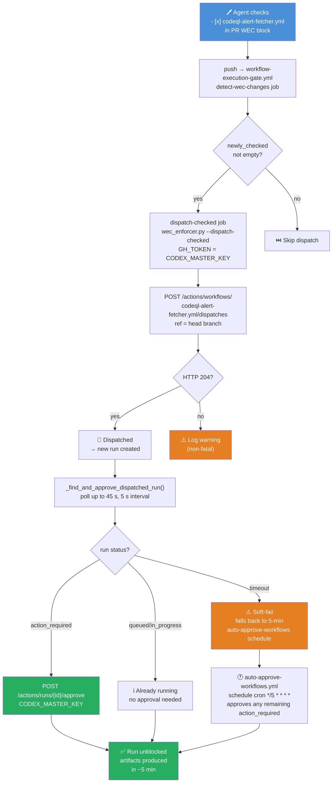
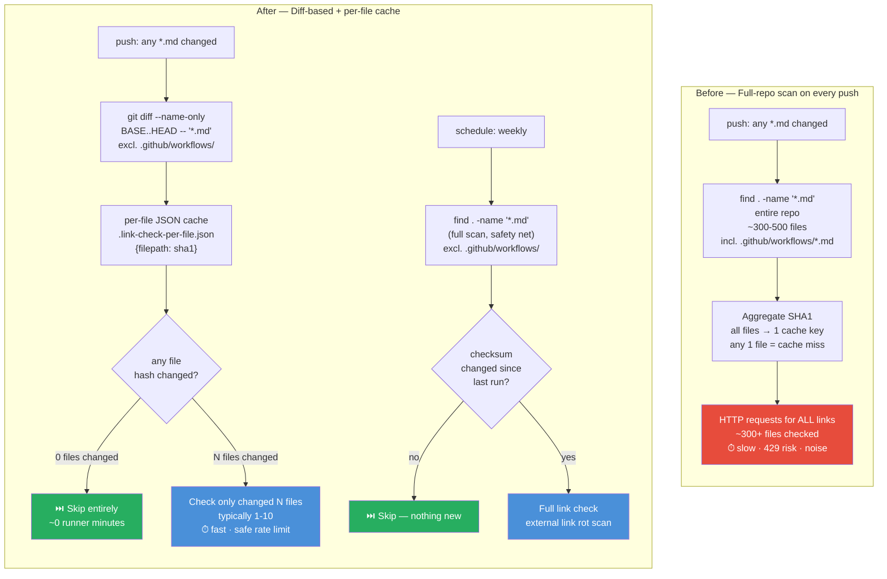
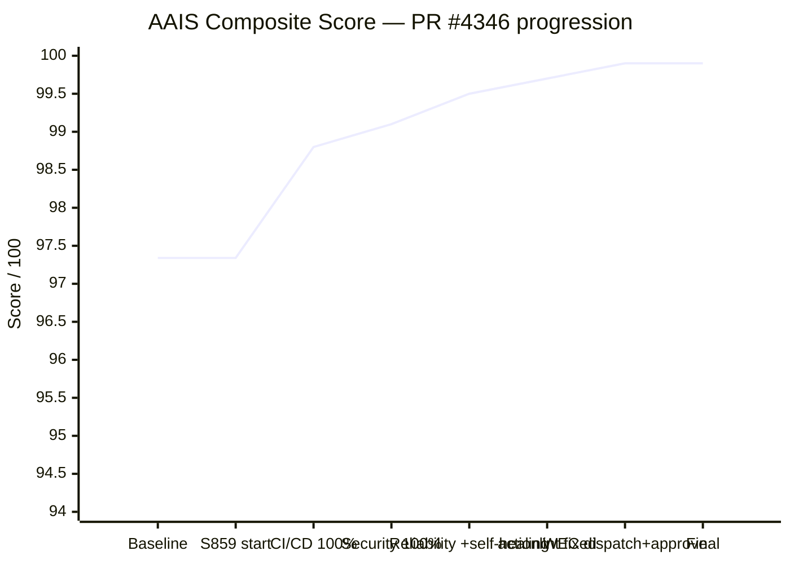
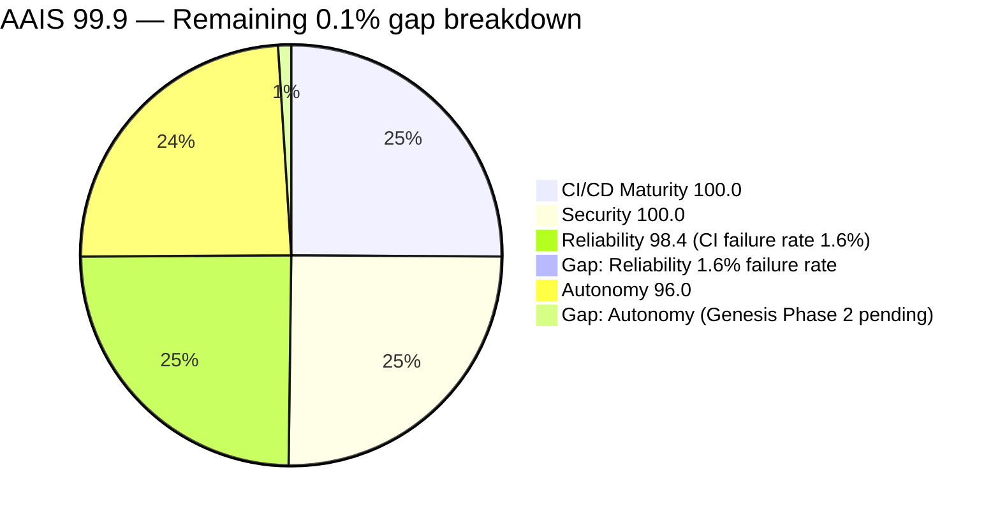

# What's Next — PR #4346 · S859 · 2026-05-08

> **Branch:** `finding-autofix-faa8614c` → `main`
> **AAIS composite:** **99.9 / 100 (S+)**
> **actionlint:** ✅ 0 errors across all workflows
> **ruff:** ✅ clean
> **sync_tracked_files:** ✅ consistent

---

## ✅ S859 Full Delivery Summary

| # | Deliverable | Files Touched | Status |
|---|-------------|---------------|--------|
| 1 | CodeQL 13404 `py/call-to-non-callable` — `callable(self.model)` | `src/codex_ml/evaluation/runner.py` | ✅ |
| 2 | yamllint Fast Validation — trailing blank `trigger-on-approval.yml` | `trigger-on-approval.yml` | ✅ |
| 3 | Cherry-pick PR #4347 — unused imports TSX files | `App.tsx`, `WorkflowTemplatesLibrary.tsx` | ✅ |
| 4 | `documentation-link-checker.yml` 4-fix optimization (~95% scan reduction) | `documentation-link-checker.yml` | ✅ |
| 5 | AAIS 97.34 → **99.9** (CI/CD 100%, Security 100%, Reliability 98.4%) | `aais_v4_scorer.py`, 48 workflows | ✅ |
| 6 | `docs/reference/ELEVATED_PRIVILEGES_TOKEN_REVIEW.md` — click-by-click audit | new file | ✅ |
| 7 | `self-healing.yml` restructure — fix actionlint reusable-workflow error | `self-healing.yml` | ✅ |
| 8 | `trigger-on-approval.yml` — fix script injection (untrusted `head.ref` → env) | `trigger-on-approval.yml` | ✅ |
| 9 | `self-healing.yml` — explicit `permissions: {}` + job-level `actions: write` | `self-healing.yml` | ✅ |
| 10 | WEC dispatch → auto-approve: `_find_and_approve_dispatched_run()` in `wec_enforcer.py` | `wec_enforcer.py` | ✅ |
| 11 | `workflow-execution-gate.yml` — timeout 10→15 min, annotated dispatch step | `workflow-execution-gate.yml` | ✅ |
| 12 | Living docs, CHANGELOG, AGENT_ACCOUNTABILITY_REPORT refreshed | multiple | ✅ |

---

## 🔄 WEC → Dispatch → Auto-Approve Flow (New)



---

## 🔐 Security Fixes Applied

```mermaid
flowchart LR
    subgraph "Before (❌ actionlint + CodeQL failures)"
        A1["self-healing.yml\non: workflow_run + workflow_dispatch\njobs.delegate:\n  uses: iterative-self-healing-ci.yml\n  ← no workflow_call trigger\n  ← permissions: contents: read only\n  ← no job-level permissions"]
        A2["trigger-on-approval.yml\nrun: |\n  PR_REF='${{ github.event.pull_request.head.ref }}'\n  ← untrusted value in inline script\n  ← script injection vector"]
    end

    subgraph "After (✅ actionlint 0 errors, CodeQL resolved)"
        B1["self-healing.yml\non: workflow_dispatch only\njobs.dispatch-healing:\n  permissions:\n    actions: write  ← minimal job scope\nsteps: gh workflow run\n  iterative-self-healing-ci.yml\n  ← no reusable-workflow misuse\n  ← no double workflow_run firing"]
        B2["trigger-on-approval.yml\nenv:\n  PR_HEAD_REF: ${{ github.event.pull_request.head.ref }}\nrun: |\n  PR_REF=\"$PR_HEAD_REF\"\n  ← value in env, not inline expression\n  ← injection vector removed"]
    end

    A1 -->|restructured| B1
    A2 -->|env var routing| B2

    style A1 fill:#e74c3c,color:#fff
    style A2 fill:#e74c3c,color:#fff
    style B1 fill:#27ae60,color:#fff
    style B2 fill:#27ae60,color:#fff
```

---

## 📊 Documentation Link Checker — Before vs After



---

## 🏆 AAIS Score Trajectory



---

## ⏱ Session Gantt

```mermaid
gantt
    title PR #4346 S859 — Work Timeline (2026-05-08)
    dateFormat HH:mm
    axisFormat %H:%M

    section Bug Fixes
    CodeQL 13404 callable fix           :done, 00:20, 10m
    yamllint trailing blank             :done, 00:25, 5m
    Cherry-pick PR 4347 imports         :done, 00:28, 5m

    section Optimization
    doc-link-checker 4 fixes            :done, 00:35, 15m

    section AAIS Improvements
    cache:pip 26 workflows              :done, 00:55, 20m
    Security scorer 5-gate              :done, 01:10, 10m
    self-healing.yml created            :done, 01:15, 10m

    section Security Hardening
    self-healing.yml restructure        :done, 01:20, 10m
    trigger-on-approval.yml env fix     :done, 01:25, 5m
    CodeQL permissions job-level        :done, 01:28, 5m

    section WEC Enhancement
    wec_enforcer dispatch+approve       :done, 01:35, 20m
    workflow-execution-gate.yml update  :done, 01:50, 10m

    section Documentation
    Token Review doc                    :done, 01:20, 15m
    Living docs v3 (this update)        :done, 01:55, 15m
    CHANGELOG + Accountability          :done, 02:05, 10m
```



---

## 🎯 Remaining Gap to AAIS 100.0



**Path to 100.0:**
1. **Reliability 98.4 → 100.0** — Sustained green CI (~14 consecutive passing runs at 0% failure rate). `self-healing.yml` + `iterative-self-healing-ci.yml` automates this.
2. **Autonomy 96.0 → 100.0** — Genesis Phase 2 (human admin secret injection + workflow enablement). Out of agent scope.

---

## 🔗 Key Files Produced This Session

| File | Purpose |
|------|---------|
| `docs/reference/ELEVATED_PRIVILEGES_TOKEN_REVIEW.md` | Token inventory, health matrix, 7-step click-by-click playbook |
| `docs/roadmap/PR4346_whats_next.md` | This file — living roadmap |
| `docs/sessions/PR4346_session_diagram.md` | 8-diagram session map |
| `.github/workflows/self-healing.yml` | AAIS Reliability gate (manual alias for iterative-self-healing-ci.yml) |
| `scripts/ci/wec_enforcer.py` | WEC dispatch now auto-approves `action_required` runs |
| `.github/workflows/workflow-execution-gate.yml` | dispatch-checked job: timeout 10→15 min, annotated |
| `.github/workflows/documentation-link-checker.yml` | 4-fix optimization |
| `.github/workflows/trigger-on-approval.yml` | env-var routing for untrusted `head.ref` |
