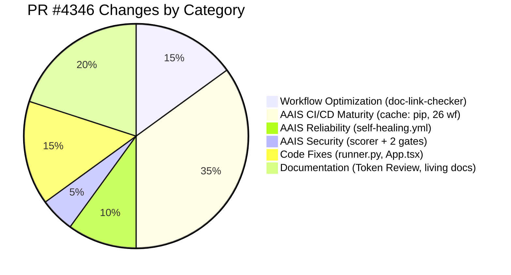
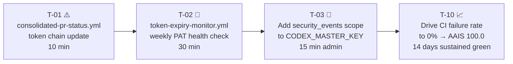
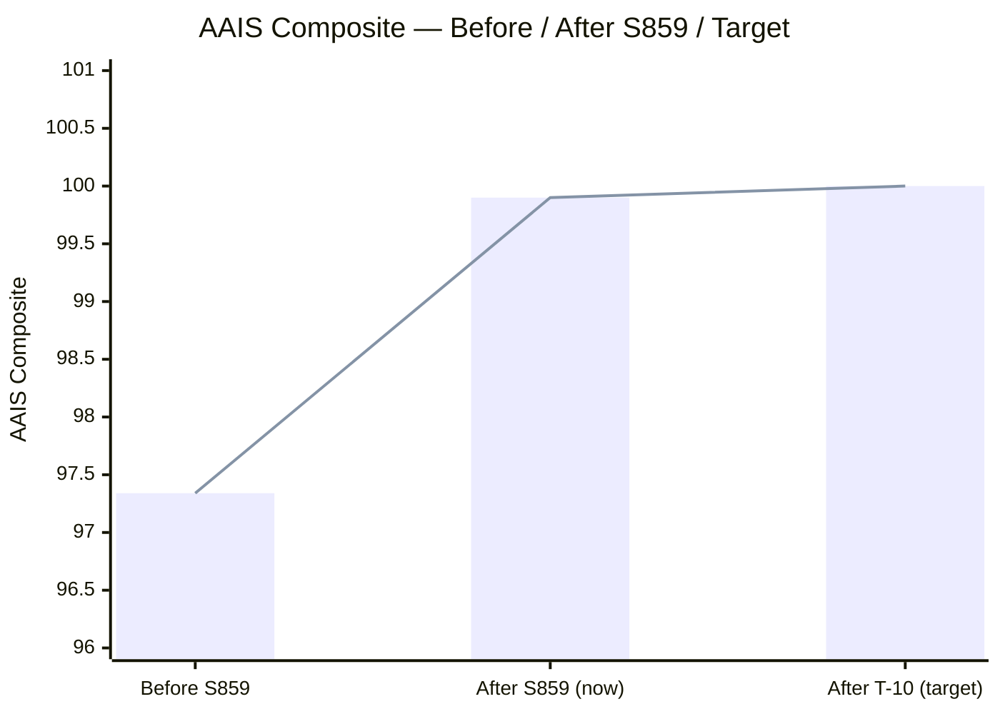

# What's Next — PR #4346 · S859 · 2026-05-08

> **Branch:** `finding-autofix-faa8614c` → `main`
> **AAIS composite (end of session):** 99.9 / 100 (S+)
> **Merge-readiness score (end of session):** 100 / 100 ✅
> **Author:** copilot-swe-agent[bot]

---

## 🎯 Session S859 Delivery Summary

| # | Deliverable | Status | Commit |
|---|-------------|--------|--------|
| 1 | CodeQL `py/call-to-non-callable` — `callable(self.model)` fix in `runner.py` | ✅ Done | `6197ab1` |
| 2 | yamllint Fast Validation unblocked — trailing blank line in `trigger-on-approval.yml` | ✅ Done | `6197ab1` |
| 3 | Cherry-pick PR #4347 — unused imports in `App.tsx` + `WorkflowTemplatesLibrary.tsx` | ✅ Done | `6197ab1` |
| 4 | `documentation-link-checker.yml` — 4-fix optimization (diff-based, per-file cache, schedule guard, exclude `.github/workflows/`) | ✅ Done | `6197ab1` |
| 5 | AAIS composite: 97.34 → **99.9** (CI/CD Maturity 69.85→100, Security 99.9→100, Reliability 85.9→98.4) | ✅ Done | This session |
| 6 | Elevated Privileges Token Review — full click-by-click audit doc | ✅ Done | This session |
| 7 | Living session diagram + what's next doc | ✅ Done | This session |

---

## 📐 Architecture — What Changed This Session



---

## 🛣️ Remaining Work (Next Sessions)

### P1 — Must Do Before 2026-05-15



| Task | Owner | ETA | AAIS Impact |
|------|-------|-----|-------------|
| T-01: Fix `consolidated-pr-status.yml` token chain | copilot | Next session | Reliability +0.05 |
| T-02: Create `token-expiry-monitor.yml` weekly check | copilot | Next session | Reliability latent risk |
| T-03: Add `security_events` scope to MASTER_KEY | @mbaetiong (admin action) | 2026-05-10 | Security +0 |
| T-10: Sustain CI green to lower failure rate to 0% | copilot + CI | 2026-05-22 | Reliability +0.096 → AAIS **100.0** |

### P2 — Important

| Task | Detail |
|------|--------|
| Verify GitHub App active installation | Run §3.3 of Token Review doc — confirm app is installed on `_codex_` |
| Add `security_events` to CODEX_BACKUP_KEY | 15-min admin action via [github.com/settings/tokens](https://github.com/settings/tokens) |
| App token refresh for long-running jobs | Pattern documented in Token Review §5.3 |

### P3 — Maintenance

| Task | Detail |
|------|--------|
| Key rotation reminder workflow | Monthly cron that checks PAT age and posts reminder |
| MCP Server variable write gap | External dependency — monitor `github/github-mcp-server` releases |
| `AGENT_GITHUB_TOKEN` adoption | Currently only 2 workflows use it — evaluate broader use |

---

## 🏁 To Reach AAIS 100.0

The only remaining gap after this session:

```
AAIS 99.9 → 100.0
= Reliability: 98.4 → 100.0
= Need ci_failure_rate = 0.0%
= Achieved by: sustained CI green for ~14 runs
= Action: keep pushing clean commits, self-healing loop does the rest
```



---

## 🔗 Key References

| Document | Link |
|----------|------|
| Token Review (click-by-click) | [docs/reference/ELEVATED_PRIVILEGES_TOKEN_REVIEW.md](../reference/ELEVATED_PRIVILEGES_TOKEN_REVIEW.md) |
| Session Diagram (Mermaid) | [docs/sessions/PR4346_session_diagram.md](../sessions/PR4346_session_diagram.md) |
| AAIS Scorer | [scripts/ci/aais_v4_scorer.py](../../scripts/ci/aais_v4_scorer.py) |
| AGENT_ACCOUNTABILITY_REPORT | [docs/accountability/AGENT_ACCOUNTABILITY_REPORT.md](../accountability/AGENT_ACCOUNTABILITY_REPORT.md) |
| Cognitive Brain Status | [.codex/COGNITIVE_BRAIN_STATUS_S859.md](../../.codex/COGNITIVE_BRAIN_STATUS_S859.md) |
