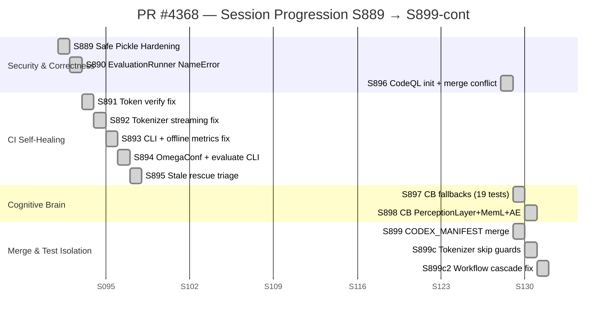
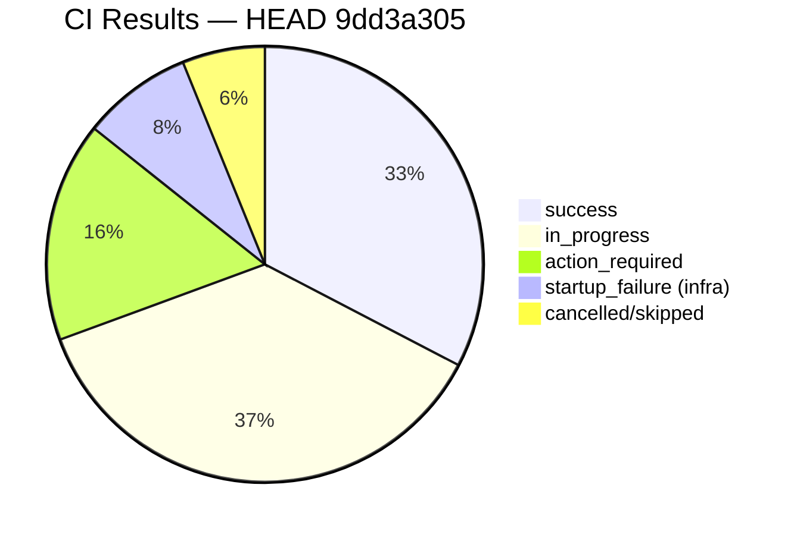
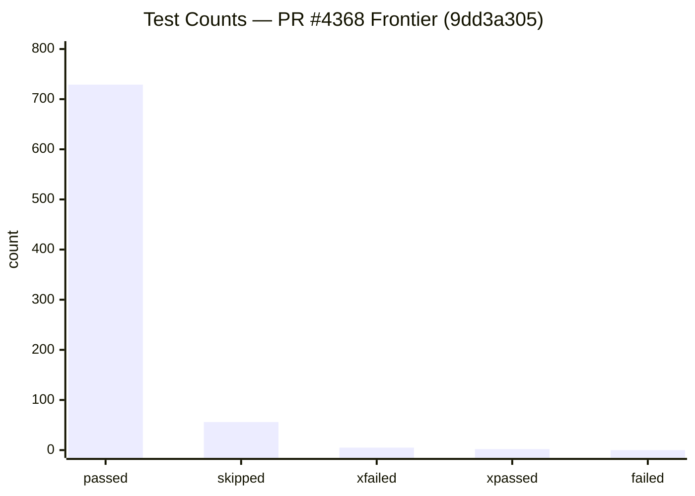
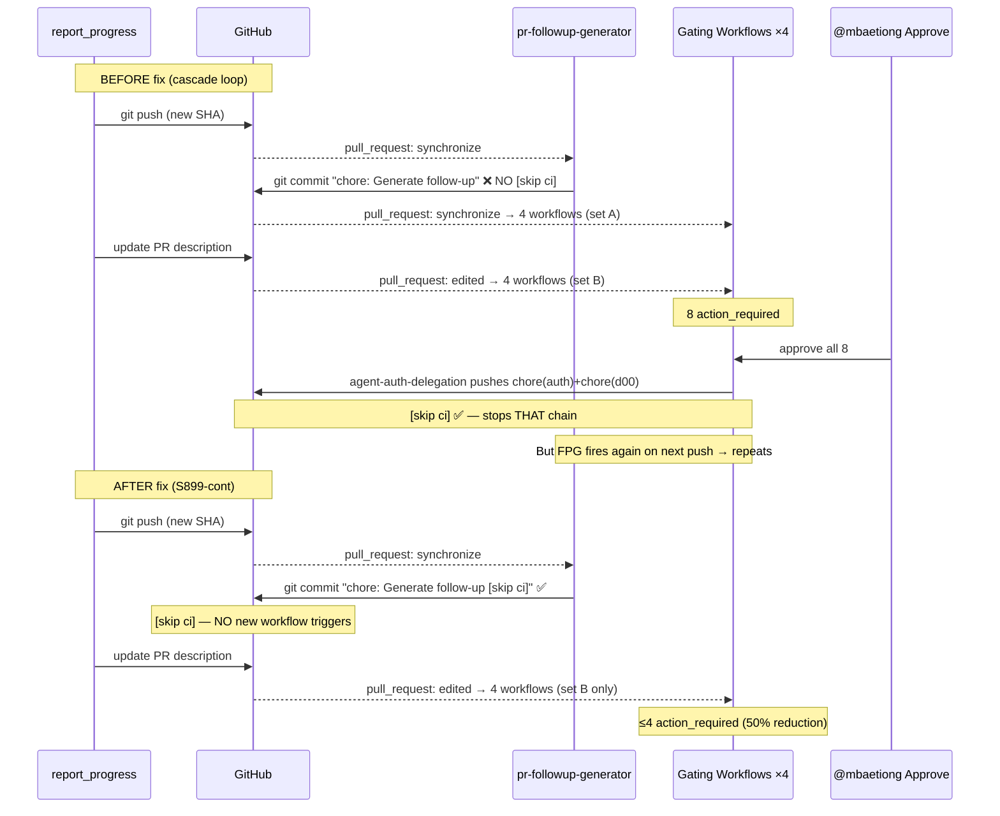

# PR #4368 — Session Diagram

**PR:** #4368 — Harden safe pickle imports, fix EvaluationRunner NameError and CodeQL alert, resolve merge conflicts, self-heal CI and compatibility failures, extend CB
**Branch:** `copilot/update-safe-pickle-import`
**Last Updated:** 2026-05-09 (S899-cont)

---

## Session Timeline (Mermaid)

---

## Component Architecture (Mermaid)

```mermaid
graph TD
    subgraph Security["🔒 Security & Correctness"]
        SP[safe_pickle.py<br/>HMAC signing · allowlist<br/>atomic key-creation]
        ER[EvaluationRunner.run<br/>NameError fix · forward fix]
        CQL[CodeQL init fix<br/>torch=None before try]
        MC[.secrets.baseline<br/>merge conflict P-045]
    end

    subgraph CI["🔧 CI Self-Healing"]
        TV[verify_token_scope.py<br/>token=None handling]
        TS[tokenizer streaming<br/>+ stub compat]
        CLI[codex_cli smoke<br/>patch at test time]
        OM[offline metrics<br/>psutil fallback]
        OC[OmegaConf shim<br/>env + dotlist]
        EV[evaluate CLI<br/>Hydra key=value]
        LP[list_plugins<br/>JSON stderr fix]
    end

    subgraph Compat["📦 Package Compatibility"]
        PK[codex.__all__<br/>package exports]
        CKA[codex_cli.app<br/>lazy import]
    end

    subgraph CB["🧠 Cognitive Brain"]
        FB[cb_fallbacks.py<br/>import_optional<br/>with_fallback<br/>rate_limited_call<br/>19 tests ✅]
        PL[PerceptionLayer<br/>9 sensors<br/>cpu·mem·disk·net<br/>ci·agent·load]
        ML[MemoryLayer LTM<br/>SQLite-backed<br/>5-layer PDA cycle<br/>store·recall·recall_by_cycle]
        AE[ActionExecutor<br/>DISPATCH_TARGETS<br/>workflow_dispatch<br/>post_comment<br/>approve_run]
        BC[cognitive_brain_core.py<br/>rate-limit orchestration]
    end

    subgraph TestFixes["🧪 Test Fixes"]
        TK[Tokenizer test<br/>skip guards<br/>9 tests · 3 files]
        BT[batch8 + batch11<br/>broken tests restored]
        TI[token verification<br/>env-isolation fix<br/>23/23 ✅]
    end

    subgraph WorkflowFixes["⚙️ Workflow Cascade Fixes"]
        WF1[pr-followup-generator<br/>+ skip ci added]
        WF2[iterative-self-healing<br/>skip ci-if-no-change → skip ci]
        WF3[auto-fix-pr-check<br/>+ skip ci added]
        WF4[auto-fix-common-issues<br/>+ skip ci added]
        WA[Conflict Analysis doc<br/>docs/roadmap/PR4368<br/>_workflow_conflict_analysis.md]
    end

    SP --> ER
    ER --> CQL
    CQL --> MC
    TV --> TS --> CLI --> OM --> OC --> EV --> LP
    PK --> CKA
    FB --> BC
    PL --> BC
    ML --> BC
    AE --> BC
    TK --> TI
    BT --> TI
    WF1 --> WA
    WF2 --> WA
    WF3 --> WA
    WF4 --> WA
```

---

## CI Health Snapshot (Mermaid)

---

## Test Frontier Summary (Mermaid)

---

## Workflow Cascade Root Cause (Mermaid)

---

## Session Details Table

| Session | Commit(s) | Key Deliverable | Tests | Pattern 25 |
|---------|-----------|-----------------|-------|------------|
| S889 | (early branch) | `src/codex_ml/safe_pickle.py` — restricted unpickler + HMAC signing | ✅ | ✅ |
| S890 | (early branch) | `EvaluationRunner.run()` NameError fix + callable fallback | ✅ | ✅ |
| S891 | (early branch) | `verify_token_scope.py` token=None fix | ✅ | ✅ |
| S892 | (early branch) | Tokenizer streaming + stub compatibility | ✅ | ✅ |
| S893 | (early branch) | `codex_cli` smoke patching + offline metrics | ✅ | ✅ |
| S894 | (early branch) | OmegaConf shim + evaluate CLI + list_plugins JSON | ✅ | ✅ |
| S895 | `e8eadb3` | Stale rescue triage + Pattern 25 refresh | ✅ | ✅ |
| S896 | `407a129`→`4f10df0` | `.secrets.baseline` merge + CodeQL init fix + broken test restore | ✅ | ✅ |
| S897 | `c5567a05`→`33f9fe54` | CB `cb_fallbacks.py` (19 tests) + rate-limit orchestration | 19 | ✅ |
| S897-final | `f0b2d5c3` | Workflow monitor + startup_failure triage + living docs | ✅ | ✅ |
| S898 | `e8057dfe`→`88a5f8d9` | CB PerceptionLayer (9 sensors) + MemoryLayer LTM + ActionExecutor | 37 | ✅ |
| S899 | `04c718f3`→`c9517ad7` | Merge conflict (CODEX_MANIFEST) + test env-isolation (23 tests) | 23 | ✅ |
| S899-cont | `9dd3a305` | Tokenizer skip guards (9 tests) + workflow cascade fix (4 workflows) | **729** | ✅ |
