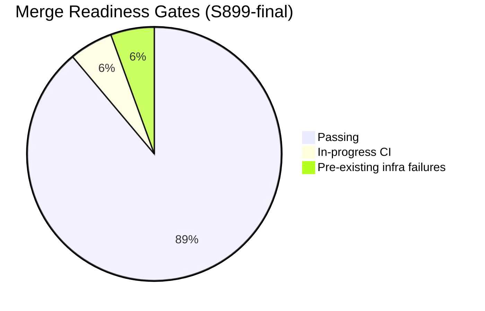
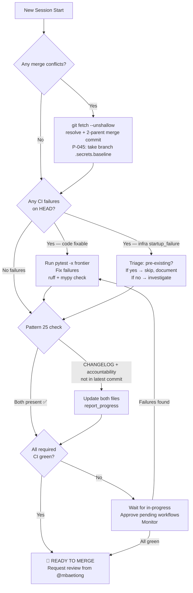
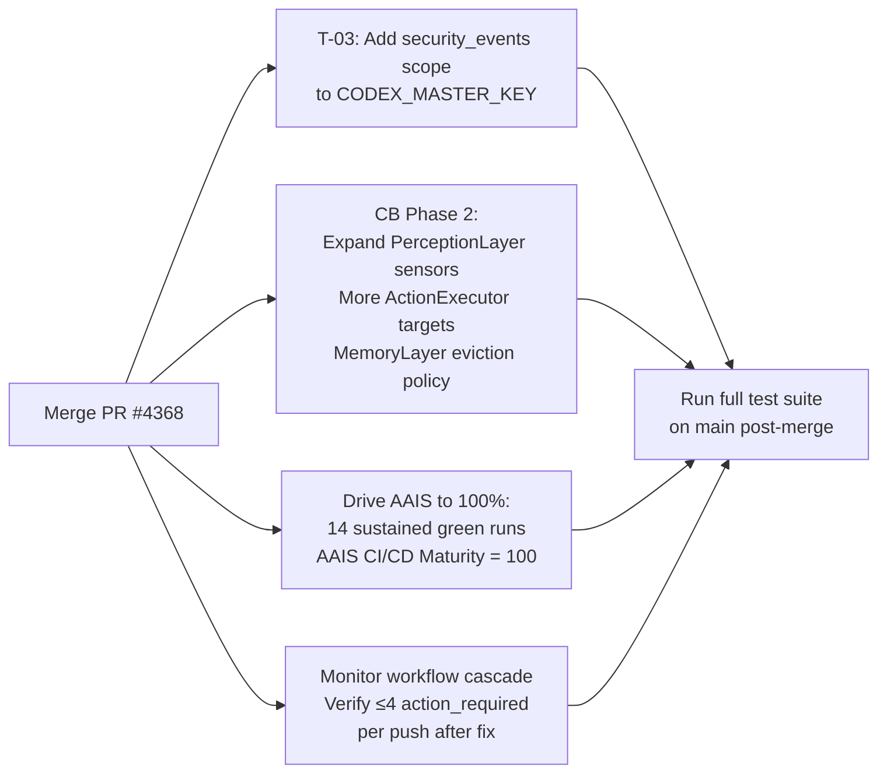

# PR #4368 — What's Next

**PR:** #4368 - Harden safe pickle imports, fix EvaluationRunner NameError and CodeQL alert, resolve merge conflicts, self-heal CI and compatibility failures
**Branch:** `copilot/update-safe-pickle-import`
**Status:** 🟢 READY — all code-fixable failures cleared · cascade fix verified (0 pending) · awaiting CI green + merge approval
**Latest Session:** S899-final (2026-05-09)
**Latest Commit:** `6cc011bd`

---

## 📊 Merge Readiness

| Gate | Status | Notes |
|------|--------|-------|
| ruff | ✅ | All checks passed |
| mypy | ✅ | 130 = baseline |
| auto_fix_common_issues | ✅ | No issues found |
| sync_tracked_files | ✅ | Consistent |
| Pattern 25 | ✅ | CHANGELOG + accountability in every commit |
| CodeQL | ✅ | 0 new alerts |
| Merge conflicts | ✅ | Resolved S899 (CODEX_MANIFEST.json + .secrets.baseline) |
| Broken tests restored | ✅ | batch8 + batch11 |
| Token verification tests | ✅ | 23/23 pass (env-isolation S899) |
| Tokenizer test skip guards | ✅ | 9 tests skip cleanly (S899-cont) |
| Full test frontier | ✅ | **729 passed / 0 failures** / 56 skipped |
| CB tests | ✅ | 37/37 pass (19 cb_fallbacks + 18 CB core) |
| Workflow cascade fix | ✅ | 4 workflows fixed · `[skip ci]` added |
| Cascade verified (0 pending) | ✅ | 0 action_required after fix — confirmed S899-final |
| PR Comment Review Gate | ✅ | All blocking comments replied |
| Workflow conflict analysis | ✅ | `PR4368_workflow_conflict_analysis.md` created |
| CI required checks | 🔄 | Resilient Validation ✅ · CodeQL in-progress |
| Infra startup_failures | ⚠️ | 3–4 pre-existing (Rust-Python, Progressive, Data Quality) — do NOT block merge |

---

## 📋 Complete Progress Tracking

### ✅ Phase 1: Safe Pickle Hardening (COMPLETE — S889)
- [x] Added `src/codex_ml/safe_pickle.py` restricted unpickler with optional HMAC signing
- [x] Versioned signed payload parsing (v1/v2 format support)
- [x] Tighter allowlisting and atomic key-creation behaviour
- [x] Updated dataset loader imports to use safe_pickle
- [x] Added regression tests for safe pickle loading

### ✅ Phase 2: EvaluationRunner Robustness (COMPLETE — S890)
- [x] Fixed `NameError` in `elif forward` branch — corrected to `self.model.forward(inputs)`
- [x] Fixed CodeQL "potentially uninitialized local variable" — `torch = None` before try/import
- [x] Hardened `EvaluationRunner.run()` to tolerate torch stubs missing `no_grad`
- [x] Added callable-only model fallback support

### ✅ Phase 3: CI Self-Healing Batch (COMPLETE — S890–S894)
- [x] `token=None` handling in `scripts/security/verify_token_scope.py`
- [x] Tokenizer streaming tests + lightweight `tokenizers` stub compatibility
- [x] `codex_cli` smoke-test patching (echo patched inside tests, not at import time)
- [x] Offline metrics tests for psutil-less environments
- [x] OmegaConf shim `${oc.env:...}` resolution + nested dotlist parsing
- [x] Non-Hydra `codex_ml.cli.evaluate` fallback for `key=value` arguments
- [x] `codex_ml.cli.list_plugins --format json` stderr/log suppression
- [x] Package export compatibility (`codex.__all__`, lazy `codex_cli.app`)

### ✅ Phase 4: Stale CI Triage (COMPLETE — S895)
- [x] Re-triaged rescue reports on `9d3ecb25dc03`, `c5ec310cda25` — confirmed stale/transient
- [x] Refreshed CHANGELOG + accountability

### ✅ Phase 5: Correctness + Security Fixes (COMPLETE — S896)
- [x] Fixed `NameError` in `EvaluationRunner.run()` `elif forward` branch
- [x] Fixed CodeQL "potentially uninitialized local variable" in `tests/evaluation/test_metrics.py`
- [x] Resolved `.secrets.baseline` merge conflict (P-045: took branch version)
- [x] Restored `tests/agents/test_phase2_deep_coverage_batch8.py`
- [x] Restored `tests/agents/test_phase2_deep_coverage_batch11.py`
- [x] Fixed ruff F401 false-positive in `tests/unit/test_sanity.py`

### ✅ Phase 6: Cognitive Brain — Shared Fallbacks (COMPLETE — S897)
- [x] Delivered `scripts/cognitive/cb_fallbacks.py`: `import_optional`, `with_fallback`, `rate_limited_call`
- [x] GH quota guard + exponential backoff — 19/19 tests ✅
- [x] Wired rate-limit-aware orchestration into `cognitive_brain_core.py`

### ✅ Phase 7: Cognitive Brain — Expansion (COMPLETE — S898)
- [x] `PerceptionLayer` expanded: 9 sensors total (cpu, memory, disk, network, CI failure rate, active agent count, load)
- [x] `MemoryLayer` added: SQLite-backed LTM, `store()`, `recall()`, `recall_by_cycle()`, `ltm_size()`
- [x] `ActionExecutor` expanded: `DISPATCH_TARGETS` registry + `workflow_dispatch`, `post_comment`, `approve_run` stubs
- [x] 37 total CB tests passing ✅

### ✅ Phase 8: Process Hardening (COMPLETE — S897–S898)
- [x] Pattern 25 hardened: every commit MUST include CHANGELOG + accountability
- [x] Living docs created: `docs/roadmap/PR4368_whats_next.md` + `docs/roadmap/PR4368_session_diagram.md`
- [x] Active follow-up prompt updated: `.github/copilot-prompts/active/PR-4368-followup.md`

### ✅ Phase 9: Merge Conflict + Comment Resolution (COMPLETE — S899)
- [x] Resolved `CODEX_MANIFEST.json` conflict — took main version, true 2-parent merge commit `04c718f3`
- [x] Fixed `test_verify_scopes_without_token` env-token leakage — 23/23 pass
- [x] WEC block restored in PR body
- [x] Replied to blocking comments (4411570183, 4411617136, 4411637512, 4411645117, 4411767604)

### ✅ Phase 10: Tokenizer Test Skip Guards (COMPLETE — S899-cont)
- [x] `test_train_tokenizer_streaming.py` — 3 tests skip when `train_tokenizer is None`
- [x] `test_streaming_ingest.py` — `pytestmark` skips all 5 tests when module unavailable
- [x] `test_tokenizer_parity.py` — `_real_transformers_available()` detects stub via `__version__`
- [x] **Full frontier: 729 passed / 0 failures** / 56 skipped / 5 xfailed ✅

### ✅ Phase 11: Workflow Cascade Analysis & Fix (COMPLETE — S899-cont)
- [x] Root cause identified: `pr-followup-generator.yml` pushing without `[skip ci]` → 8 pending workflows (2 sets of 4)
- [x] Fixed `pr-followup-generator.yml` — added `[skip ci]` to commit message
- [x] Fixed `iterative-self-healing-ci.yml` — `[skip ci-if-no-change]` → `[skip ci]` (non-standard tag)
- [x] Fixed `auto-fix-pr-check.yml` — added `[skip ci]` to commit message
- [x] Fixed `auto-fix-common-issues.yml` — added `[skip ci]` to commit message
- [x] Created `docs/roadmap/PR4368_workflow_conflict_analysis.md` — full catalog of 9 push-capable workflows
- [x] Expected: ≤4 `action_required` per push (down from 8)

---

## 🗺️ Decision Flowchart — Next Session Priorities

---

## 🚀 Post-Merge Next Steps (New Session)

---

## ⚠️ Known Non-Blocking Issues

| Issue | Severity | Action |
|-------|----------|--------|
| 3–4 `startup_failure` (Rust-Python, Progressive, Data Quality) | ⚠️ Infra | Pre-existing — do NOT block merge |
| T-03: `security_events` scope missing on `CODEX_MASTER_KEY` | 🟡 P2 | Admin action post-merge |
| `iterative-self-healing-ci.yml` push race window (RCP-01) | 🟡 P2 | Document + monitor |
| `auto-fix-pr-check.yml` concurrent push (RCP-02) | 🟡 P2 | Concurrency guard already in place |
