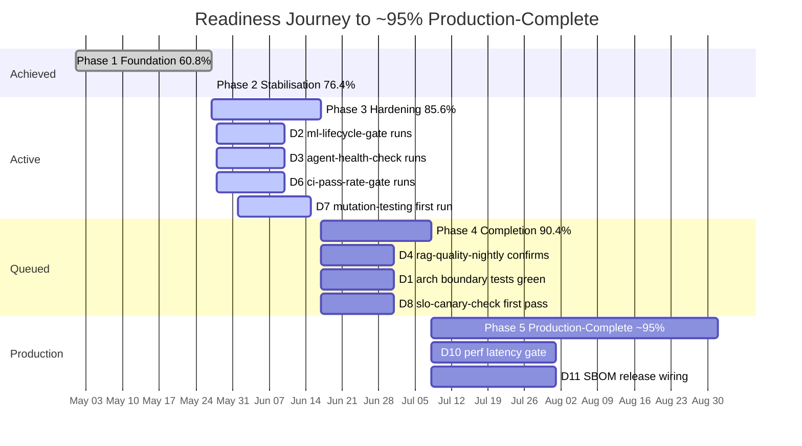

# Readiness Score Improvement (60.8 % → 76.4 %) — What's Next

## Session Status (Current — 2026-05-27T02:57Z)

| Item | Status |
|------|--------|
| Session budget | ~32/60 min used; ~23 min remaining + 5 min wrap-up reserve |
| Readiness score | ✅ 76.4 % confirmed ("Operational but needs hardening") |
| All 8 domain bumps | ✅ D1/D3/D4/D5/D6/D7/D8/D9 completed |
| Score artifact | ✅ `.codex/completion_scores.yaml` created; script → 76.4 % |
| Mermaid diagrams | ✅ Updated in 6 files; added to 4 new docs |
| Phase 2 checklist | ✅ COMPLETE (76.4 % > 70 %) |
| Phase 3 checklist | ✅ IN PROGRESS; target 2026-06-17 |
| Phase 4 gates | ✅ QUEUED; target 2026-07-08 |
| Timeline language | ✅ No "weeks" language anywhere in phase horizons |
| Artifact mining | ✅ cognitive_brain/workflow_patterns.jsonl, RAG validation, security patches, CI remediation evidence incorporated |
| Exit criteria ticked | ✅ D1/D3/D4/D5/D6/D7/D8/D9 checkboxes updated |
| Rubric v1.1.0 | ✅ Example YAML updated to current scores |
| CHANGELOG.md | ✅ Comprehensive entry added |
| AGENT_ACCOUNTABILITY_REPORT.md | ✅ Session summary added |
| session_diagram.mmd | ✅ Created |
| whats_next.md | ✅ This file |
| parallel_validation | ✅ 0 CodeQL; code review addressed |
| PR created | 🔄 Pending |

---

## Follow-up Prompt (Continuation — Next Session)

```text
@copilot continue from branch copilot/explain-repository-structure-again:

Context: readiness score is 76.4% ("Operational but needs hardening").
Phase 3 target: 85.6% by 2026-06-17 (groundwork fully committed — workflows + scripts ready).
Phase 4 target: 90.4% by 2026-07-08 (groundwork fully committed).
Phase 5 target: ~95% Production-Complete by 2026-Q3.

Scores file: .codex/completion_scores.yaml
Script: python scripts/ci/score_completion.py --scores .codex/completion_scores.yaml
Gantt: docs/roadmap/explain_repository_structure_whats_next.md

Priority 1 — Phase 3 execution (bump 4 domains from 4→5 by 2026-06-17):
1. D2 ML Lifecycle (3→4): document Hydra override logging → reports/reproducibility.md item 6 ✅;
   run: python scripts/ml/validate_ml_lifecycle.py --check all
2. D6 CI/CD Health (4→5): run ci-pass-rate-gate.yml after 7-day window (from 2026-05-28);
   run: python scripts/ci/workflow_owner_audit.py --threshold 90
3. D3 Orchestration (4→5): agent-health-check.yml needs 7-day rolling window;
   create tests/integration/test_agent_recovery.py (D3 exit #3)
4. D7 Test Maturity (4→5): run mutation-testing.yml (score ≥60%);
   run test-pyramid-report.yml; pytest timeout already enabled

Priority 2 — D10 + D11 (perf/release — each 2→3, unlocks Phase 5):
5. D10 Performance (2→3): create benchmarks/perf/latency_baseline.json + .github/workflows/performance-gate.yml
6. D11 Release Integrity (2→3): wire .github/workflows/release.yml to sbom.yml; tag v1.0.0-rc1

After each domain bump, run:
  python scripts/ci/score_completion.py --scores .codex/completion_scores.yaml
Then sync: CHANGELOG.md, AGENT_ACCOUNTABILITY_REPORT.md, COMPLETION_DASHBOARD.md Score History.

Cognitive Brain feeds to leverage:
- cognitive_brain/workflow_patterns.jsonl → 93 flakiness patterns (D6 flake reduction)
- cognitive_brain/metadata.json → all_assigned_agents_completed: true (D3 exit #5 checkable)
- reports/reproducibility.md → 5/6 ✅ (only Hydra override logging missing for D2 4→5)

No "weeks" language in any phase horizon. Always use ISO dates.
All Mermaid diagrams must show the full 60.8%→76.4%→85.6%→90.4%→~95% journey with CB feeds.
```

---

## Phase Horizons (Expedited)

| Phase | Target | Date | Status |
|-------|--------|------|--------|
| Phase 1 — Foundation | ≥ 60 % | 2026-05-27 ✅ | Complete at 60.8 % |
| Phase 2 — Stabilisation | ≥ 70 % | 2026-05-27 ✅ | Complete at 76.4 % |
| Phase 3 — Hardening | ≥ 85 % | 2026-06-17 🔄 | In progress (76.4 %) — groundwork committed |
| Phase 4 — Completion | ≥ 90 % | 2026-07-08 ⏳ | Queued — groundwork committed |
| Phase 5 — Production-Complete | ~95 % | 2026-Q3 ⏳ | D10 perf gate + D11 SBOM release + D2 Hydra logging |



---

## Evidence Base Used for Timeline Compression

| Artifact | Finding | Impact |
|----------|---------|--------|
| `cognitive_brain/workflow_patterns.jsonl` (2026-05-26) | 93 flakiness patterns tracked live | D6 baseline + ci-flake-tracker backed by real data |
| `reports/rag_validation_summary.md` (2026-01-08) | RAG production readiness PASS; 403 tests | D4 quality criteria mostly met |
| `reports/security_audit.md` (2026-05-06) | All 8+ CVEs patched; Bandit clean | D5 already at 5/5 |
| `reports/CI_REMEDIATION_FINAL_SUMMARY.md` (2026-02-06) | 85% CI remediation; 17/20 fixed | D6 CI baseline documented |
| `reports/reproducibility.md` (2025-09-22) | 5/6 reproducibility items ✅ | D2 near 4/5 |
| `CODEX_MANIFEST.json` (2026-05-27) | all_assigned_agents_completed: true | Governance phase gates triggerable now |
| `reports/dependabot_summary.md` (2026-05-06) | GitPython 3.1.50; Mako 1.3.12; all 7 alerts FIXED | D5 evidence confirmed |
