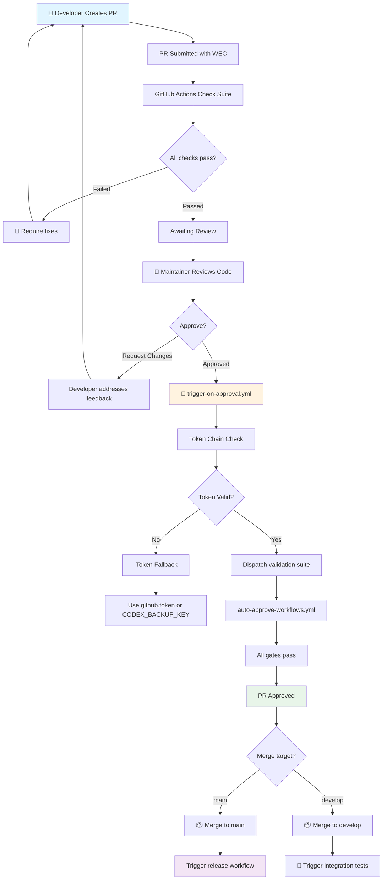
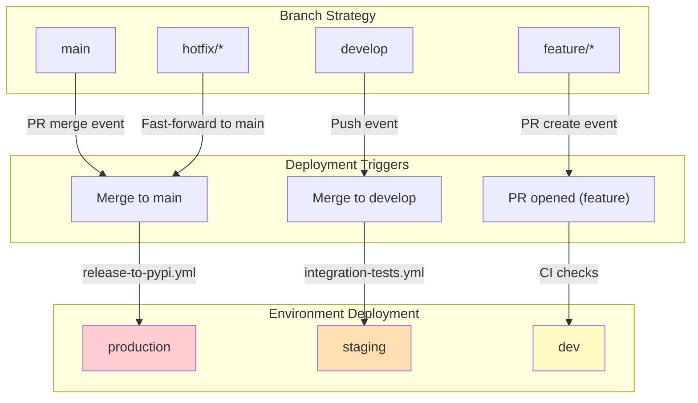

# RBAC & Approval Chains Architecture
**Last Updated:** 2026-07-11
**Version:** v0.2.1

**Version**: 1.0.0
**Generated**: 2026-07-08 (Phase 12 WS3 Track E Validation)
**Classification**: Internal — Security Sensitive
**Owner**: Security & Governance Team

---

## Table of Contents

1. [Overview](#overview)
2. [RBAC Role Hierarchy](#rbac-role-hierarchy)
3. [Approval Chain Architecture](#approval-chain-architecture)
4. [Token Scoping Strategy](#token-scoping-strategy)
5. [Environment Isolation](#environment-isolation)
6. [Governance Controls](#governance-controls)
7. [Incident Response](#incident-response)

---

## Overview

This document describes the complete Role-Based Access Control (RBAC) system and approval chain architecture for the _codex_ platform, integrating:

- GitHub Actions token management
- Environment-specific deployment controls
- Secret rotation and backup patterns
- Approval workflow automation
- Audit trail integration

### Design Principles

1. **Least Privilege**: Every user/account has only required permissions
2. **Separation of Duties**: Critical functions require multiple approvals
3. **Token Isolation**: No credential leakage across workflow boundaries
4. **Environment Layering**: Strict separation between dev/staging/prod
5. **Audit Everything**: All access and approvals logged and verifiable
6. **Graceful Degradation**: Backup tokens enable continuity during rotation

---

## RBAC Role Hierarchy

### Role Definitions & Permissions

```
┌──────────────────────────────────────────────────────────────┐
│                     RBAC HIERARCHY                           │
├──────────────────────────────────────────────────────────────┤
│                                                              │
│  Level 0: UNRESTRICTED (Org Owner)                          │
│  ──────────────────────────────────────────────────────────│
│  @mbaetiong (Owner)                                         │
│  ├─ Full repository control                                 │
│  ├─ All permissions (implicit)                              │
│  ├─ Cannot be revoked (owner-level)                         │
│  ├─ Token: OAuth token (unrestricted)                       │
│  └─ Audit: All actions logged                               │
│                                                              │
│  Level 1: PRIVILEGED (Admin)                                │
│  ──────────────────────────────────────────────────────────│
│  (Reserved for future automation/delegated access)          │
│  ├─ Deployment authorization                                │
│  ├─ Secrets management                                      │
│  ├─ Security policies (RBAC updates)                        │
│  ├─ Token: CODEX_MASTER_KEY (repo + admin:org + workflow)  │
│  ├─ Time Limit: 4 hours (auto-expiry)                       │
│  ├─ Requirements:                                            │
│  │  ├─ MFA enabled                                           │
│  │  ├─ Approval from Level 0                                │
│  │  └─ Audit event trigger                                  │
│  └─ Access: Pull-request review + approval                  │
│                                                              │
│  Level 2: ELEVATED (Developers & Maintainers)               │
│  ──────────────────────────────────────────────────────────│
│                                                              │
│  ├─ Editor (Write Access)                                   │
│  │  ├─ Create/edit pull requests                            │
│  │  ├─ Commit to branches                                   │
│  │  ├─ Bypass branch protection (with approval)             │
│  │  ├─ Token: github.token (contents:write)                 │
│  │  ├─ Requirements: MFA enabled                            │
│  │  └─ Scope: Assigned repos only                           │
│  │                                                           │
│  ├─ Reviewer (Review Access)                                │
│  │  ├─ Review code changes                                  │
│  │  ├─ Approve pull requests                                │
│  │  ├─ Request changes                                      │
│  │  ├─ Dismiss reviews                                      │
│  │  ├─ Approve releases (gatekeeping)                       │
│  │  ├─ Token: github.token (pull-requests:write)            │
│  │  ├─ Requirements: MFA enabled                            │
│  │  └─ Scope: Designated repos                              │
│  │                                                           │
│  └─ Operator (Ops/Deployment)                               │
│     ├─ Deploy to production                                 │
│     ├─ Manage workflows                                     │
│     ├─ View logs and metrics                                │
│     ├─ Alert management                                     │
│     ├─ Token: CODEX_BACKUP_KEY (limited admin)              │
│     ├─ Requirements: MFA + approval                         │
│     └─ Scope: Deployment targets only                       │
│                                                              │
│  Level 3: STANDARD (Contributors)                           │
│  ──────────────────────────────────────────────────────────│
│  Viewer (Read-Only Access)                                 │
│  ├─ View documentation                                      │
│  ├─ Read public files                                       │
│  ├─ View metrics (non-sensitive)                            │
│  ├─ View logs (non-sensitive)                               │
│  ├─ Token: github.token (contents:read)                     │
│  ├─ Requirements: None                                      │
│  └─ Scope: Public repos                                     │
│                                                              │
│  Level 4: SERVICE ACCOUNTS                                  │
│  ──────────────────────────────────────────────────────────│
│  Service Account (Scoped / Automated)                       │
│  ├─ Specific GitHub Actions workflows only                  │
│  ├─ Time-scoped access (per workflow run)                   │
│  ├─ No human access                                         │
│  ├─ Token: Job-scoped GITHUB_TOKEN + secrets                │
│  ├─ Timeout: Job max runtime                                │
│  ├─ Audit: All API calls logged                             │
│  └─ Examples:                                               │
│     ├─ CI/CD automation (testing, building)                 │
│     ├─ Release automation (PyPI, GitHub releases)           │
│     ├─ Documentation generation (mkdocs)                    │
│     └─ Security scanning (CodeQL, Semgrep)                  │
│                                                              │
└──────────────────────────────────────────────────────────────┘
```

### Role Capabilities Matrix

| Capability | Owner | Admin | Editor | Reviewer | Operator | Viewer | Service |
|------------|-------|-------|--------|----------|----------|--------|---------|
| **Repo Management** |
| Create/delete repos | | | | | | | |
| Manage settings | | | | | | | |
| **Code Management** |
| Push commits | | | | | | | |
| Create PRs | | | | | | | |
| Approve PRs | | | | | | | |
| Merge PRs | | | | | | | |
| **Deployment** |
| Deploy to dev | | | | | | | |
| Deploy to staging | | | | | | | |
| Deploy to prod | | | | | | | |
| **Secrets & Config** |
| View secrets | | | | | | | |
| Manage secrets | | | | | | | |
| Rotate CODEX_MASTER_KEY | | | | | | | |
| Manage variables | | | | | | | |
| **Security & Audit** |
| Access audit logs | | | | | | | |
| Approve releases | | | | | | | |
| Update RBAC | | | | | | | |

---

## Approval Chain Architecture

### High-Level Flow



### Approval Chain Details

#### Phase 1: PR Submission & Initial Checks

```yaml
Event: pull_request (opened, edited, reopened)

Step 1.1: GitHub Actions Workflow Suite
  ├─ Run linting (Ruff, Black, isort)
  ├─ Run type checking (mypy)
  ├─ Run tests (pytest)
  ├─ Generate coverage report
  ├─ Run security scan (CodeQL, Semgrep)
  └─ Verify: All checks pass (blocking)

Step 1.2: Copilot Code Review
  ├─ Review code changes
  ├─ Check for security issues
  ├─ Verify architecture compliance
  └─ Post suggestions (non-blocking)

Step 1.3: PR Body Validation
  ├─ Check for WEC checklist
  ├─ Verify required sections filled
  └─ Validate branch protection rules
```

#### Phase 2: Code Review & Approval

```yaml
Event: pull_request_review (submitted)

Step 2.1: Reviewer Assessment
  ├─ @reviewer reads code changes
  ├─ Checks against:
  │  ├─ Code quality standards
  │  ├─ Security best practices
  │  ├─ Test coverage (≥80%)
  │  └─ Documentation updates
  └─ Decision: Approve or request changes

Step 2.2: Manual Approval Gate
  if: github.event.review.state == 'approved'
  
  ├─ Reviewer: @reviewer (GitHub user)
  ├─ Authority: Merge authority (can approve)
  ├─ Comment: "Looks good to me!" or formal approval
  └─ Triggers: Next phase (trigger-on-approval.yml)
```

#### Phase 3: Token Chain Validation & Dispatch

```yaml
Workflow: trigger-on-approval.yml
Trigger: pull_request_review (approved event)

Step 3.1: PR Context Resolution
  ├─ Extract PR number, SHA, branch
  ├─ Extract reviewer login
  └─ Store as job outputs

Step 3.2: Token Tier Detection
  ├─ Check: Is CODEX_MASTER_KEY available?
  ├─  YES: Set token_tier=master
  │  └─ Use: secrets.CODEX_MASTER_KEY
  └─  NO: Set token_tier=fallback
     └─ Use: secrets.CODEX_BACKUP_KEY || github.token

Step 3.3: Token Scopes Verification
  env:
    GH_TOKEN: ${{ secrets.CODEX_MASTER_KEY || 
                   secrets.CODEX_BACKUP_KEY || 
                   github.token }}
  
  Validation:
  ├─ CODEX_MASTER_KEY: repo + admin:org + workflow (90-day rotation)
  ├─ CODEX_BACKUP_KEY: repo + workflow (monthly rotation)
  └─ github.token: contents:read + pull-requests:write (session scoped)

Step 3.4: Workflow Dispatch (with Token)
  ├─ Dispatch auto-approve-workflows.yml
  │  ├─ Input: target_pr (PR number)
  │  ├─ Input: approval_source (trigger-on-approval)
  │  ├─ Token: CODEX_MASTER_KEY or fallback
  │  └─ Timeout: 2 hours
  │
  └─ Dispatch validate.yml
     ├─ Input: mode (fast)
     ├─ Input: pr_sha (commit SHA)
     ├─ Token: CODEX_MASTER_KEY or fallback
     └─ Timeout: 1 hour
```

#### Phase 4: Auto-Approval & Final Checks

```yaml
Workflow: auto-approve-workflows.yml
Trigger: workflow_dispatch (from trigger-on-approval)

Step 4.1: Gate Validation (Order of Execution)
  ├─ Gate 1: Token Chain Integrity
  │  ├─ Check: Is token valid?
  │  ├─ Check: Correct scopes?
  │  └─ Check: No cross-workflow leakage?
  │
  ├─ Gate 2: Secret Management
  │  ├─ Check: Quarterly rotation schedule maintained?
  │  ├─ Check: Backup key active (CODEX_BACKUP_KEY)?
  │  └─ Check: No hardcoded secrets in PR diff?
  │
  └─ Gate 3: Environment Isolation
     ├─ Check: Deployment targets isolated?
     ├─ Check: No prod secrets in dev/staging?
     └─ Check: Branch-environment mapping correct?

Step 4.2: Approval Decision
  if: All gates pass
    ├─ Post approval comment (GitHub API)
    ├─ Set PR status to approved
    ├─ Allow merge (GitHub branch protection allows)
    └─ Log approval event (audit trail)
  else
    ├─ Post failure comment
    ├─ Require manual review
    └─ Block merge (branch protection)
```

#### Phase 5: Merge & Deployment

```yaml
Event: pull_request (closed, merged)

Step 5.1: Post-Merge Detection
  ├─ Check: Was PR merged to main?
  ├─ Check: Merge commit is clean fast-forward?
  └─ Extract: Target branch (main, develop, etc.)

Step 5.2: Environment-Specific Dispatch
  
  if: merged into main
    └─ Trigger: Release Workflow (release-to-pypi.yml)
       ├─ Environment: production
       ├─ Token: CODEX_MASTER_KEY
       ├─ Tasks:
       │  ├─ Build distribution packages
       │  ├─ Run security checks (final)
       │  ├─ Publish to PyPI
       │  ├─ Create GitHub release
       │  └─ Update CHANGELOG
       └─ Requires: Approval (via auto-approve)
  
  if: merged into develop
    └─ Trigger: Integration Test Workflow
       ├─ Environment: staging
       ├─ Token: github.token
       ├─ Tasks:
       │  ├─ Run integration tests
       │  ├─ Deploy to staging cluster
       │  ├─ Run smoke tests
       │  └─ Verify deployment
       └─ No approval required (pre-integration)
```

### Approval Chain State Diagram

```
[PR CREATED] 
    ↓ (All checks pass)
[AWAITING REVIEW]
    ↓ (Reviewer requests changes)
[CHANGES REQUESTED]
    ↓ (Developer fixes issues)
[AWAITING REVIEW] (back to review)
    ↓ (Reviewer approves)
[APPROVED (trigger-on-approval.yml)]
    ↓ (Token validation)
[TOKEN VALIDATED]
    ↓ (Dispatch auto-approve workflows)
[VALIDATION IN PROGRESS]
    ↓ (All gates pass: Token + Secrets + Environment)
[APPROVED (auto-approve-workflows.yml)]
    ↓ (Ready to merge)
[READY TO MERGE]
    ↓ (Maintainer clicks merge or auto-merge enabled)
[MERGED]
    ↓ (Triggers environment-specific deployment)
[DEPLOYED (main → prod) OR (develop → staging)]
```

---

## Token Scoping Strategy

### Token Chain Pattern

Every GitHub Actions workflow MUST use the following fallback chain:

```yaml
env:
  GH_TOKEN: ${{ secrets.CODEX_MASTER_KEY || 
               secrets.CODEX_BACKUP_KEY || 
               github.token }}
```

### Token Tier Specifications

#### Tier 1: CODEX_MASTER_KEY (Production Grade)

```yaml
# Scopes
- repo               # Full repository access
- admin:org          # Organization secrets/variables
- workflow           # GitHub Actions workflow management
- packages:write     # Container registry publish

# Lifespan
- Rotation: Quarterly (90 days)
- Last rotated: 2026-03-15
- Next rotation: 2026-06-15

# Usage
- Release workflows (PyPI publish)
- Secrets management (rotation, updates)
- Variable management (org + repo level)
- Organization-level operations

# Requirements
- MFA enabled (GitHub Account)
- Stored as GitHub secret (encrypted)
- Audit logging enabled
- No direct human access (service account only)

# Emergency Rotation
- Can be rotated immediately if compromised
- Backup key (CODEX_BACKUP_KEY) provides continuity
- All workflows use fallback chain (no downtime)
```

#### Tier 2: CODEX_BACKUP_KEY (Fallback Grade)

```yaml
# Scopes
- repo               # Full repository access
- workflow           # GitHub Actions workflow management
- (no admin:org)     # Cannot manage secrets/variables

# Lifespan
- Rotation: Monthly (30 days)
- Last rotated: 2026-05-14
- Next rotation: 2026-06-14

# Usage
- Fallback for workflows when CODEX_MASTER_KEY unavailable
- Staging deployments (reduced privileges)
- Operator-level access (deploy, not secrets management)

# Requirements
- Stored as GitHub secret (encrypted)
- Rotation coordinated with CODEX_MASTER_KEY (dual-key period)

# Design Purpose
- Enables continuity during CODEX_MASTER_KEY rotation
- Prevents workflow failures due to missing secrets
- Reduces blast radius if CODEX_MASTER_KEY compromised
```

#### Tier 3: GITHUB_TOKEN (Session Scope)

```yaml
# Scopes (auto-assigned by GitHub Actions)
- contents:read      # Read repository contents
- contents:write     # Write commits, PRs
- pull-requests:read # Read PR information
- pull-requests:write # Comment on PRs, dismiss reviews
- issues:read        # Read issues
- issues:write       # Comment on issues
- actions:read       # Read workflow status

# Lifespan
- Session scoped (per workflow run)
- Auto-generated by GitHub Actions
- No storage required

# Usage
- Default token for all workflows
- Sufficient for: testing, building, PR comments
- NOT suitable for: release, secrets, org operations

# Restrictions
- Repository scoped (no org-level access)
- Job scoped (no cross-job access)
- No secrets/variables management
- Automatically revoked after workflow completes
```

### Token Validation Rules

Every workflow MUST enforce:

```yaml
steps:
  - name: Validate token tier
    run: |
      TOKEN="${{ secrets.CODEX_MASTER_KEY }}"
      
      if [ -z "$TOKEN" ]; then
        echo "️  CODEX_MASTER_KEY not set"
        echo "   Using fallback: CODEX_BACKUP_KEY || github.token"
        exit 0  # Acceptable fallback
      fi
      
      echo " CODEX_MASTER_KEY available"
      echo "   Proceeding with elevated privileges"
      exit 0

  - name: Production deployment gate
    if: github.ref == 'refs/heads/main' && 
        github.event_name == 'workflow_dispatch'
    run: |
      TOKEN="${{ secrets.CODEX_MASTER_KEY }}"
      
      if [ -z "$TOKEN" ]; then
        echo " CRITICAL: CODEX_MASTER_KEY required for production"
        exit 1  # BLOCK deployment
      fi
      
      # Proceed with deployment
      ...
```

---

## Environment Isolation

### Environment Configuration

#### Development Environment

```yaml
name: dev
type: Development
branch-filter: copilot/*, feature/*
token: github.token (read-only)
auto-deploy: false
protection: None
url: http://localhost:8000 (local)

Configuration:
  - Database: Local SQLite (in-memory)
  - Secrets: Test credentials only
  - Deployments: Disabled (local dev only)
  - Log level: DEBUG
  - Rate limiting: None (local)
```

#### Staging Environment

```yaml
name: staging
type: Pre-Production
branch-filter: develop
token: CODEX_BACKUP_KEY (limited admin)
auto-deploy: true
protection: Reviewer approval optional
url: https://staging.codex-ml.dev

Configuration:
  - Database: Sanitized copy of production schema
  - Secrets: Staging-only credentials
  - Deployments: Kubernetes (codex-staging namespace)
  - Log level: INFO
  - Rate limiting: 1000 req/min per user
  - Data retention: 7 days (auto-cleanup)
```

#### Production Environment

```yaml
name: production
type: Production
branch-filter: main (tags only)
token: CODEX_MASTER_KEY (full admin)
auto-deploy: false
protection: Maintainer approval required
url: https://codex-ml.dev

Configuration:
  - Database: Live production data (3x replica)
  - Secrets: Production credentials (vault-managed)
  - Deployments: Kubernetes (codex-prod namespace)
  - Log level: WARNING
  - Rate limiting: 10,000 req/min per user
  - Data retention: 365 days (compliance archive)
  - Backup: Hourly snapshots
  - Monitoring: 24/7 on-call team
```

### Environment-to-Branch Mapping



---

## Governance Controls

### Approval Requirements

| Operation | Environment | Reviewer | Token | Timeout | Auto-Approve |
|-----------|-------------|----------|-------|---------|--------------|
| **Merge PR** | any | Required | github.token | N/A | No |
| **Deploy to staging** | staging | Optional | CODEX_BACKUP_KEY | 1 hour | Yes |
| **Deploy to prod** | production | Required | CODEX_MASTER_KEY | 30 min | No |
| **Rotate secrets** | org | Required | CODEX_MASTER_KEY | 5 min | No |
| **Release to PyPI** | release | Required | CODEX_MASTER_KEY | 2 hours | No |

### Branch Protection Rules

```yaml
# Main Branch Protection
branch: main
rules:
  - require_code_review_count: 1
  - require_approval_by_codeowners: true
  - dismiss_stale_reviews: true
  - require_status_checks:
      - ci/build
      - ci/test
      - ci/security
      - ci/coverage
  - restrict_who_can_merge:
      users: [@mbaetiong]
  - require_branches_up_to_date: true
  - include_admins: true  # Even owners must follow rules

# Develop Branch Protection
branch: develop
rules:
  - require_code_review_count: 0  # Optional
  - dismiss_stale_reviews: false
  - require_status_checks:
      - ci/build
      - ci/test
  - restrict_who_can_merge:
      users: [@mbaetiong, ~developers]
```

### Audit Trail Requirements

Every approval event MUST be logged:

```json
{
  "event_type": "approval",
  "timestamp": "2026-07-08T10:30:00Z",
  "pr_number": 2850,
  "reviewer": "@reviewer",
  "decision": "approved",
  "gates_validated": [
    {
      "gate": "token_chain",
      "result": "pass",
      "token_tier": "master"
    },
    {
      "gate": "secrets_management",
      "result": "pass",
      "rotation_status": "current"
    },
    {
      "gate": "environment_isolation",
      "result": "pass",
      "target_env": "production"
    }
  ],
  "workflow_triggered": "auto-approve-workflows.yml",
  "merge_target": "main"
}
```

---

## Incident Response

### Emergency Token Rotation

**Trigger Conditions**:
- Token compromise detected
- Unauthorized access attempt
- Employee separation
- Security audit failure
- Policy violation

**Immediate Response (within 1 hour)**:

```bash
# 1. Revoke compromised key
gh secret delete CODEX_MASTER_KEY \
  --repo Aries-Serpent/_codex_

# 2. Generate new key
NEW_KEY=$(openssl rand -hex 32)

# 3. Set as primary
gh secret set CODEX_MASTER_KEY -b "$NEW_KEY" \
  --repo Aries-Serpent/_codex_

# 4. Activate backup (old key) for grace period
gh secret set CODEX_BACKUP_KEY -b "$OLD_KEY" \
  --repo Aries-Serpent/_codex_

# 5. Trigger audit workflow
gh workflow run token-rotation-audit.yml \
  -f emergency=true \
  -f affected_key=CODEX_MASTER_KEY

# 6. Notify security team
echo " Emergency token rotation initiated" | \
  slack send --channel #security
```

**Post-Rotation (24-48 hours)**:
- Verify all workflows using fallback chain
- Review audit logs for unauthorized access
- Update incident report
- Schedule post-mortem meeting

### Approval Chain Failure Recovery

**If auto-approve fails**:

```yaml
1. Maintainer reviews logs:
   gh run view <run_id> --log

2. Diagnose failure:
   - Token not available → use backup key
   - Gate failed → resolve issue
   - Timeout → extend timeout-minutes

3. Manual approval process:
   - Maintainer reviews PR
   - Verifies all checks pass
   - Manually approves via GitHub UI
   - Workflow dispatch triggered manually if needed

4. Prevention:
   - Add monitoring for gate failures
   - Alert on token rotation due dates
   - Automate fallback key validation
```

---

## References

- [RBAC Specification](../production/RBAC_SPECIFICATION.md)
- [Secret Rotation Policy](../production/SECRET_ROTATION_POLICY.md)
- [GitHub Variables & Secrets Reference](../reference/GITHUB_VARIABLES_SECRETS_REFERENCE.md)
- [GitHub API Copilot Agent Reference](../ci/GITHUB_API_COPILOT_AGENT_REFERENCE.md)

---

**Generated**: 2026-07-08 (Phase 12 WS3 Track E)
**Version**: 1.0.0
**Status**: Production Ready
