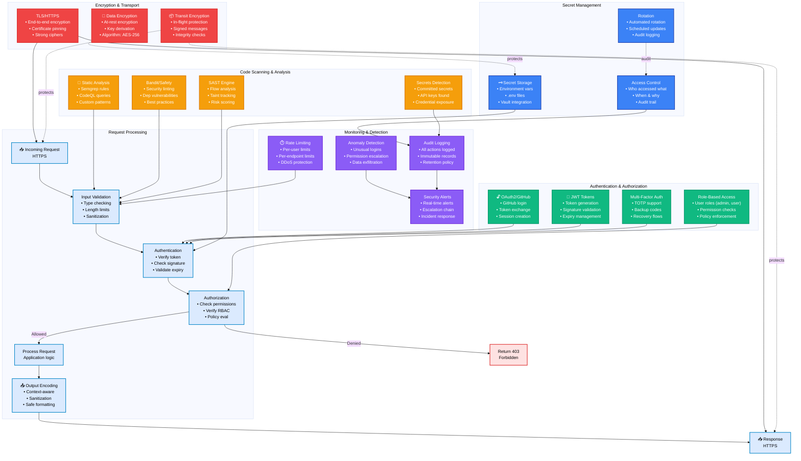

# Security Architecture
**Last Updated:** 2026-07-11
**Version:** v0.2.1

**Last Updated**: 2026-01-20
**Version**: v0.2.1
**Status**: Production-Ready
**CVEs Fixed**: 48

---

## Security Architecture Overview



---

## Security Components

### Authentication & Authorization

| Component | Purpose | Implementation |
|-----------|---------|-----------------|
| **OAuth2/GitHub** | Social login | GitHub OAuth provider |
| **JWT Tokens** | Session tokens | RSA-256 signed, 24hr expiry |
| **MFA** | Extra security layer | TOTP (Google Authenticator) |
| **RBAC** | Permission model | Role-based access control |

### Secret Management

| Component | Purpose | Tools |
|-----------|---------|-------|
| **Storage** | Keep secrets safe | Environment vars, .env, HashiCorp Vault |
| **Rotation** | Regular updates | Automated on schedule |
| **Access Control** | Audit who uses secrets | Detailed audit logs |

### Code Scanning

| Scanner | Focus | Integration |
|---------|-------|-------------|
| **Semgrep** | Custom rules | Pre-commit, CI/CD |
| **CodeQL** | Advanced analysis | GitHub Advanced Security |
| **Bandit** | Python security | pytest plugin |
| **Safety** | Dependency vulns | pip audit |
| **Secrets Scan** | Committed secrets | Pre-commit, GitHub |

### Encryption

| Type | Algorithm | Purpose |
|------|-----------|---------|
| **Transport** | TLS 1.3 | HTTPS connections |
| **At-Rest** | AES-256 | Database encryption |
| **Tokens** | RSA-2048 | JWT signatures |
| **Secrets** | AES-256-GCM | Secret storage |

### Monitoring & Detection

| Component | Coverage | Response |
|-----------|----------|----------|
| **Anomaly Detection** | Login patterns, permission changes | Automatic alert |
| **Rate Limiting** | Per-user, per-endpoint | 429 Too Many Requests |
| **Audit Logging** | Every action with context | Immutable, 1-year retention |
| **Alerts** | Real-time notifications | PagerDuty/Slack |

---

## Request Security Flow

```
1. Incoming HTTPS Request (TLS 1.3)
   ↓
2. Input Validation & Sanitization
   • Type checking
   • Length limits
   • Format validation
   ↓
3. Authentication
   • Extract JWT token
   • Verify signature
   • Check expiry
   • Rate limit check
   ↓
4. Authorization
   • Check user role
   • Verify permissions
   • Enforce RBAC policy
   ↓
5. Anomaly Detection
   • Check for suspicious patterns
   • Validate request context
   ↓
6. Process Request
   • Execute application logic
   • Log activity
   ↓
7. Output Encoding
   • Context-aware escaping
   • Safe serialization
   ↓
8. Response (TLS 1.3)
   • Encrypt response
   • Sign if needed
   • Send over HTTPS
```

---

## Vulnerability Management

### CVE Remediation (48 Fixed)

```mermaid
graph LR

    Discover[" Discover CVE"] -->|"Alert"| Assess[" Assess<br/>Severity: High"]

    Assess --> Patch[" Create Patch"]

    Patch --> Test[" Test Fix"]

    Test --> Review["👀 Code Review"]

    Review --> Merge[" Merge"]

    Merge --> Deploy[" Deploy"]

    Deploy --> Verify["✔️ Verify<br/>Fixed"]

    style Discover fill:#f59e0b,stroke:#d97706,stroke-width:2px
    style Assess fill:#f59e0b,stroke:#d97706,stroke-width:2px
    style Patch fill:#3b82f6,stroke:#1e40af,stroke-width:2px,color:#fff
    style Test fill:#10b981,stroke:#059669,stroke-width:2px,color:#fff
    style Review fill:#10b981,stroke:#059669,stroke-width:2px,color:#fff
    style Merge fill:#10b981,stroke:#059669,stroke-width:2px,color:#fff
    style Deploy fill:#10b981,stroke:#059669,stroke-width:2px,color:#fff
    style Verify fill:#10b981,stroke:#059669,stroke-width:2px,color:#fff
```



---

## Security Standards & Compliance

| Standard | Coverage | Status |
|----------|----------|--------|
| **OWASP Top 10** | XSS, CSRF, Injection | Mitigated |
| **CWE** | 25 most dangerous | Covered |
| **NIST Cybersecurity** | Core functions | Implemented |
| **GDPR** | Data privacy | Compliant |
| **SOC 2** | Security controls | Ready |

---

## Next Steps

- Review authentication implementation in the codebase
- Configure secret management according to your deployment environment
- Enable security scanning in your CI/CD pipeline
- Review incident response procedures

---

**Related Documentation**:
- [SECURITY.md](../SECURITY.md) - Security policy
- [5-Layer Architecture](../architecture/5_LAYER_ARCHITECTURE.md) - System architecture
- [Monitoring Architecture](../monitoring/MONITORING_ARCHITECTURE.md) - Observability
