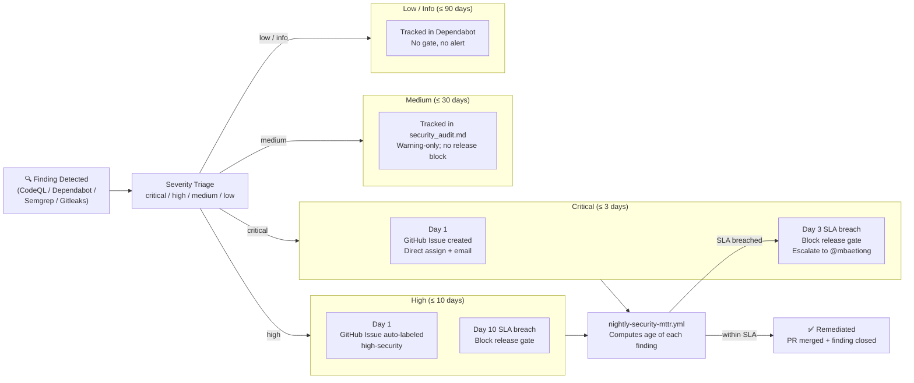

# Security Remediation SLA

**Owner**: `unified-security-scanner` (primary), `security-audit-agent` (backup)  
**Last updated**: 2026-05-27  
**Dashboard**: [`../../.codex/COMPLETION_DASHBOARD.md`](../../.codex/COMPLETION_DASHBOARD.md)  
**Tracking workflow**: [`.github/workflows/nightly-codeql-alert-triage.yml`](https://github.com/Aries-Serpent/_codex_/blob/main/.github/workflows/nightly-codeql-alert-triage.yml)

---

## Purpose

This document defines the mean-time-to-remediation (MTTR) SLA for all security findings
in the Codex platform.  Findings are discovered via CodeQL, Semgrep, Gitleaks, and
Dependabot. The nightly `nightly-codeql-alert-triage.yml` workflow computes and reports overdue findings,
and escalation/blocking is handled by the security notification/gating workflows.

---

## MTTR Escalation Flow



---

## SLA Tiers

| Severity | SLA | Block release if overdue? |
|----------|-----|--------------------------|
| **Critical** | ≤ 3 business days | ✅ Yes |
| **High** | ≤ 10 business days | ✅ Yes |
| **Medium** | ≤ 30 calendar days | ⚠️ Warning only |
| **Low / Info** | ≤ 90 calendar days | ❌ No |

Business days exclude weekends and public holidays (UTC calendar).

---

## MTTR Measurement

MTTR is calculated as:

```
MTTR = mean( dismissal_date - created_date )
```

Measured separately per severity tier.  Reported weekly in `reports/security/mttr_report.json`.

---

## Escalation

1. **Day 1**: Alert auto-created in GitHub Issues (label: `security:critical`) by `security-alert-notification.yml`.
2. **Day 2**: Slack/email escalation to domain owner (`@mbaetiong`) if unassigned.
3. **Day 3 (critical) / Day 10 (high)**: Automated release block via `security-alert-notification.yml`
   — sets `RELEASE_BLOCKED=true` in repo variable.

---

## Exceptions

Findings may be exempted with:
- Label `security:false-positive` + comment explaining why
- Documented in `docs/security/SUPPRESSIONS.md`
- Reviewed and counter-signed by a second maintainer

---

## Dependency Pinning

All direct dependencies must be pinned to a specific version or range in:
- `pyproject.toml` (Python)
- `package.json` / `package-lock.json` (Node)
- `Cargo.toml` / `Cargo.lock` (Rust)

Unpinned transitive deps are reviewed weekly via Dependabot.

CI gate: `security-scanning-suite.yml` → `dependency-review` job rejects PRs that
introduce new unpinned high-severity dependencies.

---

## Audit Schedule

| Activity | Cadence | Owner |
|----------|---------|-------|
| CodeQL scan | Every push + daily | `unified-security-scanner` |
| Semgrep scan | Every push + weekly | `unified-security-scanner` |
| Gitleaks secrets scan | Every push | `secret-detection-agent` | <!-- pragma: allowlist secret -->
| Dependabot review | Weekly | `dependency-security-review-agent` |
| MTTR burn-down review | Weekly (Monday) | `unified-security-scanner` |
| Full security audit | Quarterly | `security-audit-agent` |
