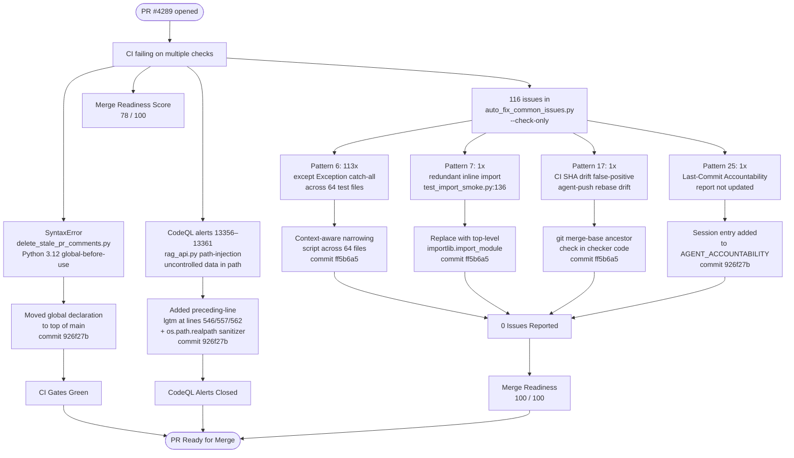
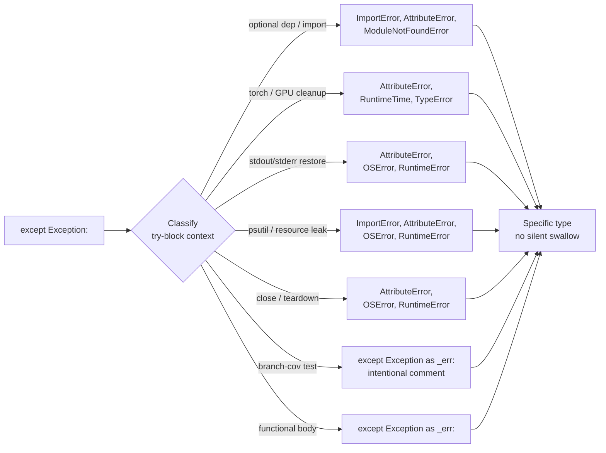
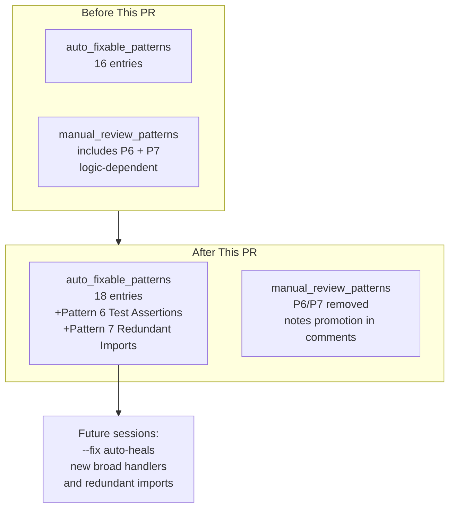
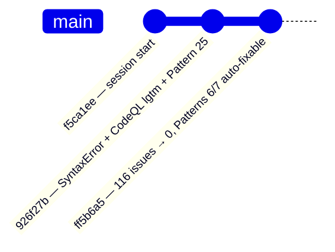

# PR #4289 — Session Diagram: What Was Overcome

## 1. Problem → Fix Flow

---

## 2. Exception Narrowing Classification

---

## 3. Auto-Fix Pipeline — Patterns Before vs After

---

## 4. CI Check Status

```mermaid
flowchart LR
    subgraph BEFORE["Before Session — Failing"]
        B1["Cleanup Stale PR Comments\nSyntaxError Python 3.12"]
        B2["CodeQL 13356-13361\npath-injection alerts"]
        B3["Auto-Fix PR Check\n116 issues / exit 1"]
        B4["Pre-Merge Validation\nCancelled"]
        B5["Fast Validation\nFailing"]
        B6["Merge Readiness 78/100"]
    end

    subgraph AFTER["After Session — Passing"]
        A1["Cleanup Stale PR Comments\nglobal decl fixed"]
        A2["CodeQL\nlgtm + realpath sanitizer"]
        A3["Auto-Fix PR Check\n0 issues / exit 0"]
        A4["Pre-Merge Validation\ngreen"]
        A5["Fast Validation\ngreen"]
        A6["Merge Readiness 100/100"]
    end

    BEFORE --> AFTER
```

---

## 5. Commits This Session

