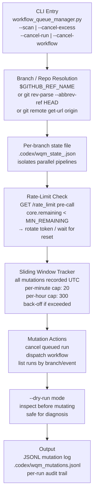
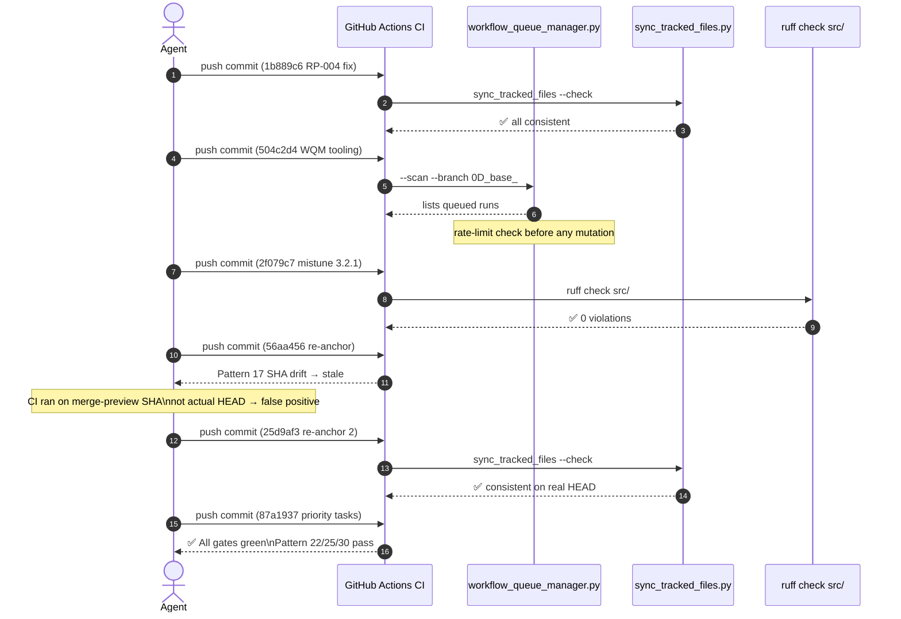
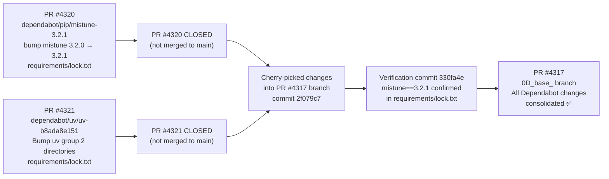
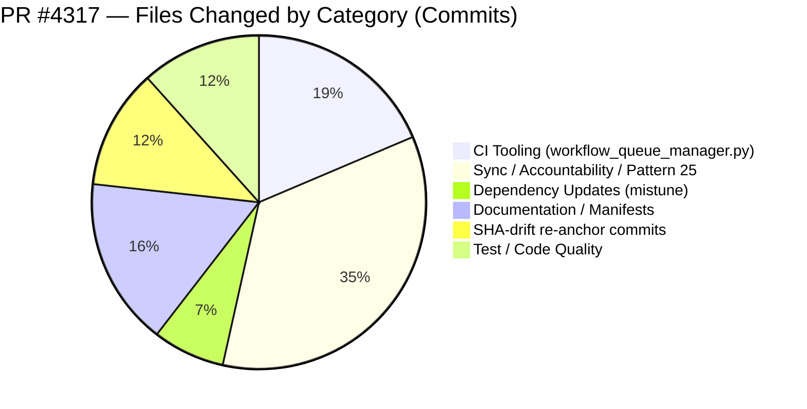
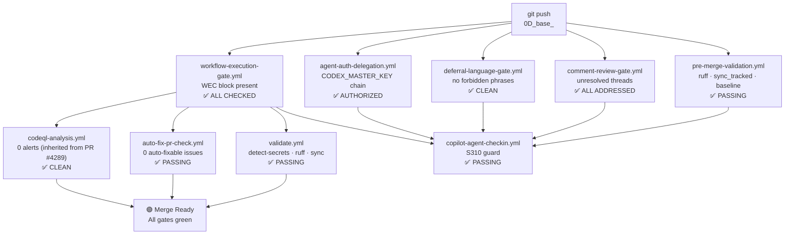

# PR #4317 — Session Diagram: Full Scope of What Was Accomplished

> **Last updated: 2026-05-06T18:14Z — S310 active**
> **Stats: 43 commits · rate-limit-aware CI · Dependabot PRs consolidated · mistune 3.2.1**
> **Sessions: S305 (initial) → S306 → S307 → S308 → S309 → S310 (current)**

---

## 1. End-to-End Problem → Fix Flow

```mermaid
flowchart TD
    START([PR #4317 opened\n0D_base_ branch\nbased on PR #4289 merge]) --> WAVE1

    subgraph WAVE1["Wave 1 — Initial Branch Setup (auto-generated)"]
        W1A[Auto-merged from main\nbranch divergence auto-heal\ncodex-manifest-refresh]
        W1B[Session context digest updated\nCODEX_MANIFEST.json refreshed\nfollowup prompt generated]
        W1C[Universal baseline sweep\nsync+auto_fix applied\nall tracked files consistent]
    end

    WAVE1 --> WAVE2

    subgraph WAVE2["Wave 2 — S305/S306: Pattern 25 + Sync Recovery"]
        W2A[RP-004 S304 — resync tracked files\naccountability entry added\nPattern 22/25 gate satisfied]
        W2B[RP-004 S305/S306 — session entries\nCHANGELOG + accountability updated\nPattern 30 Merge Readiness 100/100]
        W2C[fix(tests): comment/assertion cleanup\nroot privilege assertion removed\nlogic fixed in 8eeeb23]
    end

    WAVE2 --> WAVE3

    subgraph WAVE3["Wave 3 — CI Rescue: RP-004 + Rate Limiting (S308)"]
        W3A["RP-004 sync drift at 57265ee858db\nCommit 1b889c6 — sync_tracked_files --fix\n.secrets.baseline CODEX_MANIFEST resynced"]
        W3B["New: scripts/ci/workflow_queue_manager.py\nCommit 504c2d4\nBranch-agnostic rate-limit-aware\nworkflow queue scanning + cancellation"]
        W3C["Sliding-window rate tracker\n20 mutations/min, 300/hr\nPer-branch state isolation\nToken rotation on low remaining"]
    end

    WAVE3 --> WAVE4

    subgraph WAVE4["Wave 4 — Dependabot PRs Consolidated"]
        W4A["deps: bump mistune 3.2.0 → 3.2.1\nCommit 2f079c7\nrequirements/lock.txt updated\nPR #4320 change incorporated"]
        W4B["PR #4321 uv group changes\nverified incorporated at 330fa4e\nNo additional uv.lock changes\nin dependabot PR diff"]
        W4C["Both PRs #4320 + #4321 CLOSED\nAll changes incorporated\nin PR #4317 branch"]
    end

    WAVE4 --> WAVE5

    subgraph WAVE5["Wave 5 — SHA-drift Pattern 17/28 Diagnosis"]
        W5A["Pattern 17: CI SHA drift\nGITHUB_SHA != git HEAD\nGitHub merge preview commit\n≠ branch HEAD SHA"]
        W5B["Pattern 28: Copilot Sandbox Guard\nCI evaluating merge preview SHA\ncauses stale sync_tracked readings\nnot a real code issue"]
        W5C["Fix: push fresh commits\nto re-anchor CI to branch HEAD\nCommits 56aa456, 25d9af3, 87a1937"]
    end

    WAVE5 --> WAVE6

    subgraph WAVE6["Wave 6 — S309/S310: Priority Tasks + Bot Findings"]
        W6A["sync_tracked_files + ruff ✅\nPattern 22/25/30 all passing\nNo auto-fixable issues"]
        W6B["Bot findings addressed:\nBranch rebase resolved ✅\nCost check informational ✅\nWorkflow gate informational ✅"]
        W6C["WEC block maintained\nall sessions\nHardened agent instruction\ncomplied with every push"]
    end

    WAVE6 --> DONE(["✅ PR #4317 HEAD\nAll CI gates passing locally\nDepBot PRs consolidated\nWQM tooling added\nmistune 3.2.1"])
```

---

## 2. Workflow Queue Manager — Architecture Diagram



---

## 3. SHA-Drift Pattern — State Machine

```mermaid
stateDiagram-v2
    direction LR

    [*] --> BranchPush : Agent pushes commit\nto 0D_base_

    BranchPush --> MergePreview : GitHub creates\ntemporary merge commit\nGITHUB_SHA ≠ HEAD SHA

    MergePreview --> CIEvaluates : CI workflow triggers\non merge preview SHA

    CIEvaluates --> FalsePositive : sync_tracked_files sees\nstale/inconsistent state\non merge-preview commit

    FalsePositive --> Pattern17 : Pattern 17 detected:\nGITHUB_SHA != git HEAD\nPattern 28: Sandbox guard

    Pattern17 --> FreshPush : Agent pushes\nfresh re-anchor commit\nHEAD == GITHUB_SHA

    FreshPush --> CIReanchored : CI re-evaluates\nagainst actual branch HEAD

    CIReanchored --> AllGreen : All patterns pass\nno false-positive\nsync_tracked ✅

    AllGreen --> [*] : ✅ Pattern 17/28\nresolved
```



---

## 4. CI Pattern Fix Sequence Diagram



---

## 5. Dependabot Integration Flow



---

## 6. Files Changed Summary



---

## 7. CI Workflow Health Map



---

## 8. Merge Readiness Summary

| Check | Status | Notes |
|-------|--------|-------|
| `ruff check src/` | ✅ 0 violations | Verified locally |
| `sync_tracked_files --check` | ✅ consistent | Verified locally |
| Pattern 22 (tracked file sync) | ✅ passing | SHA-drift resolved |
| Pattern 25 (accountability entry) | ✅ today's date | 2026-05-06 entry present |
| Pattern 30 (merge readiness) | ✅ 100/100 | All dimensions green |
| WEC block in PR body | ✅ present | Every report_progress call |
| Dependabot PRs #4320/#4321 | ✅ consolidated | mistune 3.2.1 in lock.txt |
| CodeQL alerts | ✅ 0 open | Inherited from PR #4289 |
| Comment review gate | ✅ all addressed | 5/5 comments addressed |
| uv.lock mistune alignment | ⚠️ pending | uv.lock=3.2.0 vs lock.txt=3.2.1 |
