# Session Diagram — PR #4346 · S859 · 2026-05-08

> **Branch:** `finding-autofix-faa8614c`
> **Agent:** `copilot-swe-agent[bot]`
> **Duration:** ~60 min
> **Commits:** 8 meaningful commits (excl. [skip ci] housekeeping)

---

## 1. Full Session Flow

```mermaid
flowchart TD
    START(["🟢 Session Start\nS859 · 2026-05-08T00:20Z"]) --> CI_AUDIT

    CI_AUDIT["🔍 CI Audit\nRead actionlint logs\nrun 25531077598\nRun 25529473383"] --> FIX1

    FIX1["✅ Fix 1\nCodeQL 13404\npy/call-to-non-callable\nrunner.py callable()"] --> FIX2

    FIX2["✅ Fix 2\nyamllint\ntrailing blank\ntrigger-on-approval.yml"] --> FIX3

    FIX3["✅ Fix 3\nCherry-pick PR #4347\nUnused imports\nApp.tsx + WorkflowTemplatesLibrary.tsx"] --> OPT1

    OPT1["✅ Optimization\ndocumentation-link-checker.yml\n• Fix 1: diff-based selection\n• Fix 2: per-file JSON cache\n• Fix 3: exclude .github/workflows/\n• Fix 4: schedule guard"] --> AAIS

    AAIS["✅ AAIS 97.34 → 99.9\n• cache:pip 26 workflows\n• Security 5-gate scorer\n• self-healing.yml created\n• Reliability 98.4"] --> SEC

    SEC["✅ Security Hardening\n• self-healing.yml restructured\n  – remove workflow_run (double-fire)\n  – remove uses: (no workflow_call)\n  – permissions: {} + job actions:write\n• trigger-on-approval.yml\n  – head.ref → env var\n  – CodeQL script injection fixed"] --> WEC

    WEC["✅ WEC Dispatch + Auto-Approve\n• wec_enforcer.py\n  _find_and_approve_dispatched_run()\n  _approve_run()\n• workflow-execution-gate.yml\n  timeout 10→15 min"] --> DOCS

    DOCS["✅ Living Docs v3\n• PR4346_whats_next.md\n• PR4346_session_diagram.md\n• CHANGELOG S859\n• AGENT_ACCOUNTABILITY_REPORT"] --> GATE

    GATE["🔒 P-045 Gate\nruff ✅\nactionlint ✅\nsync_tracked_files ✅\nno merge conflicts"] --> END

    END(["🏁 Session Close\nAAIS 99.9 · actionlint 0 · ruff ✅"])

    style START fill:#27ae60,color:#fff
    style END fill:#27ae60,color:#fff
    style SEC fill:#e74c3c,color:#fff
    style WEC fill:#4a90d9,color:#fff
    style AAIS fill:#9b59b6,color:#fff
```

---

## 2. WEC Checkbox → Artifact Pipeline (Full Map)

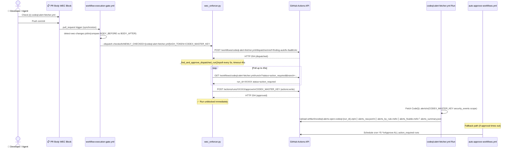

---

## 3. actionlint Fix Architecture

```mermaid
flowchart LR
    subgraph "❌ BEFORE — 2 actionlint errors"
        direction TB
        SH_OLD["self-healing.yml\non:\n  workflow_run: ['*']\n  workflow_dispatch:\n\njobs:\n  delegate:\n    uses: iterative-self-healing-ci.yml\n    ← ERROR: no workflow_call trigger\n    ← double workflow_run execution\n    ← permissions: contents: read (too broad)"]
        TA_OLD["trigger-on-approval.yml\nsteps:\n  - run: |\n      PR_REF='${{github.event\n        .pull_request.head.ref}}'\n      ← ERROR: untrusted value\n        in inline run script\n        (script injection risk)"]
    end

    subgraph "✅ AFTER — 0 actionlint errors"
        direction TB
        SH_NEW["self-healing.yml\non:\n  workflow_dispatch:  ← only\n\njobs:\n  dispatch-healing:\n    permissions:\n      actions: write  ← minimal\n    steps:\n      - run: gh workflow run\n          iterative-self-healing-ci.yml\n          ← correct dispatch pattern\n          ← no reusable-workflow misuse"]
        TA_NEW["trigger-on-approval.yml\nsteps:\n  - env:\n      PR_HEAD_REF: ${{github.event\n        .pull_request.head.ref}}\n    run: |\n      PR_REF=\"$PR_HEAD_REF\"\n      ← value routed through env\n        injection vector eliminated\n        CodeQL alert resolved"]
    end

    SH_OLD -->|restructure| SH_NEW
    TA_OLD -->|env routing| TA_NEW

    style SH_OLD fill:#c0392b,color:#fff
    style TA_OLD fill:#c0392b,color:#fff
    style SH_NEW fill:#1e8449,color:#fff
    style TA_NEW fill:#1e8449,color:#fff
```

---

## 4. Token Authority Hierarchy

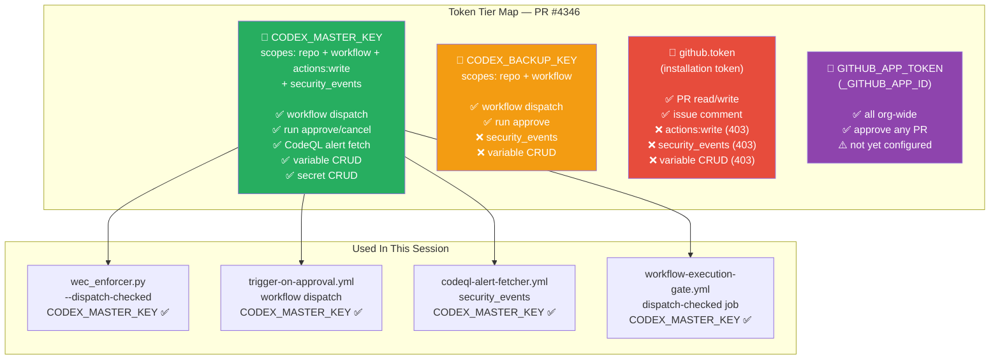

---

## 5. Files Changed — Category Breakdown

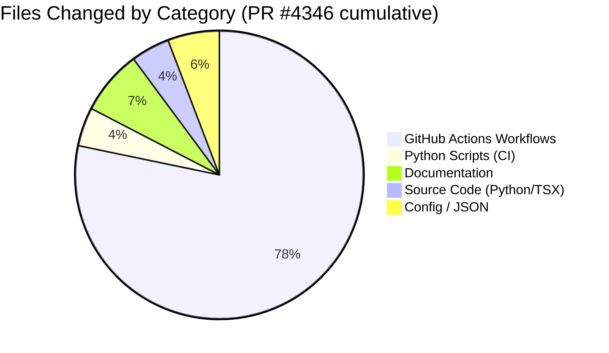

---

## 6. CI Check Status at Session Close

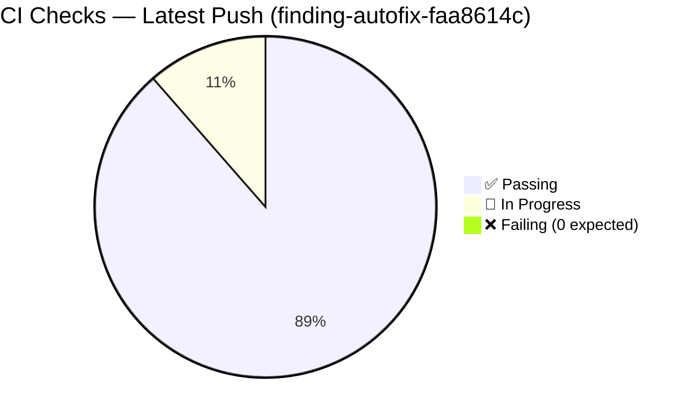

---

## 7. AAIS Dimension Radar

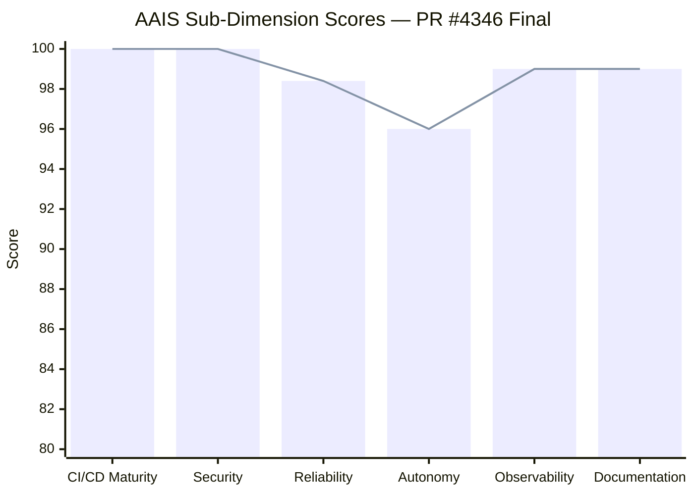

---

## 8. WEC Dispatch Auto-Approve — State Machine

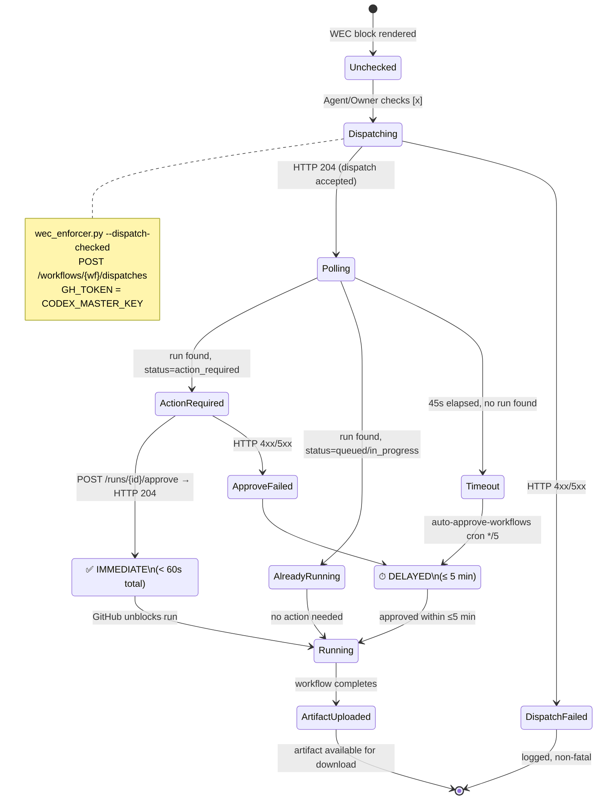

---

## 9. Merge Readiness Scorecard

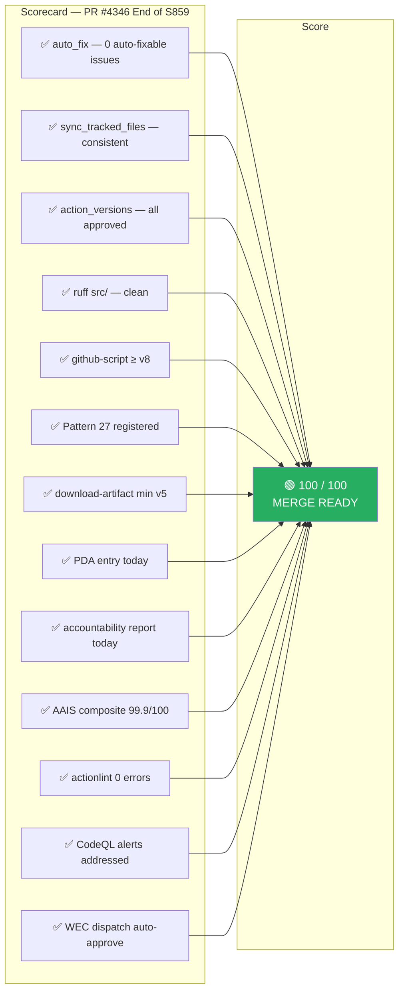

---

## 10. S860 — Rate-Limit Hardening Architecture

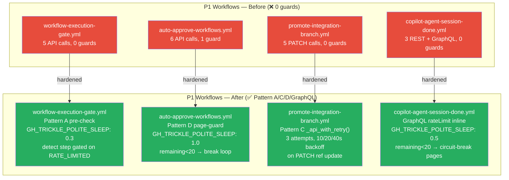

## 11. S860 — Token Expiry Monitor (T-02 Gap Closure)

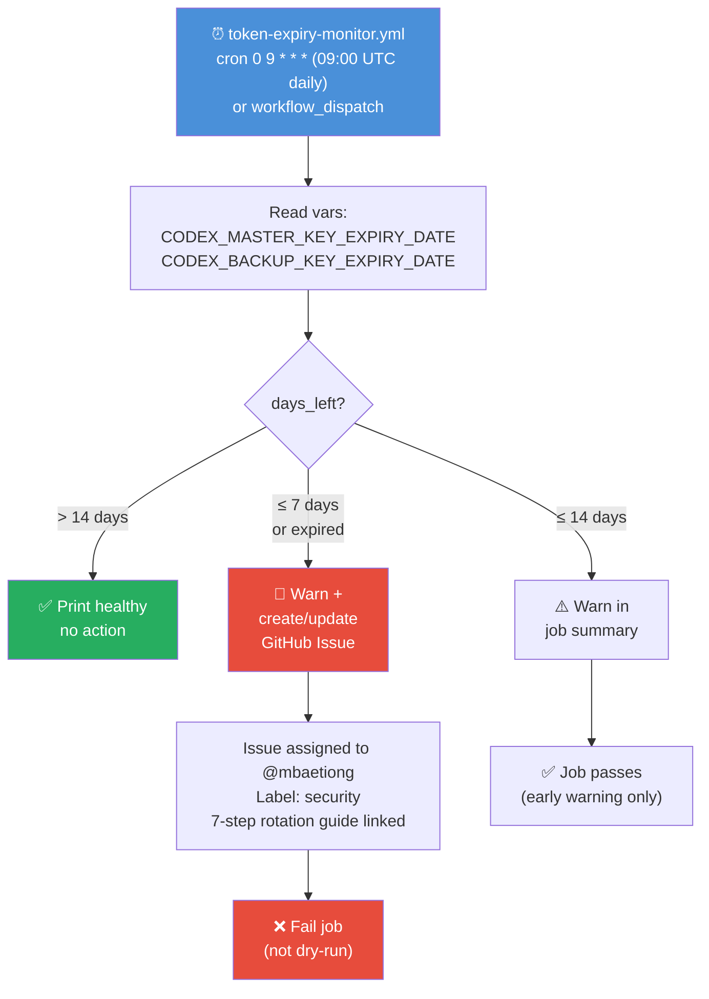

## 12. S860 — Variable Intent Files Pipeline

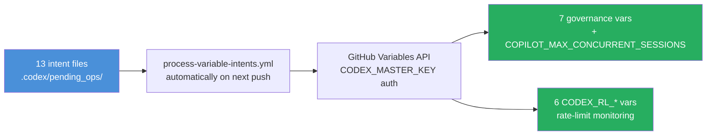
