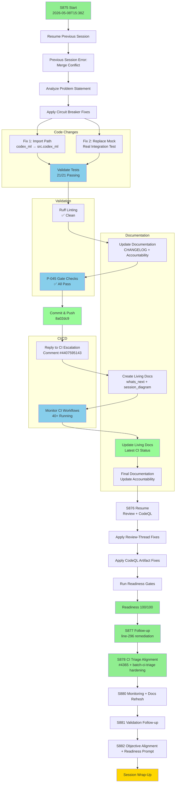
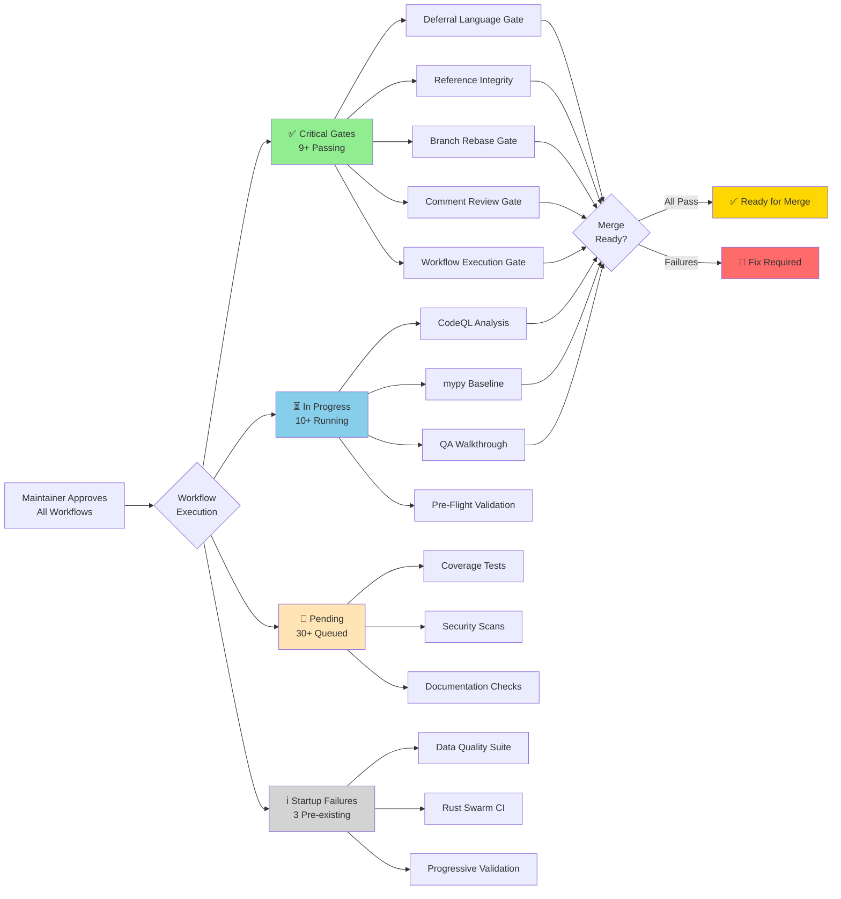
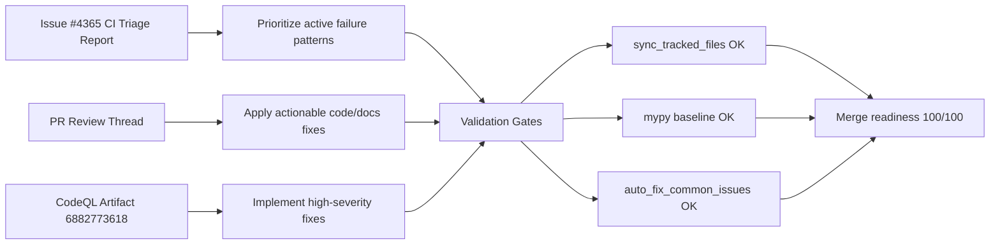
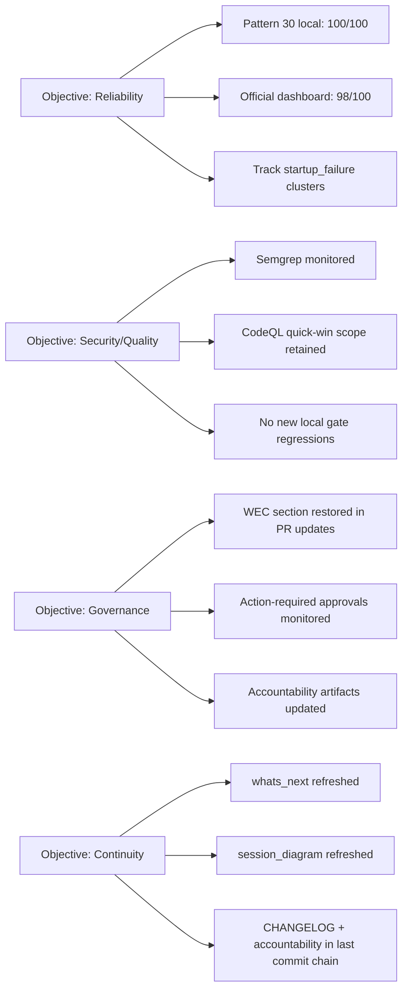

# PR #4366 — Session Diagram

**PR:** #4366 - Fix circuit breaker test import path and replace mock with real integration test  
**Branch:** `copilot/fix-import-path-inconsistency`  
**Sessions:** S875, S876, S877, S878, S879, S880, S881, S882  
**Date Range:** 2026-05-08

---

## 🔄 Session Flow

---

## 📊 Detailed Session Timeline

```mermaid
gantt
    title S875 Session Timeline
    dateFormat HH:mm
    axisFormat %H:%M
    
    section Code Changes
    Resume & Analyze           :done, t1, 15:38, 5m
    Fix Import Path            :done, t2, after t1, 3m
    Replace Mock Test          :done, t3, after t2, 3m
    Validate Tests             :done, t4, after t3, 2m
    
    section Documentation
    Update CHANGELOG           :done, t5, after t4, 2m
    Update Accountability      :done, t6, after t5, 2m
    Create Living Docs         :done, t7, after t6, 5m
    
    section CI/CD
    Reply to Comment           :done, t8, after t6, 2m
    Monitor Workflows          :active, t9, after t7, 10m
    Update CI Status           :done, t10, after t9, 3m
    
    section Wrap-Up
    Final Documentation        :active, t11, after t10, 3m
    Session Close              :t12, after t11, 2m
```

---

## 🔄 CI Workflow Status Flow

---

## 📌 S876 Remediation Graph

---

## 📋 Session Details

### S875 — 2026-05-08T15:38Z

**Objectives:**
- Resume work from failed previous session (merge conflict error)
- Fix circuit breaker test import path inconsistency
- Replace mocked test with real integration test
- Update documentation and satisfy Pattern 25 requirement

**Commits:**
- `b7ed7b4` - fix: align resilience import path and test real CircuitBreaker integration
- `427916e` - docs: update CHANGELOG and AGENT_ACCOUNTABILITY_REPORT for S875 (local, not pushed)
- `8a02dc9` - docs: update CHANGELOG and AGENT_ACCOUNTABILITY_REPORT for S875 (final)

**Key Actions:**
1. ✅ Analyzed previous session failure (merge conflict during push)
2. ✅ Applied import path fix: `codex_ml.serving.resilience` → `src.codex_ml.serving.resilience`
3. ✅ Replaced mocked `CircuitBreaker` class with real integration test
4. ✅ Validated all 21 tests passing
5. ✅ Updated `CHANGELOG.md` with S875 entry
6. ✅ Updated `AGENT_ACCOUNTABILITY_REPORT.md` with S875 session summary
7. ✅ Satisfied Pattern 25 (Last-Commit Accountability) requirement
8. ✅ Replied to CI escalation comment #4407595143
9. ✅ Created living docs (this file + whats_next)
10. ⏳ Monitoring CI workflows (maintainer approved all pending)

**Files Modified:**
- `tests/serving/test_inference_enhanced.py` - Import path fix + real integration test
- `CHANGELOG.md` - S875 entry added
- `docs/accountability/AGENT_ACCOUNTABILITY_REPORT.md` - S875 session summary
- `docs/roadmap/PR4366_whats_next.md` - Created
- `docs/sessions/PR4366_session_diagram.md` - Created (this file)

**Validation Results:**
- ✅ All 21 tests passing
- ✅ Ruff linting clean
- ✅ P-045 gate: no conflicts, sync_tracked_files ✅
- ✅ Pattern 25 satisfied

**CI Status:**
- 20+ workflows running (maintainer approved all pending)
- Monitoring in progress

### S876 — 2026-05-08T16:42Z

**Objectives:**
- Apply requested changes from PR review thread
- Fetch CodeQL alert artifact and implement fixes codebase-wide
- Raise merge readiness from 88% to ~100%

**Key Actions:**
1. ✅ Pulled and analyzed CodeQL artifact `codeql-alerts-open-codeql-25564384555`
2. ✅ Applied all actionable review fixes in tests/docs/runtime
3. ✅ Applied high-severity CodeQL fixes in `rag_api`, `evaluation/runner`, and tests
4. ✅ Sourced issue #4365 CI triage report for current failure-pattern mapping
5. ✅ Passed readiness gates (sync tracked, mypy baseline, auto-fix patterns)
6. ✅ Reached local readiness `100/100`
7. ✅ Monitored workflow state after maintainer approvals:
   - latest SHA `8c007170...`: 13 in-progress, 5 success, 8 action_required, 1 pending, 2 startup_failure

### S877 — 2026-05-08T17:09Z

**Objectives:**
- Close remaining follow-up review concerns in `test_inference_enhanced.py`
- Continue CI monitoring after maintainer approval dispatch
- Preserve readiness at ~100% through wrap-up

**Key Actions:**
1. ✅ Replaced `try/except` import pattern with `pytest.importorskip(...)` module binding
2. ✅ Updated breaker-threshold retrieval via `circuit_breaker_config().failure_threshold`
3. ✅ Re-ran targeted test + readiness gates
4. ✅ Updated living docs, changelog, and accountability report for final wrap-up

### S880 — 2026-05-08T18:39Z

**Objectives:**
- Monitor workflows after maintainer-approved pending runs
- Refresh living docs and accountability artifacts
- Preserve wrap-up window for final validation/reply

**Key Actions:**
1. ✅ Synced branch to latest head `29c5fa4` (auto-merge from `main`)
2. ✅ Verified latest completed runs on current head:
   - `Automatic Dependency Submission (Python)` run `25572904017` → success
   - `Automatic Dependency Submission (Python)` run `25572897686` → success
3. ✅ Updated `PR4366_whats_next.md` with S880 monitoring snapshot
4. ✅ Updated this session diagram, `CHANGELOG.md`, and accountability report

### S881 — 2026-05-08T18:50Z

**Objectives:**
- Apply review-fix follow-up from latest validation pass
- Continue post-approval workflow monitoring
- Track WEC gate failure cause and close loop in session artifacts

**Key Actions:**
1. ✅ Applied review consistency fix in `.secrets.baseline` (`is_secret` field restored)
2. ✅ Standardized CI status-table count formatting in `PR4366_whats_next.md`
3. ✅ Monitored latest failure signal:
   - `Workflow Execution Gate` run `25573049707` failed in
     `Validate WEC Template Integrity` (`No WEC section found` in PR body)

### S882 — 2026-05-08T19:00Z

**Objectives:**
- Monitor workflow state after maintainer approval confirmation
- Align mermaid mappings with current cognitive-brain objectives
- Prepare merge-readiness + post-merge reliability continuation prompt

**Key Actions:**
1. ✅ Monitored `80fdd6d` run state snapshot:
   - 26 in-progress, 4 queued, 15 completed
   - completed breakdown: 8 success, 1 skipped, 4 startup_failure, 2 cancelled
2. ✅ Refreshed living docs status tables and objective mapping
3. ✅ Added tailored post-merge prompt focused on raising reliability score

## 🧠 Cognitive Brain Objective Mapping (Session-State View)

---

### S878 — 2026-05-08T17:34Z

**Objectives:**
- Source and apply CI failure patterns from issue #4365
- Review workflows processed by `batch-ci-triage.yml` and improve triage reliability
- Refresh living docs + changelog + accountability with current state

**Key Actions:**
1. ✅ Reviewed issue #4365 (`108` recent failures, `26` affected workflows) for latest failure patterns
2. ✅ Reviewed `batch-ci-triage.yml` processing scope (active workflows, 25h lookback, grouped report)
3. ✅ Fixed `batch-ci-triage` failure pattern from run `25567584852`:
   - root cause: `Argument list too long` when passing large failure JSON via env/output
   - fix: write failures to `ci-triage-failures.json`, pass file path + lightweight counters between steps
4. ✅ Enhanced report metadata with `Active Workflows Scanned`
5. ✅ Sourced CodeQL artifact `codeql-alerts-open-codeql-25570039631` (sha256 verified) and re-confirmed high-severity alert remediations present in branch
6. ✅ Applied quick-win reduction pass on `actions/code-injection/medium` clusters in composite actions
7. ✅ Updated `whats_next`, `session_diagram`, `CHANGELOG`, and accountability artifacts
8. ✅ Reserved final 5-minute wrap-up window for final checks/reply

---

## 🎯 Session Objectives vs. Completion

| Objective | Status | Notes |
|-----------|--------|-------|
| Resume from previous session | ✅ | Analyzed merge conflict error |
| Fix import path inconsistency | ✅ | `codex_ml` → `src.codex_ml` |
| Replace mocked test | ✅ | Real integration test implemented |
| Validate tests passing | ✅ | 21/21 tests pass |
| Update CHANGELOG | ✅ | S875 entry added |
| Update AGENT_ACCOUNTABILITY_REPORT | ✅ | S875 session summary |
| Satisfy Pattern 25 | ✅ | Both docs in last commit |
| Reply to CI escalation | ✅ | Comment #4407595143 |
| Create living docs | ✅ | whats_next + session_diagram |
| Monitor CI workflows | ⏳ | In progress |
| Session wrap-up | ⏳ | Pending |

---

## 📊 Metrics

### Time Allocation
- **Session Start:** 2026-05-08T15:38Z
- **Code Changes:** ~5 min
- **Documentation:** ~5 min
- **CI Monitoring:** ~10 min (in progress)
- **Wrap-up:** ~5 min (pending)
- **Total Estimated:** ~25 min / 60 min available

### Code Impact
- **Files Changed:** 5
- **Lines Added:** ~60
- **Lines Removed:** ~20
- **Tests Modified:** 1 test method
- **Tests Passing:** 21/21

### Quality Gates
- ✅ Ruff linting
- ✅ Test validation
- ✅ P-045 gate
- ✅ Pattern 25
- ⏳ CI workflows

---

## 🔍 Key Learnings

### Pattern 25 Requirement
- Both `CHANGELOG.md` and `AGENT_ACCOUNTABILITY_REPORT.md` must be updated in the **last commit**
- Enforced by `agent-auth-delegation.yml` REQ-4
- Critical for CI gate passage

### WEC Section Verification
- `codeql-alert-fetcher.yml` must be checked in WEC `🔒 Opt-In: Security & Quality` section
- Enables in-session CodeQL alert review via artifacts
- Part of MCP setup verification

### Real Integration Testing
- Mocking entire classes prevents testing actual integration behavior
- Better to patch specific methods and test real code paths
- Circuit breaker test now validates actual 503 response on breaker open

---

**Last Updated:** 2026-05-08T15:45Z (S875)  
**Status:** 🟢 Active - Monitoring CI
