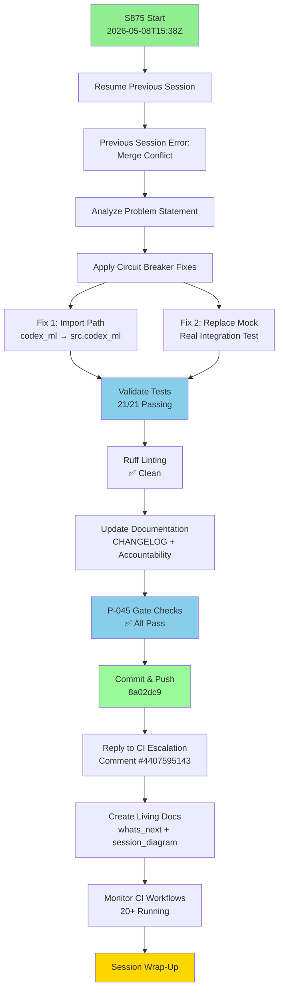

# PR #4366 — Session Diagram

**PR:** #4366 - Fix circuit breaker test import path and replace mock with real integration test  
**Branch:** `copilot/fix-import-path-inconsistency`  
**Sessions:** S875  
**Date Range:** 2026-05-08

---

## 🔄 Session Flow

---

## 📋 Session Details

### S875 — 2026-05-08T15:38Z

**Objectives:**
- Resume work from failed previous session (merge conflict error)
- Fix circuit breaker test import path inconsistency
- Replace mocked test with real integration test
- Update documentation and satisfy Pattern 25 requirement

**Commits:**
- `b7ed7b4` - fix: align resilience import path and test real CircuitBreaker integration
- `427916e` - docs: update CHANGELOG and AGENT_ACCOUNTABILITY_REPORT for S875 (local, not pushed)
- `8a02dc9` - docs: update CHANGELOG and AGENT_ACCOUNTABILITY_REPORT for S875 (final)

**Key Actions:**
1. ✅ Analyzed previous session failure (merge conflict during push)
2. ✅ Applied import path fix: `codex_ml.serving.resilience` → `src.codex_ml.serving.resilience`
3. ✅ Replaced mocked `CircuitBreaker` class with real integration test
4. ✅ Validated all 21 tests passing
5. ✅ Updated `CHANGELOG.md` with S875 entry
6. ✅ Updated `AGENT_ACCOUNTABILITY_REPORT.md` with S875 session summary
7. ✅ Satisfied Pattern 25 (Last-Commit Accountability) requirement
8. ✅ Replied to CI escalation comment #4407595143
9. ✅ Created living docs (this file + whats_next)
10. ⏳ Monitoring CI workflows (maintainer approved all pending)

**Files Modified:**
- `tests/serving/test_inference_enhanced.py` - Import path fix + real integration test
- `CHANGELOG.md` - S875 entry added
- `docs/accountability/AGENT_ACCOUNTABILITY_REPORT.md` - S875 session summary
- `docs/roadmap/PR4366_whats_next.md` - Created
- `docs/sessions/PR4366_session_diagram.md` - Created (this file)

**Validation Results:**
- ✅ All 21 tests passing
- ✅ Ruff linting clean
- ✅ P-045 gate: no conflicts, sync_tracked_files ✅
- ✅ Pattern 25 satisfied

**CI Status:**
- 20+ workflows running (maintainer approved all pending)
- Monitoring in progress

---

## 🎯 Session Objectives vs. Completion

| Objective | Status | Notes |
|-----------|--------|-------|
| Resume from previous session | ✅ | Analyzed merge conflict error |
| Fix import path inconsistency | ✅ | `codex_ml` → `src.codex_ml` |
| Replace mocked test | ✅ | Real integration test implemented |
| Validate tests passing | ✅ | 21/21 tests pass |
| Update CHANGELOG | ✅ | S875 entry added |
| Update AGENT_ACCOUNTABILITY_REPORT | ✅ | S875 session summary |
| Satisfy Pattern 25 | ✅ | Both docs in last commit |
| Reply to CI escalation | ✅ | Comment #4407595143 |
| Create living docs | ✅ | whats_next + session_diagram |
| Monitor CI workflows | ⏳ | In progress |
| Session wrap-up | ⏳ | Pending |

---

## 📊 Metrics

### Time Allocation
- **Session Start:** 2026-05-08T15:38Z
- **Code Changes:** ~5 min
- **Documentation:** ~5 min
- **CI Monitoring:** ~10 min (in progress)
- **Wrap-up:** ~5 min (pending)
- **Total Estimated:** ~25 min / 60 min available

### Code Impact
- **Files Changed:** 5
- **Lines Added:** ~60
- **Lines Removed:** ~20
- **Tests Modified:** 1 test method
- **Tests Passing:** 21/21

### Quality Gates
- ✅ Ruff linting
- ✅ Test validation
- ✅ P-045 gate
- ✅ Pattern 25
- ⏳ CI workflows

---

## 🔍 Key Learnings

### Pattern 25 Requirement
- Both `CHANGELOG.md` and `AGENT_ACCOUNTABILITY_REPORT.md` must be updated in the **last commit**
- Enforced by `agent-auth-delegation.yml` REQ-4
- Critical for CI gate passage

### WEC Section Verification
- `codeql-alert-fetcher.yml` must be checked in WEC `🔒 Opt-In: Security & Quality` section
- Enables in-session CodeQL alert review via artifacts
- Part of MCP setup verification

### Real Integration Testing
- Mocking entire classes prevents testing actual integration behavior
- Better to patch specific methods and test real code paths
- Circuit breaker test now validates actual 503 response on breaker open

---

**Last Updated:** 2026-05-08T15:45Z (S875)  
**Status:** 🟢 Active - Monitoring CI
