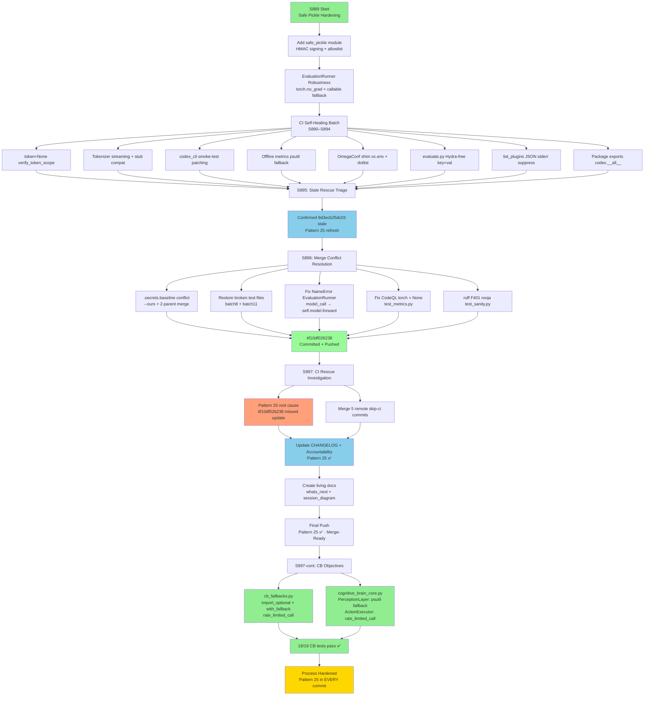

# PR #4368 — Session Diagram

**PR:** #4368 - Harden safe pickle imports, fix EvaluationRunner NameError, CodeQL fix, merge conflict resolution, CI self-healing
**Branch:** `copilot/update-safe-pickle-import`
**Sessions:** S889, S890, S891, S892, S893, S894, S895, S896, S897
**Date Range:** 2026-05-09

---

## 🔄 Session Flow

---

## 📊 Key Metrics per Session

| Session | Commits | Key Deliverable | Pattern 25 |
|---------|---------|-----------------|------------|
| S889 | safe_pickle + EvalRunner | Core hardening | ✅ |
| S890–S894 | CI self-healing batch | 8 compatibility fixes | ✅ |
| S895 | Stale triage + accountability | Confirmed stale failure | ✅ |
| S896 | Merge conflict + CodeQL | NameError + CodeQL + tests restored | ⚠️ Commit `4f10df026238` missed CHANGELOG/accountability update (Pattern 25 violation) → auto-fix workflow triggered failure |
| S897 | CI rescue + living docs | Pattern 25 restored, docs created | ✅ |

---

## 🔑 Critical Fixes Summary

| Fix | File | Issue |
|-----|------|-------|
| NameError in forward branch | `src/codex_ml/evaluation/runner.py` | `model_call` undefined in `elif forward` |
| CodeQL uninit variable | `tests/evaluation/test_metrics.py` | `torch` used before assignment |
| Merge conflict | `.secrets.baseline` | Resolved with `--ours` (P-045) |
| Syntax error (automated commit) | `tests/agents/test_phase2_deep_coverage_batch8.py` | Unclosed list literal |
| Syntax error (automated commit) | `tests/agents/test_phase2_deep_coverage_batch11.py` | Unexpected indent |
| ruff F401 | `tests/unit/test_sanity.py` | `# noqa: F401` added |
