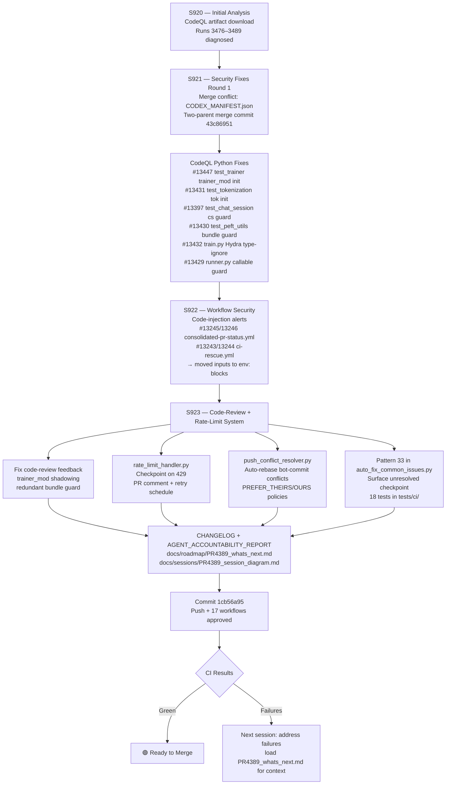

# PR #4389 — Session Diagram

**PR:** [#4389](https://github.com/Aries-Serpent/_codex_/pull/4389)
**Branch:** `copilot/add-full-path-to-init-tracing-docs`
**Sessions:** S920–S923
**Date Range:** 2026-05-10 → 2026-05-11

---

## 🔄 Session Flow

---

## 🔍 Root Cause Analysis — 10 Failed Agent Sessions

```mermaid
graph LR
    A[PR #4379 merged<br/>2026-05-10T02:31Z] --> B[PR #4389 created<br/>branch: add-full-path-to-init-tracing-docs]
    B --> C[Run #3476 — 23:53Z<br/>Session starts on add-logging branch]
    C -->|429 rate limit| D[Run #3477 — 00:41Z<br/>Immediate retry]
    D -->|429| E[Run #3478 — 00:54Z]
    E -->|429| F[Run #3479 — 01:09Z]
    F -->|429| G[Runs 3480–3483<br/>~15 min each, all 429]
    G -->|~15h gap reset| H[Run #3486 — 17:13Z<br/>New branch, push conflict]
    H -->|bot commits diverged branch| I[Run #3489 — 17:47Z<br/>push conflict again]
    I --> J[S923: Build recovery system<br/>rate_limit_handler.py<br/>push_conflict_resolver.py]
```

### Failure Mode Breakdown

| Run | Branch | Failure Mode | Bot Commits During Session |
|-----|--------|-------------|---------------------------|
| 3476–3483 | `add-logging-for-exception-handler` | 429 weekly rate limit (cascade) | chore(d00), chore(auth), chore(manifest) × multiple |
| 3486 | `add-full-path-to-init-tracing-docs` | Push conflict (bot commits) | fix(ci): universal baseline sweep |
| 3489 | `add-full-path-to-init-tracing-docs` | Push conflict (bot commits) | fix(ci): universal baseline sweep |

---

## 📦 Deliverables — PR #4389 (S920–S923)

| Category | Item | Status |
|----------|------|--------|
| Security | 6 CodeQL Python error-level alerts | ✅ Fixed |
| Security | 4 CodeQL Actions code-injection alerts | ✅ Fixed |
| Conflict | CODEX_MANIFEST.json merge conflict | ✅ Resolved |
| Code quality | trainer_mod shadowing + bundle guard | ✅ Fixed |
| Resilience | `rate_limit_handler.py` | ✅ Created |
| Resilience | `push_conflict_resolver.py` | ✅ Created |
| Resilience | Pattern 33 in auto_fix_common_issues | ✅ Added |
| Resilience | `docs/ops/RATE_LIMIT_RECOVERY.md` | ✅ Created |
| Tests | `tests/ci/test_rate_limit_handler.py` (18 tests) | ✅ Created |
| Docs | `PR4389_whats_next.md` | ✅ Created |
| Docs | `PR4389_session_diagram.md` | ✅ Created |
