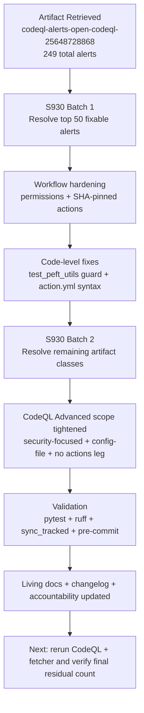

# PR #4393 — Session Diagram

## Session Notes

- Main artifact target: `codeql-alerts-open-codeql-25648728868`
- Digest: `sha256:9ab2851104147588b9abb2f47eaf550e0a7286a84945600417b947724c34cd33`
- Session focus: explicit remediation of the full 249-alert scope in this active PR.
