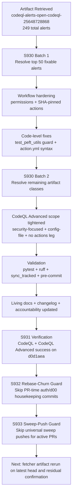

# PR #4393 — Session Diagram

## Session Notes

- Main artifact target: `codeql-alerts-open-codeql-25648728868`
- Digest: `sha256:9ab2851104147588b9abb2f47eaf550e0a7286a84945600417b947724c34cd33`
- Session focus: explicit remediation of the full 249-alert scope in this active PR.
- S931 verified CI posture:
    - CodeQL runs green (`25649802257`, `25649802298`) for remediation commit `d0d1aea`.
    - Optional high-cost suites reported `startup_failure` with zero jobs (infra/startup-state, not code failures).
- S932 process hardening:
    - `agent-auth-delegation.yml` now skips PR-time housekeeping commits that previously caused repeated branch divergence/rebases.
- S933 process hardening:
    - `iterative-self-healing-ci.yml` now defers sweep pushes on active `copilot/*` branches and on protected branches while open PRs exist.
