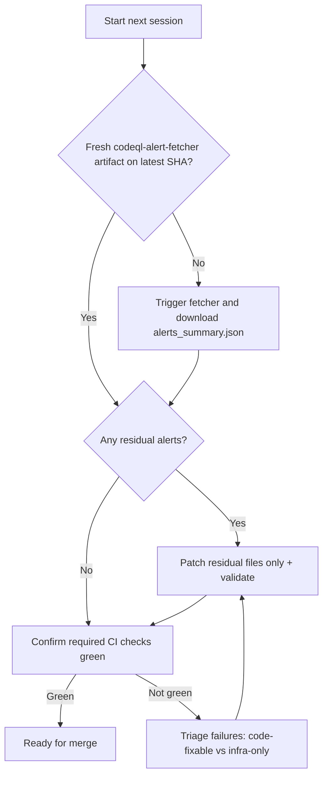

# PR #4393 — Session Diagram

```mermaid
graph TD
  A[Artifact Retrieved<br/>codeql-alerts-open-codeql-25648728868<br/>249 total alerts] --> B
  B[S930 Batch 1<br/>Resolve top 50 fixable alerts] --> C
  C[Workflow hardening<br/>permissions + SHA-pinned actions] --> D
  D[Code-level fixes<br/>test_peft_utils guard + action.yml syntax] --> E
  E[S930 Batch 2<br/>Resolve remaining artifact classes] --> F
  F[CodeQL Advanced scope tightened<br/>security-focused + config-file + no actions leg] --> G
  G[Validation<br/>pytest + ruff + sync_tracked + pre-commit] --> H
  H[Living docs + changelog + accountability updated] --> I
  I[S931 Verification<br/>CodeQL + CodeQL Advanced success on d0d1aea] --> J
  J[S932 Rebase-Churn Guard<br/>Skip PR-time auth/d00 housekeeping commits] --> K
  K[S933 Sweep-Push Guard<br/>Skip universal sweep pushes for active PRs] --> L
  L[S934 Monitoring Pass<br/>Head 5e6a479 workflow snapshot captured] --> M
  M[S935 Reviewer-Thread Fixes<br/>permissions + guard naming + followup prompt accuracy] --> N
  N[S936 Auto-Approve Hardening<br/>high-volume + active-copilot triggers] --> O
  O[Next: fetcher artifact rerun on latest head and residual confirmation]
```

## Session Notes

- Main artifact target: `codeql-alerts-open-codeql-25648728868`
- Digest: `sha256:9ab2851104147588b9abb2f47eaf550e0a7286a84945600417b947724c34cd33`
- Session focus: explicit remediation of the full 249-alert scope in this active PR.
- S931 verified CI posture:
    - CodeQL runs green (`25649802257`, `25649802298`) for remediation commit `d0d1aea`.
    - Optional high-cost suites reported `startup_failure` with zero jobs (infra/startup-state, not code failures).
- S932 process hardening:
    - `agent-auth-delegation.yml` now skips PR-time housekeeping commits that previously caused repeated branch divergence/rebases.
- S933 process hardening:
    - `iterative-self-healing-ci.yml` now defers sweep pushes on active `copilot/*` branches and on protected branches while open PRs exist.
- S934 monitoring snapshot (head `5e6a479`):
    - 12 success, 9 in_progress, 4 action_required, 4 cancelled, 1 skipped.
- S935 verification snapshot:
    - Reviewer thread `4260812198` requested updates were applied.
    - Dependency-submission run `25649801454` failure was followed by successful rerun state on `25650141042` (`submit-dependency-snapshot` success).
- S936 active-session hardening:
    - Auto-approve now escalates during active Copilot session events (`requested` / `in_progress`) and can monitor a full 60-minute window to verify no workflow failures.
- Post-approval live status on `ed6fb33`:
    - 12 in-progress runs, 8 pending, 7 queued; 3 startup-failure runs (infra/startup class) observed in heavy optional suites.
- Continuation readiness:
    - `.codex/FOLLOWUP_PROMPT_CODEQL_REMAINING_25648728868.md` refreshed for next-session final CodeQL/security verification.

---

## Failure Mode Breakdown (adopted from prior PR handoff pattern)

| Signal | Observed Run(s) | Classification | Mitigation |
|--------|------------------|----------------|------------|
| `startup_failure` with zero jobs | `25649802340`, `25649802349`, `25649802378` | Infra/startup-level (not code regression) | Monitor only; do not treat as code-fixable failure |
| Repeated branch divergence from housekeeping commits | recurring `chore(auth)` + `chore(d00)` commits | Process conflict / merge-churn | S932 guard in `agent-auth-delegation.yml` |
| Sweep-driven merge conflicts during active PRs | `fix(ci): universal baseline sweep` branch pushes | Process conflict / merge-churn | S933 guard in `iterative-self-healing-ci.yml` |

---

## Next-Session Decision Flow

