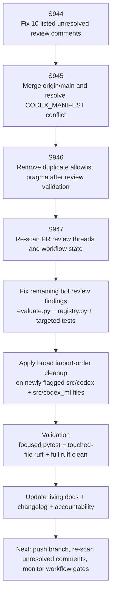
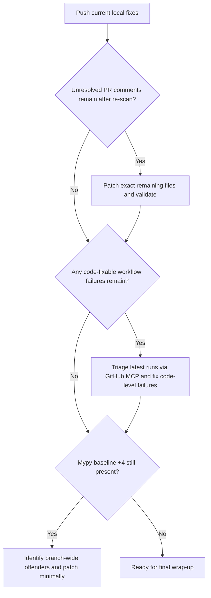

# PR #4395 — Session Diagram

## Session Notes

- Current remote head before next push: `649298f6`.
- Maintainer-directed priority remained:
  - clear all unanswered comments,
  - clear merge-conflict state,
  - address current code-quality/security findings,
  - keep living docs current.
- GitHub MCP confirmed the currently visible `startup_failure` runs have **zero jobs**, which classifies them as startup/infra-state rather than code-test regressions.
- Focused mypy on touched files is clean; the branch-wide mypy baseline still reports `+4` beyond baseline and should be re-checked after the next push.

---

## Failure Mode Breakdown

| Signal | Classification | Action |
|--------|----------------|--------|
| `startup_failure` with zero jobs | Infra/startup-state | Monitor only; do not treat as direct code failure |
| Unresolved inline review comments on changed lines | Code-fixable | Patch file, validate locally, push for re-scan |
| `action_required` workflow outcomes | Approval/delegation state | Monitor after next push / approval cycle |
| Branch-wide mypy `+4` over baseline | Needs follow-up triage | Re-check after push to confirm whether it is still attributable to current branch state |

---

## Next-Session Decision Flow

