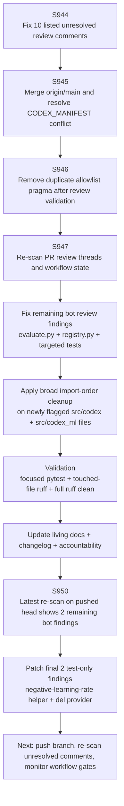
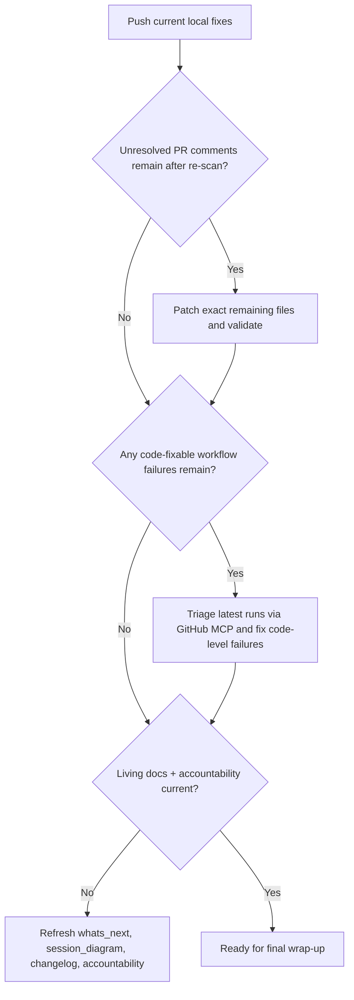

# PR #4395 — Session Diagram

## Session Notes

- Current pushed head before this local patch: `b01aa0d`.
- Maintainer-directed priority remained:
  - clear all unanswered comments,
  - clear merge-conflict state,
  - address current code-quality/security findings,
  - keep living docs current.
- GitHub MCP confirmed the currently visible `startup_failure` runs have **zero jobs**, which classifies them as startup/infra-state rather than code-test regressions.
- Focused mypy on touched files is clean; branch-wide `mypy_baseline.py --require-baseline` also passed after the S949 hygiene sweep.
- Latest re-scan on `b01aa0d` showed only 2 unresolved review findings, both in tests and both addressed in the current local patch.

---

## Failure Mode Breakdown

| Signal | Classification | Action |
|--------|----------------|--------|
| `startup_failure` with zero jobs | Infra/startup-state | Monitor only; do not treat as direct code failure |
| Unresolved inline review comments on changed lines | Code-fixable | Patch file, validate locally, push for re-scan |
| `action_required` / queued workflow outcomes | Approval/delegation / queue state | Monitor after next push / approval cycle |
| Residual test-only inline review findings | Code-fixable | Apply smallest local fix, validate, push for re-scan |

---

## Next-Session Decision Flow

