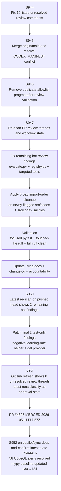
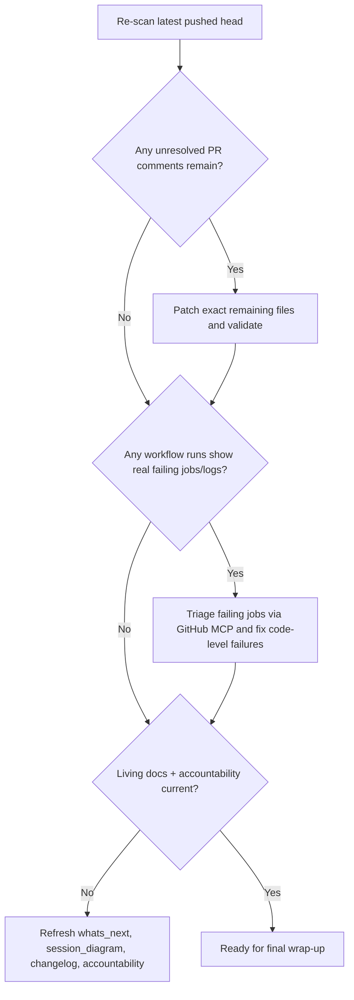

# PR #4395 — Session Diagram (archived — PR merged 2026-05-11T17:57Z)

> **Status: MERGED** by @mbaetiong · Continuation work on `copilot/sync-docs-and-confirm-latest-state` (PR #4416)

## Session Notes

- Current pushed head: `679a1d3`.
- Maintainer-directed priority remained:
  - clear all unanswered comments,
  - clear merge-conflict state,
  - address current code-quality/security findings,
  - keep living docs current.
- GitHub MCP confirmed the currently visible `startup_failure` runs have **zero jobs**, which classifies them as startup/infra-state rather than code-test regressions.
- Focused mypy on touched files is clean; branch-wide `mypy_baseline.py --require-baseline` also passed after the S949 hygiene sweep.
- Latest re-scan on `679a1d3` shows 0 unresolved review findings after GitHub refresh.
- Current non-success workflow runs on `679a1d3` are `action_required` approval-state runs; sampled opt-in runs in this class currently have zero jobs, so they do not indicate code-test failure.

---

## Failure Mode Breakdown

| Signal | Classification | Action |
|--------|----------------|--------|
| `startup_failure` with zero jobs | Infra/startup-state | Monitor only; do not treat as direct code failure |
| Unresolved inline review comments on changed lines | Code-fixable | Patch file, validate locally, push for re-scan |
| `action_required` workflow outcomes with zero jobs | Approval/delegation state | Monitor only; not a code-fixable failure unless a later run produces failing jobs/logs |
| Unresolved inline review findings | Code-fixable | Now cleared on latest refresh |

---

## Next-Session Decision Flow

