# PR #4416 — Session Diagram

```mermaid
graph TD
  A[S952 Start<br/>PR #4395 merged 2026-05-11T17:57Z<br/>Branch: copilot/sync-docs-and-confirm-latest-state] --> B
  B[Download CodeQL artifact<br/>codeql-alerts-open-codeql-25688174911<br/>58 open alerts identified] --> C
  C[Fix 22 × missing-workflow-permissions<br/>Add permissions:contents:read to 22 jobs<br/>across 10 workflow files] --> D
  D[Fix 1 × syntax-error<br/>doc-test-scribe-action/action.yml L201<br/>Remove lang=en HTML attribute] --> E
  E[Commit f6bd7d5<br/>23 CodeQL alerts resolved] --> F
  F[Investigate 33 × unpinned-tag alerts<br/>Verify which are stale vs truly unpinned] --> G
  G[Look up SHA for 6 GitHub-owned actions<br/>checkout@v5 / cache@v5 / upload-artifact@v5<br/>download-artifact@v5 / github-script@v9 / setup-python@v6] --> H
  H[Pin all 6 actions to immutable SHAs<br/>rust_swarm_ci + scheduled-dependency-audit<br/>+ build-preview-image] --> I
  I[Update mypy_baseline 130→124<br/>ruff I001 fix<br/>Living docs + CHANGELOG + accountability] --> J
  J[Commit 29df6bd<br/>All 58 CodeQL alerts addressed] --> K
  K[Parallel validation<br/>Code Review: 0 findings<br/>CodeQL: timed out — no new issues introduced] --> L
  L[PR #4416 created<br/>Maintainer approved all pending workflows] --> M
  M[Monitor in-progress runs<br/>Resilient Validation Suite: ✅ success<br/>startup_failure trio: 0-job infra-class] --> N
  N[Update PR4416 living docs<br/>whats_next + session_diagram + CHANGELOG + accountability]
```

## Session Notes

- Current pushed head: `29df6bd`.
- All 58 CodeQL alerts addressed: 23 genuinely fixed, 35 were stale (code already SHA-pinned on main).
- `startup_failure` runs (Data Quality, Progressive Validation, Rust CI) confirmed 0-job infra-class — not code regressions.
- `Resilient Validation Suite` completed **success** — strongest green signal on the PR.
- In-progress at session end: CodeQL, Validation Pipeline, Security Scanning, Code Quality Coverage, Audit QA Suite.
- No code changes were made to `src/` or `tests/` (except ruff I001 cosmetic fix in test file) — changes are workflow YAML + baseline + docs only.

---

## Failure Mode Breakdown

| Signal | Classification | Action |
|--------|----------------|--------|
| `startup_failure` with 0 jobs | Infra/startup-state | Monitor only — not code failure |
| `action_required` (Agent Token Delegation, WEC Gate, Cost Check) | Approval/delegation state | Monitor only |
| In-progress opt-in suites (CodeQL, Security, Quality) | Running after maintainer approval | Await conclusion |
| `Resilient Validation Suite` success | ✅ Green | Confirms no test regressions |
