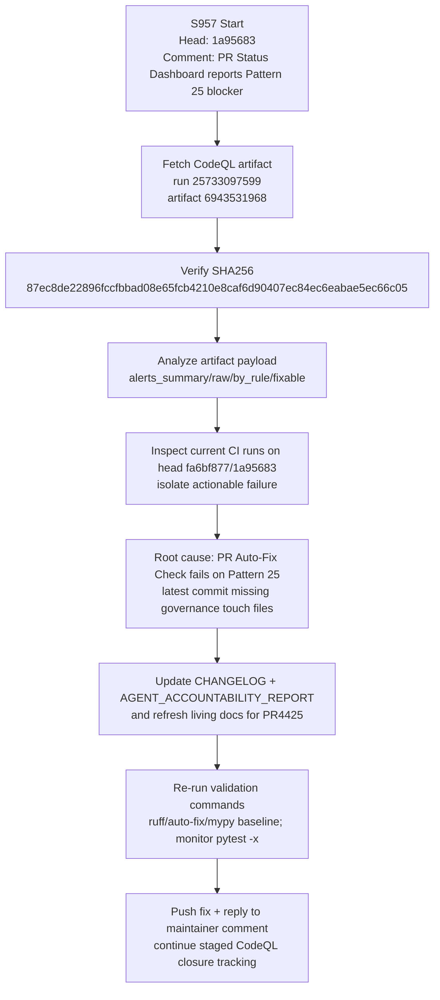

# PR #4425 — Session Diagram

## Session Notes

- Artifact checksum matched expected value exactly.
- Current staged-closure checkpoint: **127 baseline alerts verified as the starting remediation point from [workflow run 25733097599](https://github.com/Aries-Serpent/_codex_/actions/runs/25733097599)**.
- Current actionable CI blocker is Pattern 25 governance freshness in latest commit context.
- Optional-suite startup failures observed with 0 jobs remain classified as infra/startup state.
- CodeQL remediation remains tracked as staged closure: `127 → 100 → 75 → 50 → 25 → 0`.
