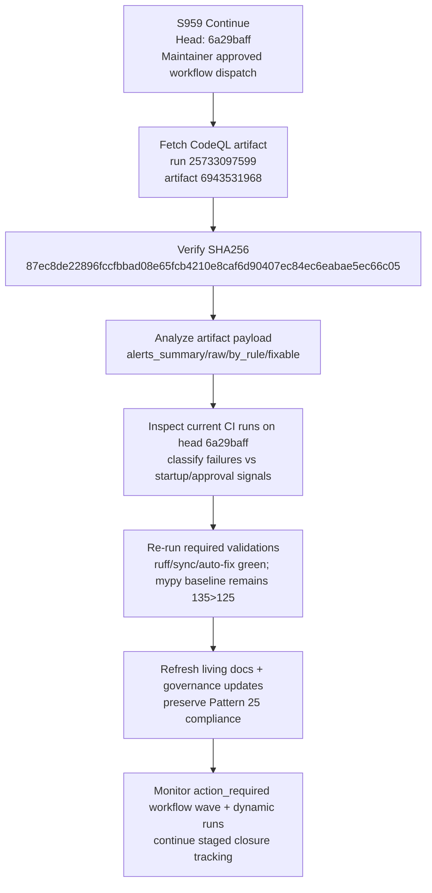

# PR #4425 — Session Diagram

## Session Notes

- Artifact checksum matched expected value exactly.
- Current staged-closure checkpoint: **127 baseline alerts verified as the starting remediation point from [workflow run 25733097599](https://github.com/Aries-Serpent/_codex_/actions/runs/25733097599)**.
- Current head (`6a29baff`) has no new local Pattern 25 regression (`auto_fix_common_issues --check-only` green).
- Optional-suite startup failures observed with 0 jobs remain classified as infra/startup state.
- Latest workflow wave on current head is dominated by `action_required` approval-state runs; continue monitoring for post-approval terminal outcomes.
- CodeQL remediation remains tracked as staged closure: `127 → 100 → 75 → 50 → 25 → 0`.
