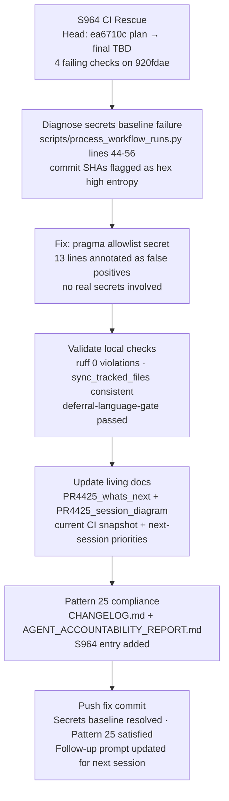

# PR #4425 — Session Diagram

## Session Notes (S964 — 2026-05-12T19:00Z)

- **Root cause of `🔐 Enforce Secrets Baseline` failure**: `scripts/process_workflow_runs.py` contains a Python list of git commit SHAs (hex strings, 40-char) used to identify target commits for PR #3248 workflow analysis. `detect-secrets` flagged these as "Hex High Entropy String" false positives. Added `# pragma: allowlist secret` to lines 44-56 (no real secrets were ever present).
- **`🚨 Deferral Language Policy Check`**: Already passing — last run (25755219121) showed 0 failed jobs.
- **Staged CodeQL closure**: `127 → 100 → 75 → 50 → 25 → 0` — next session to continue batch fixes using latest open-alert data.
- **mypy baseline**: 135 vs 125 gap remains tracked as Priority 2 for next session.
- **Pattern 25**: CHANGELOG.md + AGENT_ACCOUNTABILITY_REPORT.md updated in this commit ✅.

## Session History

| Session | Head Commit | Key Action |
|---------|-------------|------------|
| S959 | `6a29baff` | CodeQL artifact analysis, living-docs refresh |
| S960 | `033e194` | Bandit 63→0 HIGH/MEDIUM (B605/B306/B314/B113/B108/B310) |
| S961 | `a142c75` | PR reviewer threads — followup.md tasks, CODEX_MANIFEST monotonicity, archive_ops dedup |
| S962 | `4cf58f0` | Confirmed 3 review items fixed; verify_living_files.py created |
| S963 | `400fc3f` | followup.md rewritten with real tasks; merge-conflict resolved |
| S964 | TBD | Secrets baseline false-positive fix; living docs updated |
