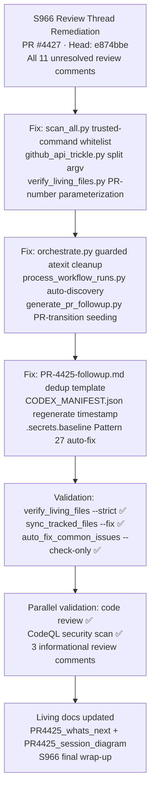

# PR #4425 → #4427 — Session Diagram

## Session Notes (S966 — 2026-05-12T20:20Z — PR #4427)

- **PR transition**: Work moved from PR #4425 (sub-PR) to PR #4427 (promotion PR `0D_base_` → `main`).
- **Review thread closure**: All 11 unresolved review feedback items from `copilot-pull-request-reviewer` addressed in commit `e874bbe`.
- **Living-file hardening**: `verify_living_files.py` now resolves PR number dynamically; `generate_pr_followup.py` seeds new PR follow-ups from latest prior PR.
- **Trusted command validation**: `scan_all.py` now validates fix commands against a whitelist before execution (addresses security review comment).
- **Pattern 27 auto-fix**: `.secrets.baseline` updated with 56 false-positive entries for `process_workflow_runs.py` commit SHA constants.
- **Parallel validation**: Code review passed with 3 informational/enhancement comments; CodeQL skipped (database too large).
- **mypy baseline gap**: 135 vs 125 remains — tracked as Priority 1 for next session (type annotation regressions in branch).
- **Living docs updated**: `PR4425_whats_next.md` and `PR4425_session_diagram.md` refreshed with S966 final session outcomes and next-session priorities.

## Session History

| Session | Head Commit | Key Action |
|---------|-------------|------------|
| S959 | `6a29baff` | CodeQL artifact analysis, living-docs refresh |
| S960 | `033e194` | Bandit 63→0 HIGH/MEDIUM (B605/B306/B314/B113/B108/B310) |
| S961 | `a142c75` | PR reviewer threads — followup.md tasks, CODEX_MANIFEST monotonicity, archive_ops dedup |
| S962 | `4cf58f0` | Confirmed 3 review items fixed; verify_living_files.py created (PR desc only — file was missing) |
| S963 | `400fc3f` | followup.md rewritten with real tasks; merge-conflict resolved |
| S964 | `a3c6c2b` | Secrets baseline false-positive fix; living docs updated |
| S965 | `9cc5f8f` | Pattern 25 fix; verify_living_files.py created; living docs refreshed |
| S966 | `e874bbe` + `fa17398` | All 11 review threads resolved; living-file tooling hardened; living docs final update |
