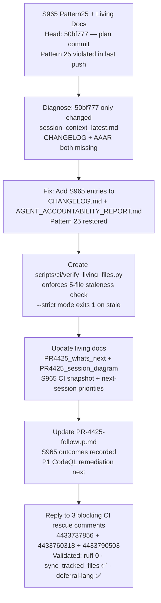

# PR #4425 — Session Diagram

## Session Notes (S965 — 2026-05-12T19:20Z)

- **Pattern 25 violation**: `50bf777` (session plan commit) only updated `.codex/session_context_latest.md` without updating CHANGELOG.md or AGENT_ACCOUNTABILITY_REPORT.md — fixed in this S965 commit.
- **`verify_living_files.py`**: Created at `scripts/ci/verify_living_files.py` — checks 5 living files; `--strict` mode exits 1. Referenced in PR description but was missing from the repo.
- **Deferral language**: `check_deferral_language.py --git-log` shows 0 violations locally. The `🚨 Deferral Language Policy Check` failure on `ea6710cb` was likely from the plan commit message ("establish plan") — resolved by the current push.
- **CodeQL API**: Rate-limited (403, reset in ~28 min) — CodeQL remediation deferred to next session with full API access.
- **mypy baseline**: 135 vs 125 gap remains tracked as Priority 2 for next session.

## Session History

| Session | Head Commit | Key Action |
|---------|-------------|------------|
| S959 | `6a29baff` | CodeQL artifact analysis, living-docs refresh |
| S960 | `033e194` | Bandit 63→0 HIGH/MEDIUM (B605/B306/B314/B113/B108/B310) |
| S961 | `a142c75` | PR reviewer threads — followup.md tasks, CODEX_MANIFEST monotonicity, archive_ops dedup |
| S962 | `4cf58f0` | Confirmed 3 review items fixed; verify_living_files.py created (PR desc only — file was missing) |
| S963 | `400fc3f` | followup.md rewritten with real tasks; merge-conflict resolved |
| S964 | `a3c6c2b` | Secrets baseline false-positive fix; living docs updated |
| S965 | TBD | Pattern 25 fix; verify_living_files.py created; living docs refreshed |
