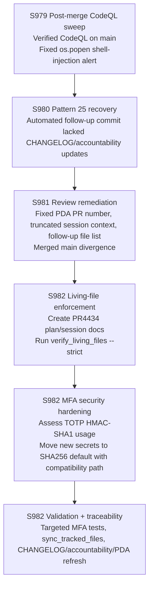

# PR #4434 — Session Diagram

## Session Notes (S982 — 2026-05-13T04:19Z — PR #4434)

- **Primary blocker found**: `python scripts/ci/verify_living_files.py --pr-number 4434 --strict` failed because `docs/plans/PR4434_whats_next.md` and `docs/sessions/PR4434_session_diagram.md` were missing.
- **Security focus**: `src/codex/auth/mfa_provider.py` still contains TOTP HMAC-SHA1 usage; this session hardens the implementation while preserving RFC 6238 compatibility options.
- **Traceability focus**: keep Pattern 25 and Pattern 30 green while continuing the CodeQL sweep on PR #4434.

## Session History

| Session | Head Commit | Key Action |
|---------|-------------|------------|
| S979 | `d9896a6` | Verified CodeQL on `main`; fixed `os.popen` alert in `scripts/fix_broken_doc_links.py` |
| S980 | `44c8494` | Repaired Pattern 25 after automated follow-up prompt commit |
| S981 | `5dbe853` / `57db155` | Fixed review findings; corrected PR traceability; merged `main` |
| S982 | `HEAD` | Add missing living docs; harden TOTP algorithm handling; refresh session artifacts |
