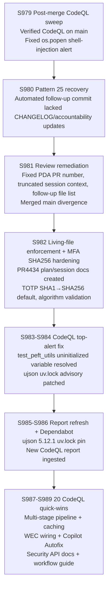
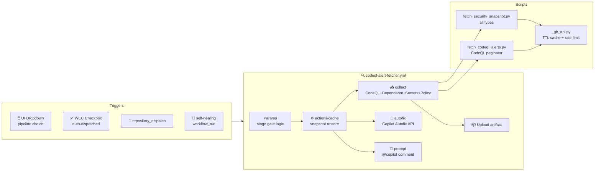

# PR #4434 — Session Diagram

## Pipeline Architecture Diagram (S989)

## Session History

| Session | Head Commit | Key Action |
|---------|-------------|------------|
| S979 | `d9896a6` | Verified CodeQL on `main`; fixed `os.popen` alert |
| S980 | `44c8494` | Repaired Pattern 25 after automated follow-up prompt commit |
| S981 | `5dbe853` | Fixed review findings; corrected PR traceability; merged `main` |
| S982 | `c0d4e8f` | Add missing living docs; TOTP SHA1→SHA256 default |
| S983–S984 | various | peft_utils uninitialized var fix; MFA review nits |
| S985–S986 | `415e983` | ujson uv.lock 5.12.1; CodeQL report refresh |
| S987–S989 | `HEAD` | 20 quick-wins; `_gh_api.py`; fetch_security_snapshot.py; pipeline+cache+autofix+prompt; docs |

## CI Health (S989)

| Check | Status |
|-------|--------|
| YAML valid | ✅ |
| Pattern 25 (CHANGELOG + accountability) | ✅ |
| Pattern 30 (PDA entry 2026-05-13) | ✅ |
| ruff (changed files) | ✅ |
| WEC checkbox in PR template | ✅ |
| self-healing workflow_run trigger | ✅ |
