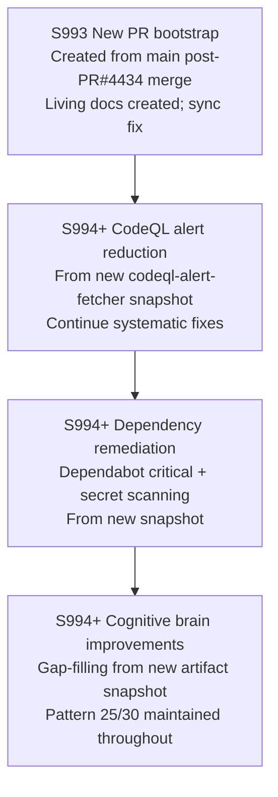

# PR #4442 — Session Diagram

## Session History

| Session | Head Commit | Key Action |
|---------|-------------|------------|
| S993 | `8b55232` | New PR bootstrap from main; living docs created; sync fix |

## CI Health (S993)

| Check | Status |
|-------|--------|
| `sync_tracked_files --fix` | ✅ CODEX_MANIFEST `.secrets.baseline` refreshed |
| `auto_fix_common_issues --check-only` | ✅ all 33 patterns clean |
| Pattern 25 (CHANGELOG + accountability) | ✅ |
| Pattern 30 (PDA entry 2026-05-13) | ✅ |
| ruff (changed files) | ✅ |

## Carry-Forward Context

This PR continues from PR #4434 (merged 2026-05-13):

- **`codeql-alert-fetcher.yml`**: Hardened single-job security snapshot collector (S992)
- **Security snapshot bundle**: `AGENT_SECURITY_CONTEXT.md`, `collector_status.json`, `codeql/alerts_fixable.md`, `dependabot/alerts_critical.json`, `secrets/alerts_active.json`
- **CodeQL baseline**: ~119 open on main after PR #4434 merge; 20+ fixed in PR #4434
- **Fetcher guides**: `docs/reference/CODEQL_FETCHER_WORKFLOW_GUIDE.md`, `docs/reference/SECURITY_API_REFERENCE.md`
