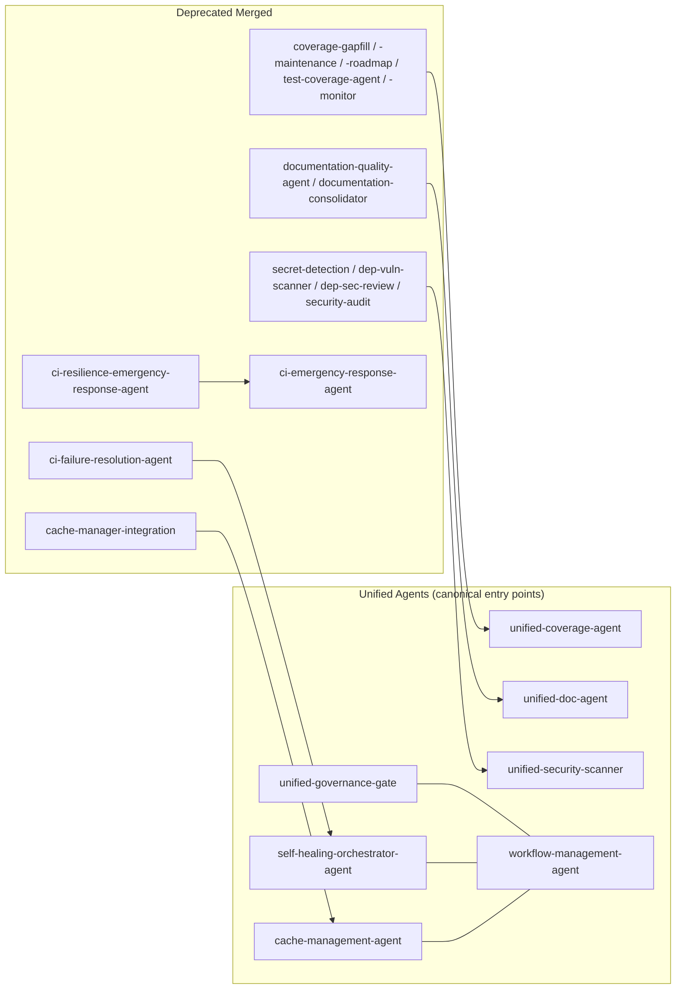

# Codebase Cognitive Map
**Last Updated:** 2026-07-11
**Version:** v0.2.0

> Generated: 2026-06-22T08:42:00Z | Updated: 2026-06-22
> PR: #4731 | Session: S1325

---

## Mission Overview

**Objective**: Provide a high-level cognitive map of the `_codex_` repository including components, flows, dependencies, and operational context for AI agents and human contributors.

**Energy Level**: (4/5 - High Priority Reference Document)

**Status**: Active

**Last Updated**: 2026-06-22T00:00:00Z | **Version**: 2.1.0 | **Last Reviewed**: 2026-06-22T18:02:00Z

---

## Architecture Overview

**Type**: Modular ML/AI Platform with agent Orchestration
**MLOps Maturity**: Level 4 target; see readiness checklists in `docs/` and `.codex/` for current gaps.
**Stats**: Thousands of test files and test functions exist across `tests/`; coverage baseline is 34% (locked 2026-07-02). Dependency status is tracked by current security alerts and audits. Volatile agent and workflow counts belong in generated inventories rather than this map.

### Repository Structure
```
_codex_/
 src/                 # Canonical Python implementation
 tests/               # Pytest suites
 configs/             # Primary Hydra configuration
 agents/              # Packaged orchestration primitives
 cognitive_app/       # React/TypeScript application
 scripts/             # Validation and operational commands
 docs/                # Guidance and architecture
 .codex/              # Agent state, policy, and operational evidence
 .github/workflows/   # Active CI and governance definitions
```

Selected root package directories are compatibility or packaging bridges. New Python
implementation should use the appropriate package under `src/` and installed-package
imports. See the contributor-facing [repository map](../REPOSITORY_MAP.md) for
role-specific shortcuts.

---

## Core Components

### 1. Codex Ingestion Pipeline (`src/codex/`)
**Purpose**: Complete Python code processing system

**Commands**:
```bash
python -m codex.cli ingest <source> # Ingest code (file/ZIP/Git)
python -m codex.cli analyze <snapshot-id> # Static + runtime analysis
python -m codex.cli transform <snapshot-id> --tier A # Apply transformations
python -m codex.cli verify <snapshot-id> # Behavior verification
```

**Flow**: Source Ingest Analyze Transform Verify PR

### 2. agent System (`agents/`)
**Purpose**: Autonomous AI agents with physics-inspired optimization

**Key Agents**:
- `workflow_navigator.py` - Tokenized workflows (AUDIT_EXEC, DOC_GEN)
- `quantum_game_theory.py` - Quantum-inspired decisions
- `physics_orchestrator.py` - 6 physics paradigms
- `mental_mapping.py` - Context tracking

**Tokens**: `audit`, `decide`, `docs`, `organize`, `review`, `heal`

**Canonical registry:** See [`agents/AGENT_CONSOLIDATION_MATRIX.md`](../../agents/AGENT_CONSOLIDATION_MATRIX.md) for dated counts and consolidation status. Unified entry points include `unified-coverage-agent`, `unified-doc-agent`, `unified-security-scanner`, `ci-testing-agent`, `ci-emergency-response-agent`, and `cache-management-agent`.

**Unified entry points:**



### 3. MCP Package System (`scripts/mcp/`)
**Purpose**: Package codebase for ChatGPT Projects

**Commands**:
```bash
./scripts/mcp/mcp-package --list # List 9 topics
./scripts/mcp/mcp-package --topic agents # Package by topic
./scripts/mcp/mcp-package --custom "patterns" # Custom patterns
```

**Topics**: zendesk, agents, quantum, docs, mcp, workflows, python_dev, testing, security

**Output**: Flat ZIP with manifest.json, README_dataset.md, index.md

**Docs**: `docs/mcp/` - 93+ KB across 8 comprehensive guides

### 4. RAG & Verification (`src/rag/`, `src/verification/`)
- RAG pipelines: Chunking, embedding, retrieval
- CoVe: Chain-of-Verification fact-checking
- MCP adapters: Pinecone, Mock integrations

---

## Data Flows

### Code Ingestion
```
External Source Ingest Static Analysis Runtime Analysis
LLM Intent Inference Transformation Verification PR Creation
```

### agent workflow
```
Request WorkflowNavigator agent Orchestration
Task Execution Verification State Persistence
```

### MCP Packaging
```
Human Request component Selection File Flattening
Manifest Generation ZIP Creation ChatGPT Upload
```

### CI/CD
```
Git Push Status Validation Security Gates Quality Gates
Test Execution Cache Management Artifact Generation
```

---

## Dependencies & Integrations

### External Services
- **OpenAI API**: LLM intent inference (`OPENAI_API_KEY`)
- **GitHub API**: PR creation, workflows (`GITHUB_TOKEN`)
- **Pinecone**: Vector embeddings (optional)
- **CodeQL/Semgrep**: Security scanning

### Python Dependencies
- **Core**: numpy, pandas, openai, httpx, pydantic, hydra-core
- **Dev**: pytest, black, ruff, mypy, nox, pre-commit
- **ML/AI**: torch, transformers, safetensors (optional)

---

## CI/CD Pipeline

### Key Workflows (`.github/workflows/`)

| workflow | Trigger | Purpose | Cache |
|----------|---------|---------|-------|
| `status_validation.yml` | push, PR | Repo status | - |
| `security_gates.yml` | push, PR | Security | - |
| `nox_gates.yml` | push, PR | Quality (lint/type) | Ruff, MyPy |
| `optimized-ci.yml` | push, PR | Optimized CI | All tools |
| `build-chatgpt-package.yml` | dispatch | MCP packaging | - |
| `scan-secrets-variables.yml` | schedule | Secrets scan | Gitleaks |

### Cache Strategy (Phase 3C-Lite + Phase 5)
- **Ruff**: ~20-30 MB | **MyPy**: ~50-80 MB
- **Pytest**: ~30-50 MB | **pre-commit**: ~50-100 MB
- **Total**: 7.69 GB / 10 GB limit (23% buffer)
- **Keys**: `${{ runner.os }}-${{ github.workflow }}-<tool>-${{ hashFiles(...) }}`
- **Phase 5** introduces the 4-layer cache hierarchy and skip-rescan policy — see [`docs/workflows/CACHE_POLICY.md`](../workflows/CACHE_POLICY.md) (owned by `cache-management-agent`).

---

## Security & Secrets

### Active Variable Inventory (2026-06-03 Audit)

**Total**: 113 variables/secrets across 5 scopes

```mermaid
%%{init: {'accessibility': {'title': 'Diagram showing CODEX_MASTER_KEY, CODEX_BACKUP_KEY'}}%%

graph TB
 subgraph "Org Secrets (13)"
 OM[CODEX_MASTER_KEY]
 OB[CODEX_BACKUP_KEY]
 OA[CODEX_ADMIN_KEY]
 OG[_GITHUB_APP_*]
 OP[PYPI_TOKEN / NPM_TOKEN]
 OH[HF_TOKEN / RAG_OPENAI_KEY]
 OC[CODECOV_TOKEN]
 end
 subgraph "Repo Secrets (7)"
 RS[OPENAI_API_KEY]
 RW[CODEX_WEBHOOK_SECRET]
 RG[CODEX_GHP_TOKEN_*]
 RB[_CODEX_BOT_RUNNER]
 end
 subgraph "Repo Variables (76)"
 RV1[agent/Autonomy: AGENT_KILL_SWITCH, AUTONOMY_*]
 RV2[Copilot: COPILOT_AGENT_*, COPILOT_WEC_*]
 RV3[Cognitive Brain: COGNITIVE_BRAIN_*]
 RV4[CI/CD: CODEX_CI_*, CODEX_COVERAGE_THRESHOLD]
 RV5[LLM/ML: CODEX_LLM_MODEL, WANDB_MODE]
 RV6[Runtime: CODEX_SESSION_ID, CODEX_LOG_LEVEL]
 end
 subgraph "Env Variables (14) — Sandbox"
 EV[CODEX_ENV_*versions, RUST_BACKTRACE, CARGO_TERM_COLOR]
 end
 subgraph "Env Secrets (3) — Sandbox"
 ES[CODEX_RUNNER_TOKEN, CODEX_ENVIRONMENT_RUNNER]
 end

 OM --> |token_chain| RS

 OB --> |fallback| RS

 RV2 --> |controls| EV
```



> **Diagram legend**: `token_chain` = primary token source for write operations; `fallback` = secondary token source used only when primary is unavailable (`CODEX_BACKUP_KEY` fills in when `CODEX_MASTER_KEY` is absent).

### Token Write Chain

```
GH_TOKEN = CODEX_MASTER_KEY || CODEX_BACKUP_KEY || github.token
```

- Defined in `COPILOT_AGENT_PREFLIGHT_RULES.token_rule`
- Use `report_progress` tool — never `git push` directly

### Key Variable Relationships

| Variable | Controls | Used By |
|----------|---------|---------|
| `AGENT_KILL_SWITCH` | Emergency halt all agents | All agent runners |
| `COPILOT_AGENT_MAX_AUTONOMY_LEVEL` | agent autonomy ceiling (D=max) | Copilot coding agents |
| `CODEX_CI_FAILURE_RATE` | Live CI health signal | `ci-health-alert-agent`, WEC |
| `CODEX_COVERAGE_THRESHOLD` | Coverage gate (80%) | `nox_gates.yml`, `coverage-with-timeout.yml` |
| `COGNITIVE_BRAIN_INJECTION_ENABLED` | Session context injection | `cognitive-brain-session-injector` |
| `COPILOT_WEC_SELECTION_MATRIX` | workflow trigger routing | `workflow-execution-gate.yml` |
| `CODEX_MASTER_KEY` | All write operations | All agents, `token_rule` |

### Secrets (GitHub UI injected)
- `OPENAI_API_KEY` — OpenAI API for LLM calls
- `CODEX_MASTER_KEY` — Genesis Protocol / all write ops
- `CODEX_BACKUP_KEY` — Fallback write key
- `_GITHUB_APP_PRIVATE_KEY` — GitHub App authentication

### Security Scanning
- Gitleaks, Trufflehog — Secret detection
- Semgrep SAST — Static analysis
- CodeQL — Code scanning

### Anti-/tmp/ Protection
**Policy**: Use `.github/tmp/` instead of `/tmp/` for tracked artifacts
**Applied**: emergency_cache_cleanup.sh, MCP tools
**Exception**: `CODEX_BRIDGE_DIR=/tmp/codex_secure_bridge` is a runtime tmpfs mount (not tracked)
**Doc**: `docs/system/ANTI_TMP_PROTECTION_SYSTEM.md`

### agent Variable Expectations

Per-agent MUST/SHOULD variable requirements are documented in [`agents/VARIABLE_EXPECTATIONS.md`](../../agents/VARIABLE_EXPECTATIONS.md). Key categories:

| agent Category | Key Variables |
|----------------|--------------|
| CI/CD agents | `CODEX_CACHE_VERSION`, `CODEX_TEST_TIMEOUT_MINUTES`, `CODEX_COVERAGE_THRESHOLD` |
| Self-healing agents | `CODEX_MAX_HEALER_RUNS_PER_HOUR`, `AUTONOMOUS_ACTIONS_ENABLED` |
| Cognitive brain agents | `COGNITIVE_BRAIN_INJECTION_ENABLED`, `SESSION_CONTEXT_AUTO_CAPTURE` |
| Security agents | `DISABLE_SECRET_FILTER` (MUST be `false`), `CODEX_ENV` |
| Orchestration agents | `COPILOT_WEC_SELECTION_MATRIX`, `COPILOT_AGENT_PREFLIGHT_RULES` |
| ML/training agents | `CODEX_SEED`, `CODEX_CPU_MINIMAL`, `CODEX_TELEMETRY_ENABLED` |

All agents universally MUST check `AGENT_KILL_SWITCH` at startup.

---

## MCP & ChatGPT Integration

### Packaging Capabilities
1. **9 Predefined Topics**: All major capabilities covered
2. **Custom Patterns**: Glob-based file selection
3. **Flat Structure**: Optimized for ChatGPT
4. **Metadata**: SHA256, sizes, language detection
5. **Navigation**: Manifest-driven discovery

### Methodology Transfer (8 Capabilities)
1. Python script development/deconstruction
2. workflow navigation & state management
3. Quantum game theory application
4. API integration patterns
5. CI/CD workflow optimization
6. agent-based architecture
7. TDD methodology
8. Documentation generation

### Documentation (`docs/mcp/`)
- `QUICK_START.md` - 5-minute onboarding
- `PACKAGING_GUIDE.md` - Complete workflows
- `PACKAGEABLE_CAPABILITIES.md` - Capability transfer
- `ChatGPT_Project_SYSTEM_PROMPT.md` - AI prompt
- `GENERIC_NAVIGATION_SYSTEM.md` - Universal navigation
- `ADVANCED_FEATURES_PLANSET.md` - Roadmap (Future iterations)

---

## Operational Context

### GitHub Limits
- **Copilot Pro+**: 64K tokens/session
- **GitHub Team**: 10 GB cache, limited Actions minutes
- **Current Cache**: 7.69 GB (23% buffer)

### Quality Metrics
- **Tests**: Thousands of test files and functions; use current CI artifacts for results.
- **Coverage**: `pyproject.toml` defines the current baseline; roadmap values are targets.
- **Security**: Use current security alerts and audit artifacts.
- **Cache**: Use current cache-health workflow artifacts.

### Performance Targets
- Test execution: <5 min
- Lint/type: <2 min
- Package creation: <2 min

---

## Reference

### Common Commands
```bash
# Codex
python -m codex.cli ingest|analyze|transform|verify

# MCP
./scripts/mcp/mcp-package --list|--topic|--custom

# Testing
make docker-test
pytest tests/ --cov=src/

# Quality
nox -s lint|type|format

# agent
python -m scripts.space_traversal.audit_runner agent-interface
```

## Entry Points

| System | Entry | Type |
|--------|-------|------|
| Codex CLI | `python -m codex.cli` | Module |
| MCP Package | `./scripts/mcp/mcp-package` | Script |
| agent Navigator | `agents.workflow_navigator` | Class |
| Tests | `pytest` / `make docker-test` | Command |

---

## Navigation for AI Agents

## Getting Started
1. **Architecture**: This doc `docs/ARCHITECTURE.md`
2. **Capabilities**: `docs/capabilities/*.md`
3. **Workflows**: `agents/TOKENIZED_WORKFLOWS.md`
4. **MCP**: `docs/mcp/QUICK_START.md`
5. **Contributing**: `docs/CONTRIBUTING.md`

### Finding Things
- **Code**: `src/` (app), `agents/` (agents)
- **Tests**: `tests/` (mirrors `src/`)
- **Scripts**: `scripts/` (automation)
- **Docs**: `docs/` (organized by topic)
- **CI/CD**: `.github/workflows/`

### Common Tasks
- **New capability**: `docs/capabilities/` template
- **Extend agents**: `agents/workflow_navigator.py`
- **Add CI**: `.github/workflows/` templates
- **Package code**: `scripts/mcp/mcp-package`
- **Run tests**: `make docker-test`

---

## Related Documents

- [Codebase Dashboard](./CODEBASE_DASHBOARD.md) - Live status & next steps
- [Roadmap](../ROADMAP.md) - Feature roadmap & iterations
- [Architecture](../architecture/INDEX.md) - Detailed architecture
- [Contributing](../CONTRIBUTING.md) - Contribution guide
- [Admin Guide](../ADMIN_IMPLEMENTATION_GUIDE.md) - Admin setup

---

**Owner**: DevOps + agent Development Team
**Review**: Monthly or after major changes
**Last Reviewed**: 2026-01-23T08:42:00Z

---

## Verification Checklist

### Architecture Accuracy
- [x] component structure matches current repository layout
- [x] Data flows reflect actual implementation
- [x] Dependencies list is up-to-date
- [x] Integration points correctly documented

### Documentation Quality
- [x] All code examples are valid and tested
- [x] Links to related documents are functional
- [x] Tables render correctly in GitHub/browser
- [x] Commands and paths are accurate

### Currency
- [x] Updated 2026-07-13
- [x] Version number incremented (2.0.0)
- [x] Iteration-based workflow language used throughout

---

## Success Metrics

| Metric | Target | Current | Status |
|--------|--------|---------|--------|
| Documentation freshness | <30 iterations | 0 iterations | |
| Broken links | 0 | 0 | |
| Outdated references | 0 | 0 | |
| Table rendering issues | 0 | 0 | |

---

## Physics Alignment

| Principle | Application | Section |
|-----------|-------------|---------|
| Path | Clear navigation from overview to detailed components | All sections |
| Fields | Data flows show transformation through pipeline | Data Flows |
| Patterns | Architecture patterns visible and documented | Components |
| Redundancy | Multiple entry points and cross-references | Navigation |
| Balance | Balanced detail across all major components | All sections |

---

## Redundancy Patterns

**Navigation Redundancy**:
- Multiple access paths: By component, by workflow, by role
- Cross-references between related sections
- Both top-down and bottom-up navigation supported

**Update Strategy**:
- Version-controlled documentation
- Git history maintains all previous versions
- Rollback available via commit history

---

## Energy Distribution

| Section | Energy | Rationale |
|---------|--------|-----------|
| Architecture Overview | | Critical for understanding system structure |
| Core Components | | Essential for development and maintenance |
| Data Flows | | Important for troubleshooting and optimization |
| CI/CD Pipeline | | Key for deployment and automation |
| Quick Reference | | Utility section for common tasks |

---

**Questions?** [Dashboard](./CODEBASE_DASHBOARD.md)
