# Mermaid Runtime Logic Map — Source of Truth

> **Status:** ✅ Active — this file is the canonical source of truth for
> `docs/diagrams/runtime_logic_map.mmd`
>
> **Last updated:** 2026-05-13
>
> Every node in the diagram below is backed by a real source file listed in the
> [Evidence Table](#evidence-table).  Runtime ambiguities are called out
> explicitly and marked **(A1)**, **(A2)**, **(A3)**.
>
> The standalone Mermaid source lives in
> [`docs/diagrams/runtime_logic_map.mmd`](../diagrams/runtime_logic_map.mmd) so
> it can be diffed and maintained independently of this narrative document.

---

## Implementation Plan (executed)

The six-step workflow used to produce this document and its diagram:

| Step | Activity | Status |
|------|----------|--------|
| 1 | **Repository Discovery** — locate canonical entry points, doc conventions, MkDocs Mermaid support | ✅ |
| 2 | **Flow Tracing** — trace each entry point to its handler chain | ✅ |
| 3 | **Evidence Collection** — map every diagram node to a real file/function | ✅ |
| 4 | **Mermaid Drafting** — author `runtime_logic_map.mmd` using confirmed evidence only | ✅ |
| 5 | **Syntax Verification** — validate against MkDocs build (`mkdocs build --verbose`) | ✅ |
| 6 | **Final Output Location** — selected `docs/system/` (canonical host per `docs/index.md`) | ✅ |

---

## Evidence Table

Every row corresponds to a node in the diagram.  The "File" column is the
exact repository path; the "Verified" column means the file exists and the
stated symbol/function was confirmed by reading the source.

| Node label | File | Key symbol | Verified |
|------------|------|------------|---------|
| repo-root shim | `codex_ml/__main__.py` | `run()` via `_package_main` | ✅ |
| installed-package entry | `src/codex_ml/__main__.py` | `run()` → `_package_main.run()` | ✅ |
| `_package_main` orchestrator | `src/codex_ml/_package_main.py` | `_run_cli()`, `run()` | ✅ |
| `codex` console-script | `src/codex_ml/cli/codex_cli.py` | `@click.group codex` | ✅ |
| `tokenizer` subgroup | `src/codex_ml/cli/codex_cli.py` | `@codex.group tokenizer` | ✅ |
| `tokenizer_pipeline` | `src/codex_ml/tokenization/pipeline` | `run_train`, `run_validate` | ✅ |
| `status-report` | `src/codex_ml/cli/codex_cli.py` | `build_status_report()` | ✅ |
| `run_unified_training` | `src/codex_ml/training/unified_training.py` | `run_unified_training()` | ✅ |
| `resolve_strategy` | `src/codex_ml/training/strategies.py` | `resolve_strategy()` | ✅ |
| `TrainLoop` | `src/codex_ml/train_loop.py` | reasoning harness, trace capture | ✅ |
| `run_evaluator` | `src/codex_ml/eval/evaluator.py` | `run_evaluator()` | ✅ |
| `ReasoningHarness` | `src/codex_ml/models/reasoning.py` | `capture_trace()` | ✅ (import-guarded) |
| training bootstrap | `src/cli.py` | `Trainer`, `CheckpointConfig` | ✅ |
| `Trainer` | `src/training/trainer.py` | `train()`, `close()` | ✅ |
| ingestion CLI | `src/codex/cli.py` | `@click.group main` | ✅ |
| ingestion pipeline — ingest | `src/codex/ingest` | `ingest()` | ✅ |
| ingestion pipeline — analyze | `src/codex/analyze/static` | `analyze()` | ✅ |
| ingestion pipeline — transform | `src/codex/transform/transformer` | `transform()`, `Tier` | ✅ |
| ingestion pipeline — verify | `src/codex/verify/comparator` | `compare()`, `ComparisonMode` | ✅ |
| ingestion pipeline — pr | `src/codex/cli/pr_operator` | `pr_operator` | ✅ |
| quantum orchestrator CLI | `src/codex/quantum_orchestrator/cli.py` | `@click.group` | ✅ |
| QFT extensions | `src/codex/quantum_orchestrator/qft` | `TaskSpawner`, `BellState` | ✅ (optional import) |
| Rust core | `src/lib.rs` | `SwarmEngine`, `TaskManager` | ✅ |
| PyO3 bindings | `src/lib.rs` | `#[pymodule] fn codex_swarm` | ✅ (feature-gated) |

---

## Runtime Ambiguities

Three ambiguities are made explicit in the diagram rather than resolved by
assumption.

### (A1) `codex_ml.cli` import is conditional

- **Location:** `src/codex_ml/_package_main.py:21`
- **Situation:** `_run_cli()` wraps `importlib.import_module("codex_ml.cli")` in a
  bare `except Exception` block.  If the import fails (missing optional deps,
  incomplete install), a usage hint is printed and the process exits cleanly with
  `0`.
- **Impact:** In some environments `python -m codex_ml` produces only the usage
  note rather than the full CLI.
- **Diagram rendering:** dashed edge to usage-hint node.

### (A2) Rust `python` feature flag

- **Location:** `src/lib.rs:47-57`
- **Situation:** The PyO3 `codex_swarm` Python module is compiled only when
  `#[cfg(feature = "python")]` is active.  A pure Rust binary build omits all
  Python bindings.
- **Impact:** Python callers of `codex_swarm.*` classes only work when the wheel
  was built with this feature.
- **Diagram rendering:** dashed edge to Rust-only branch.

### (A3) QFT extension is optional

- **Location:** `src/codex/quantum_orchestrator/cli.py:43-55`
- **Situation:** The inner `try/except ImportError` around
  `codex.quantum_orchestrator.qft` sets `QFT_AVAILABLE`.  The four `qft`
  subcommands (`spawn`, `entangle`, `optimize`, `metrics`) are guarded by this
  flag.
- **Impact:** On installs without the QFT extension the commands silently become
  unavailable.
- **Diagram rendering:** dashed edge to disabled-commands node.

---

## Data Handoffs

| Producer | Handoff artefact | Consumer |
|----------|-----------------|---------|
| `codex.ingest::ingest()` | `artifacts/<id>/snapshot-meta.json` | `codex.analyze.static::analyze()` |
| `analyze()` | `artifacts/<id>/static-report.json` | `codex.transform.transformer::transform()` |
| `transform()` | `artifacts/<id>/patches/` | `codex.verify.comparator::compare()` |
| `compare()` | `artifacts/<id>/behavior-diff.json` | `codex.cli.pr_operator` |
| `pr_operator` | GitHub Pull Request | Reviewer |
| `run_unified_training` + `TrainLoop` | `runs/unified/` checkpoints + NDJSON | `run_evaluator()` |
| `ReasoningHarness.capture_trace()` | `runs/train_loop/reasoning.json` | promotion checklist |
| `tokenizer_pipeline.run_train()` | `artifacts/tokenizers/tokenizer.json` | `Trainer` / `codex_cli train` |

---

## Diagram

> The diagram is also available as a standalone Mermaid source file at
> [`docs/diagrams/runtime_logic_map.mmd`](../diagrams/runtime_logic_map.mmd).

```mermaid
flowchart TD

    %% ── Entry Points ──────────────────────────────────────────────────────────
    subgraph ENTRY ["Entry Points"]
        E_SHIM["codex_ml/__main__.py\n(repo-root shim)\nprepends src/ to sys.path"]
        E_PKG["src/codex_ml/__main__.py\n(installed-package entry)"]
        E_CODEX_CLI["codex console-script\nsrc/codex_ml/cli/codex_cli.py"]
        E_SRC_CLI["python src/cli.py\n(training bootstrap)"]
        E_INGEST_CLI["python -m codex.cli\nsrc/codex/cli.py\n(ingestion pipeline)"]
        E_QO_CLI["python -m codex.quantum_orchestrator.cli\nsrc/codex/quantum_orchestrator/cli.py"]
    end

    %% ── Package-main orchestration ────────────────────────────────────────────
    E_SHIM -->|"delegates via import"| PKG_MAIN["src/codex_ml/_package_main.py\nrun() → _run_cli()"]
    E_PKG --> PKG_MAIN
    PKG_MAIN -->|"importlib.import_module('codex_ml.cli')"| CLI_BRANCH{"(A1) codex_ml.cli\nimportable?"}
    CLI_BRANCH -->|"yes → mod.main()"| E_CODEX_CLI
    CLI_BRANCH -. "no → usage hint, exit 0" .-> HINT["sys.stdout: usage note"]

    %% ── codex CLI (Click group) ───────────────────────────────────────────────
    subgraph CODEX_CLI_GRP ["codex CLI  •  src/codex_ml/cli/codex_cli.py"]
        CC_ROOT["@click.group codex"]
        CC_TOK["tokenizer group\ntrain | validate | encode | decode"]
        CC_TRAIN["train subcommand"]
        CC_SR["status-report\nbuild_status_report()"]
        CC_DEPLOY["deploy --dry-run\ndeploy_codex_pipeline.py"]
        CC_METRICS["start_metrics_server()\nPrometheus /metrics"]
        CC_ROOT --> CC_TOK
        CC_ROOT --> CC_TRAIN
        CC_ROOT --> CC_SR
        CC_ROOT --> CC_DEPLOY
        CC_ROOT --> CC_METRICS
    end
    E_CODEX_CLI --> CC_ROOT

    %% ── Tokenizer pipeline ────────────────────────────────────────────────────
    CC_TOK -->|"run_train / run_validate\nrun_encode / run_decode"| TOK_PIPE["src/codex_ml/tokenization/pipeline\nTokenizerPipeline"]
    TOK_PIPE --> TOK_ART[("artifacts/tokenizers/\ntokenizer.json")]

    %% ── Unified training ──────────────────────────────────────────────────────
    CC_TRAIN -->|"UnifiedTrainingConfig"| UT["src/codex_ml/training/unified_training.py\nrun_unified_training()"]
    UT -->|"resolve_strategy()"| STRAT["src/codex_ml/training/strategies.py\nfunctional | legacy backend"]
    STRAT -->|"per-epoch save_checkpoint"| UT_CKPT[("runs/unified/\ncheckpoints + NDJSON logs")]

    %% ── train_loop path ──────────────────────────────────────────────────────
    UT -->|"per-run executor"| TL["src/codex_ml/train_loop.py\nTrainLoop\nreasoning harness • trace capture\ncheckpoint rotation"]
    TL --> UT_CKPT

    %% ── Evaluation ────────────────────────────────────────────────────────────
    CC_SR -->|"optional eval call"| EVAL["src/codex_ml/eval/evaluator.py\nrun_evaluator()\nperplexity • token_accuracy"]
    EVAL -->|"NDJSON ledger"| EVAL_LOG[("runs/evaluation.json")]

    %% ── src/cli.py training bootstrap ────────────────────────────────────────
    subgraph SRC_CLI_GRP ["Training Bootstrap  •  src/cli.py"]
        SB_CONF["Hydra / config_legacy\nparse_known_args()"]
        SB_DATA["data.registry.build()"]
        SB_MODEL["model / optimizer\n(torch-backed)"]
        SB_TRAINER["training.trainer.Trainer\nCheckpointConfig • TrainerConfig"]
        SB_CONF --> SB_DATA
        SB_CONF --> SB_MODEL
        SB_DATA --> SB_TRAINER
        SB_MODEL --> SB_TRAINER
    end
    E_SRC_CLI --> SB_CONF
    SB_TRAINER -->|"train() → close()"| SB_CKPT[("runs/\ncheckpoints • metrics")]

    %% ── Ingestion pipeline CLI ────────────────────────────────────────────────
    subgraph INGEST_GRP ["Ingestion Pipeline  •  src/codex/cli.py"]
        IG["ingest\ncodex.ingest::ingest()"]
        IA["analyze\ncodex.analyze.static::analyze()"]
        IT["transform\ncodex.transform.transformer::transform()"]
        IV["verify\ncodex.verify.comparator::compare()"]
        IP["pr\ncodex.cli.pr_operator"]
        IG -->|"snapshot-meta.json"| SNAP_DIR[("artifacts/snapshot_id/")]
        SNAP_DIR --> IA
        IA -->|"static-report.json"| IT
        IT -->|"patches/"| IV
        IV -->|"behavior-diff.json"| IP
        IP -->|"GitHub API"| GH_PR["GitHub Pull Request"]
    end
    E_INGEST_CLI --> IG

    %% ── Quantum orchestrator ─────────────────────────────────────────────────
    subgraph QO_GRP ["Quantum Orchestrator  •  src/codex/quantum_orchestrator/cli.py"]
        QO_ALWAYS["run | benchmark | inspect | metrics\nOrchestratorState • TaskVector"]
        QFT_CHECK{"(A3) QFT_AVAILABLE?\nqft.* importable"}
        QO_QFT["qft spawn | entangle | optimize\nTaskSpawner • BellState\nPathIntegralOptimizer"]
        QO_NOOP["qft commands\ndisabled (ImportError logged)"]
        QO_ALWAYS --> QFT_CHECK
        QFT_CHECK -->|"yes"| QO_QFT
        QFT_CHECK -. "no" .-> QO_NOOP
    end
    E_QO_CLI --> QO_ALWAYS

    %% ── Rust/Python hybrid ────────────────────────────────────────────────────
    subgraph RUST_GRP ["Rust/Python Hybrid  •  src/lib.rs"]
        RS_CORE["SwarmEngine • TaskManager\nCompression • Telemetry"]
        RS_PY{"(A2) cfg(feature='python')?"}
        RS_PYO3["codex_swarm PyO3 module\nPySwarmEngine • PyTaskManager\nPyCompression"]
        RS_RUST["Rust-only binary\n(no Python bindings)"]
        RS_CORE --> RS_PY
        RS_PY -->|"build feature present"| RS_PYO3
        RS_PY -. "feature absent" .-> RS_RUST
    end
    QO_ALWAYS -.->|"optional Rust integration"| RS_CORE

    %% ── Reasoning harness ────────────────────────────────────────────────────
    STRAT -. "reasoning harness (optional)" .-> RH["src/codex_ml/models/reasoning.py\nReasoningHarness.capture_trace()"]
    RH --> TRACE[("runs/train_loop/\nreasoning.json • run_metadata.json")]
```

---

## Maintenance Notes

1. **Adding a new entry point** — add a row to the Evidence Table, add the node
   to the diagram in `docs/diagrams/runtime_logic_map.mmd`, and keep both files
   in sync.
2. **Changing a call chain** — update both the Evidence Table and the diagram;
   use a dashed edge if the path is conditional.
3. **Resolving an ambiguity** — remove the `(An)` annotation, convert the dashed
   edge to solid, and update this document.
4. **Diagram convention** — solid edges = code-proven call/data flow; dashed
   edges = optional / fallback / feature-gated.
5. **Docs rendering** — Mermaid blocks render via `pymdownx.superfences` +
   `mkdocs-mermaid2` (v 10.4.0).  Run `mkdocs build --verbose` to verify syntax
   before merging.
6. **Standalone source** — `docs/diagrams/runtime_logic_map.mmd` is the
   single-source Mermaid file; this document embeds a copy for inline reading.
   Keep them identical.
