# Training Workflow
**Last Updated:** 2026-07-11
**Version:** v0.2.1

**Last Updated**: 2026-01-20  
**Version**: v0.2.1  
**Reference**: [E2E Request Flow](../architecture/E2E_REQUEST_FLOW.md)

---

## Training Workflow Overview

```mermaid
%%{init: {'accessibility': {'title': 'Model Training Workflow<br/>Configuration to Checkpoint'}, 'theme': 'base'}}%%
graph TD
    Start([" Training Start"]) --> LoadCfg[" Load Configuration<br/>• config.yaml<br/>• defaults resolution<br/>• override application"]
    
    LoadCfg --> ValidCfg{"Config<br/>Valid?"}
    ValidCfg -->|" Error"| CfgError["Return Error<br/>Fix and retry"]
    ValidCfg -->|" OK"| PrepData["📥 Data Preparation<br/>• Load dataset<br/>• Tokenize text<br/>• Create batches<br/>• Compute statistics"]
    
    PrepData --> SplitData[" Train/Val/Test Split<br/>• training: 70%<br/>• validation: 15%<br/>• test: 15%"]
    
    SplitData --> LoadModel[" Load Model<br/>• Architecture: GPT-2 style<br/>• Init: Xavier/He<br/>• Parameters: 124M<br/>• Device: GPU/CPU"]
    
    LoadModel --> Optimizer[" Setup Optimizer<br/>• Algorithm: AdamW<br/>• LR: 5e-4<br/>• Weight decay: 0.01<br/>• Scheduler: Cosine"]
    
    Optimizer --> InitMonitor[" Init Monitoring<br/>• Loss tracking<br/>• Metric computation<br/>• Log directory setup<br/>• Tensorboard init"]
    
    InitMonitor --> EpochStart(["▶️ Start Epoch Loop"])
    
    %% Main training loop
    EpochStart --> EpochNum{"/Epoch<br/>1-N"}
    
    EpochNum -->|"Next Epoch"| BatchStart(["▶️ Start Batch Loop"])
    
    BatchStart --> BatchNum{"/Batch<br/>1-M"}
    
    BatchNum -->|"Next Batch"| LoadBatch["📦 Load Batch<br/>• Sample from loader<br/>• Move to device<br/>• Prepare tensors"]
    
    LoadBatch --> Forward["➡️ Forward Pass<br/>• inputs → model<br/>• Logits: [B, T, V]<br/>• Context length: T"]
    
    Forward --> Loss["💢 Compute Loss<br/>• Cross-entropy<br/>• Average over batch<br/>• Normalize"]
    
    Loss --> Backward["⬅️ Backward Pass<br/>• Compute gradients<br/>• Backprop through graph<br/>• Accumulate"]
    
    Backward --> Clip["✂️ Gradient Clipping<br/>• Max norm: 1.0<br/>• Prevent exploding grads<br/>• Check L2 norm"]
    
    Clip --> OptStep[" Optimizer Step<br/>• Update weights<br/>• Apply learning rate<br/>• Update momentum"]
    
    OptStep --> ZeroGrad[" Zero Gradients<br/>• Reset for next iter"]
    
    ZeroGrad --> LogBatch[" Log Batch Metrics<br/>• Loss: X.XXX<br/>• Accuracy: XX%<br/>• Learning rate: 1e-4"]
    
    LogBatch --> BatchCheck{"More<br/>Batches?"}
    
    BatchCheck -->|" Yes"| BatchNum
    BatchCheck -->|" No"| EvalVal[" Evaluate Validation<br/>• Forward on val set<br/>• Compute val loss<br/>• Compute metrics<br/>• No backprop"]
    
    EvalVal --> ValMetrics[" Validation Metrics<br/>• Val loss: Y.YYY<br/>• Val accuracy: YY%<br/>• Best so far?"]
    
    ValMetrics --> IsBest{"Better than<br/>Best?"}
    
    IsBest -->|" Yes"| SaveBest["💾 Save Best Model<br/>• Save weights<br/>• Save optimizer state<br/>• Save epoch info"]
    
    IsBest -->|" No"| CheckEarly["🛑 Check Early Stop<br/>• No improvement<br/>• for N epochs?"]
    
    SaveBest --> CheckEarly
    
    CheckEarly --> StopEarly{"/No improve<br/>N epochs?"}
    
    StopEarly -->|" Stop"| StopEpoch["🛑 Early Stopping<br/>Trigger"]
    
    StopEarly -->|" Continue"| LRSchedule[" Update LR Schedule<br/>• Cosine schedule<br/>• Decay: 1 - t/T<br/>• New LR: 4.9e-4"]
    
    LRSchedule --> EpochCheck{"More<br/>Epochs?"}
    
    EpochCheck -->|" Yes"| EpochNum
    EpochCheck -->|" No"| EpochDone[" Training Done"]
    
    StopEpoch --> EpochDone
    
    EpochDone --> LoadBest["📂 Load Best Model<br/>• Restore weights<br/>• Optimizer state"]
    
    LoadBest --> EvalTest[" Evaluate Test<br/>• Forward on test set<br/>• Final metrics<br/>• No backprop"]
    
    EvalTest --> TestMetrics[" Final Test Metrics<br/>• Test loss: Z.ZZZ<br/>• Test accuracy: ZZ%<br/>• Precision: 0.XX<br/>• F1: 0.XX"]
    
    TestMetrics --> SaveFinal["💾 Save Final Checkpoint<br/>• Weights<br/>• Config<br/>• Metadata<br/>• Hyperparameters<br/>• Training stats"]
    
    SaveFinal --> UploadCloud["☁️ Upload to Cloud<br/>• S3 bucket<br/>• Versioned<br/>• Metadata tagged"]
    
    UploadCloud --> LogExp[" Log Experiment<br/>• MLflow: run params<br/>• Metrics & artifacts<br/>• Artifacts: weights<br/>• Tags: version, date"]
    
    LogExp --> NotifyGH["🐙 Notify GitHub<br/>• PR comment<br/>• 'Training complete'<br/>• Metrics summary<br/>• Checkpoint link"]
    
    NotifyGH --> End([" Training Complete"])
    
    CfgError -.error.-> End
    
    %% Error handling
    Forward -.catch.-> ErrorHandle[" Handle Error<br/>• Log error<br/>• Save checkpoint<br/>• Alert user<br/>• Cleanup"]
    ErrorHandle --> End
    
    %% Styling
    style Start fill:#10b981,stroke:#059669,stroke-width:3px,color:#fff
    style End fill:#10b981,stroke:#059669,stroke-width:3px,color:#fff
    
    style LoadCfg fill:#3b82f6,stroke:#1e40af,stroke-width:2px,color:#fff
    style LoadModel fill:#3b82f6,stroke:#1e40af,stroke-width:2px,color:#fff
    style Optimizer fill:#3b82f6,stroke:#1e40af,stroke-width:2px,color:#fff
    
    style PrepData fill:#f59e0b,stroke:#d97706,stroke-width:2px,color:#fff
    style SplitData fill:#f59e0b,stroke:#d97706,stroke-width:2px,color:#fff
    
    style Forward fill:#16a34a,stroke:#15803d,stroke-width:2px,color:#fff
    style Backward fill:#16a34a,stroke:#15803d,stroke-width:2px,color:#fff
    style OptStep fill:#16a34a,stroke:#15803d,stroke-width:2px,color:#fff
    
    style Loss fill:#dc2626,stroke:#991b1b,stroke-width:2px,color:#fff
    style Clip fill:#dc2626,stroke:#991b1b,stroke-width:2px,color:#fff
    
    style EvalVal fill:#7c3aed,stroke:#6d28d9,stroke-width:2px,color:#fff
    style SaveBest fill:#7c3aed,stroke:#6d28d9,stroke-width:2px,color:#fff
    style SaveFinal fill:#7c3aed,stroke:#6d28d9,stroke-width:2px,color:#fff
    
    style UploadCloud fill:#0891b2,stroke:#0e7490,stroke-width:2px,color:#fff
    style LogExp fill:#0891b2,stroke:#0e7490,stroke-width:2px,color:#fff
    style NotifyGH fill:#0891b2,stroke:#0e7490,stroke-width:2px,color:#fff
```



---

## Key Phases

### 1. Configuration & Data Loading
- Load and validate Hydra configuration
- Prepare train/val/test datasets
- Configure optimizer and scheduler

### 2. Training Loop
- **Per Epoch**:
  - Process batches with forward/backward
  - Accumulate gradients
  - Apply optimizer step
  
- **Per Batch**:
  - Load data to device
  - Forward pass
  - Compute loss
  - Backward pass
  - Gradient clipping
  - Optimizer step

### 3. Validation & Checkpointing
- Evaluate on validation set
- Compare with best model
- Save if improved
- Check for early stopping

### 4. Model Evaluation
- Evaluate on test set
- Compute final metrics
- Save final checkpoint

### 5. Logging & Integration
- Upload to cloud storage
- Log to MLflow
- Notify GitHub PR

---

## Hyperparameter Configuration

```yaml
# Configuration used in training
model:
  architecture: gpt2
  parameters: 124M
  hidden_size: 768
  num_layers: 12
  num_heads: 12
  
training:
  epochs: 30
  batch_size: 32
  learning_rate: 5e-4
  weight_decay: 0.01
  warmup_steps: 1000
  max_grad_norm: 1.0
  
optimizer:
  algorithm: adamw
  betas: [0.9, 0.999]
  eps: 1e-8
  
scheduler:
  type: cosine
  total_steps: 100000
  warmup_ratio: 0.1
  
evaluation:
  val_split: 0.15
  test_split: 0.15
  early_stopping_patience: 5
```

---

## Typical Training Metrics

```
Epoch 1/30
  Batch 1: loss=4.523, acc=0.12, lr=5.0e-4
  Batch 2: loss=4.189, acc=0.18, lr=5.0e-4
  ...
  Batch 100: loss=3.234, acc=0.35, lr=5.0e-4
  Val: loss=3.156, acc=0.37  NEW BEST
  
Epoch 2/30
  ...
  Val: loss=3.089, acc=0.41  NEW BEST

Epoch 15/30 (trained 6 hours)
  ...
  Val: loss=2.123, acc=0.72  NEW BEST

Epoch 20/30
  ...
  Val: loss=2.145, acc=0.71  No improvement (5/5)
  🛑 Early stopping triggered

Final Test Results:
  Test loss: 2.134
  Test accuracy: 0.71
  Precision: 0.73
  Recall: 0.70
  F1: 0.71
```

---

## File Artifacts

| File | Purpose | Location |
|------|---------|----------|
| **Checkpoint** | Model weights + optimizer state | `checkpoints/model-epoch-15.pt` |
| **Config** | Final resolved configuration | `checkpoints/config.yaml` |
| **Metrics** | Per-epoch metrics JSON | `logs/metrics.json` |
| **Logs** | Training logs | `logs/training.log` |
| **Tensorboard** | Visualizations | `logs/tensorboard/` |

---

## Performance Characteristics

| Metric | Value | Notes |
|--------|-------|-------|
| **Time per epoch** | ~2 hours | 124M params, GPU |
| **Time per batch** | ~45ms | Batch size 32 |
| **GPU memory** | ~24GB | A100, FP32 |
| **Total time** | ~30 hours | 15 epochs (with early stop) |
| **Data throughput** | ~700 samples/sec | GPU bound |

---

## Next Steps

- Review evaluation workflow implementation in the codebase
- Explore model serving configuration
- 👉 See [E2E Request Flow](../architecture/E2E_REQUEST_FLOW.md) for full request lifecycle

---

**Related Documentation**:
- [5-Layer Architecture](../architecture/5_LAYER_ARCHITECTURE.md) - System architecture
- Review training guides in the repository
- Explore configuration management patterns
- Check model management implementation
