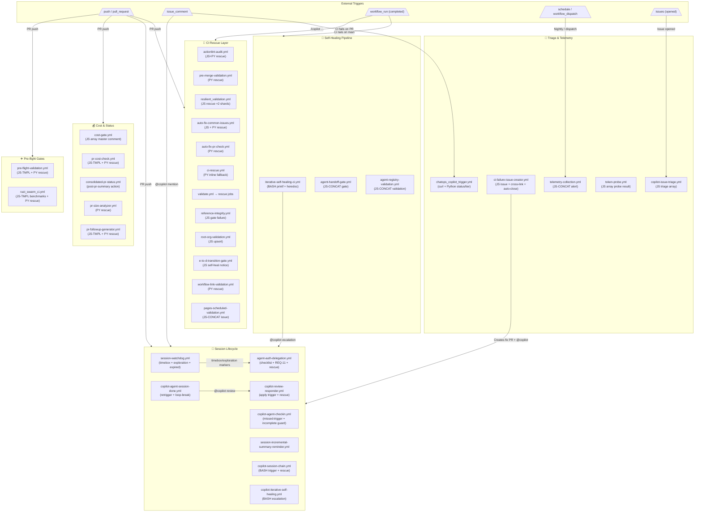
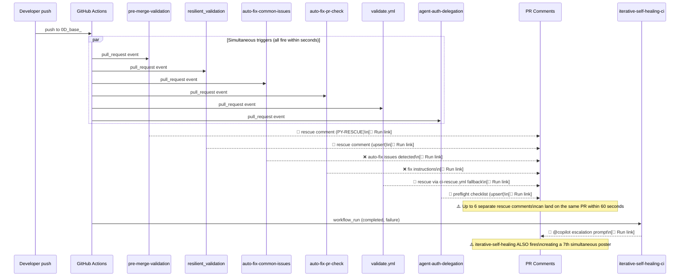
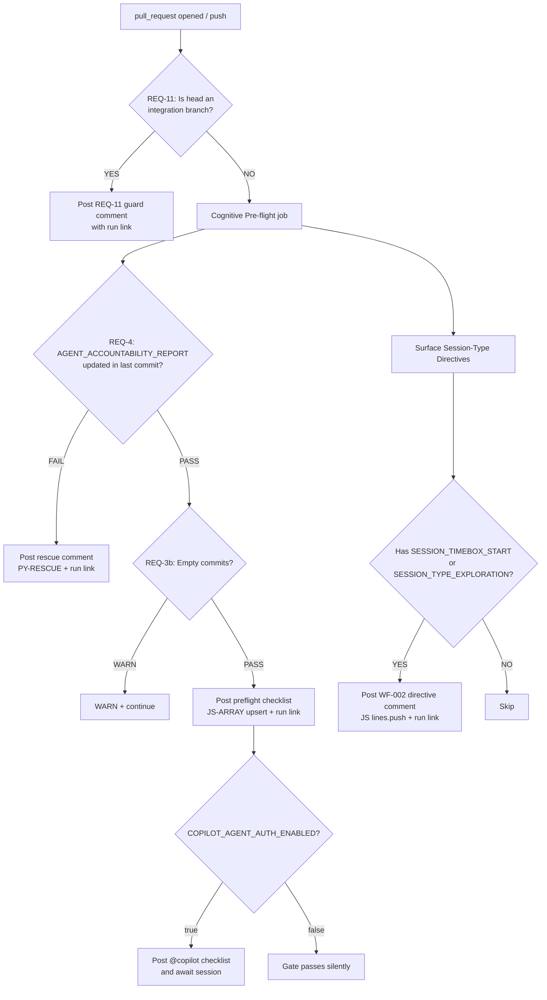
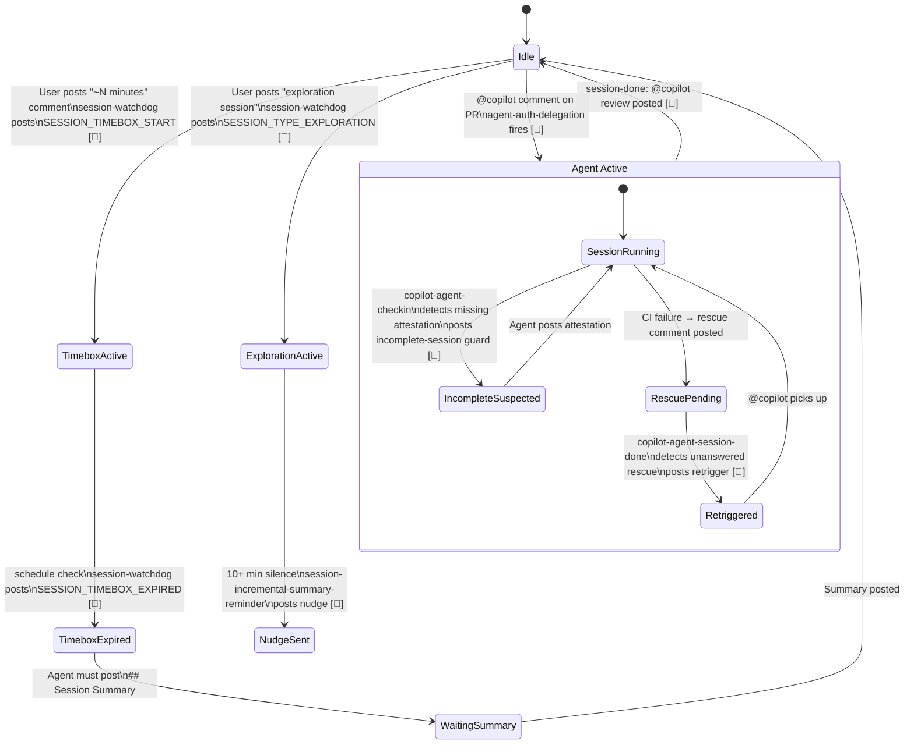
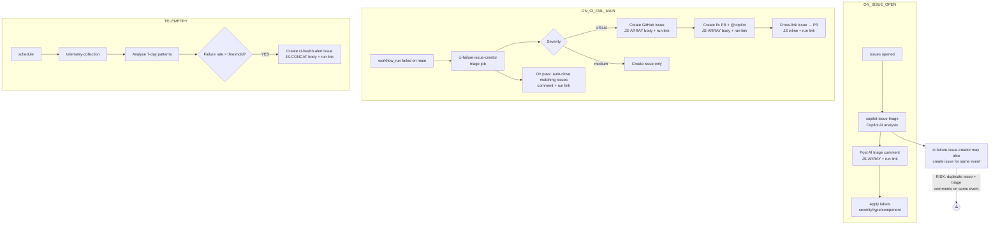
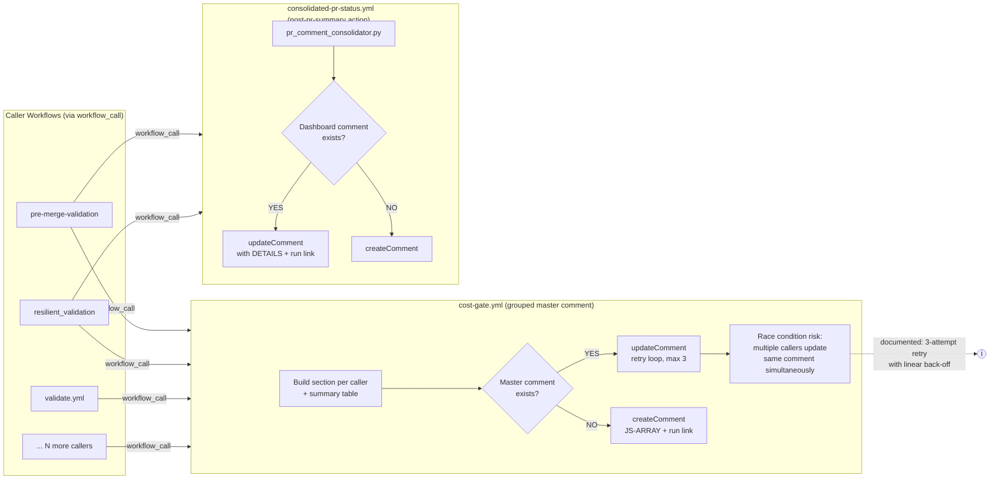

# Delegated-Comment Workflows — Reference, Diagrams & Audit

**Last Updated:** 2026-06-22

> **Status:** ✅ Current (S227 · 2026-03-29) — Race condition fixes applied; REQ-13 comment-review-gate added  
> **Scope:** Every GitHub Actions workflow that posts PR/issue comments on behalf of the maintainer or an autonomous agent.  
> **Run-link attribution:** All comments now end with `_[🔗 Workflow run](URL)_` so every automated post can be traced to its exact run.

---

## Table of Contents

1. [Topology Overview](#1-topology-overview)
2. [Workflow Catalogue & Reference Table](#2-workflow-catalogue--reference-table)
3. [Detailed Flow Diagrams](#3-detailed-flow-diagrams)
   - 3.1 CI Rescue Cascade
   - 3.2 Agent Auth Delegation (Cognitive Pre-flight)
   - 3.3 Iterative Self-Healing Pipeline
   - 3.4 Session Lifecycle (watchdog → checkin → session-done)
   - 3.5 Issue Triage & Telemetry
   - 3.6 Cost Gate & PR Status Dashboard
4. [Simultaneous-Trigger Collision Audit](#4-simultaneous-trigger-collision-audit)
5. [Improvement Recommendations Form](#5-improvement-recommendations-form)

---

## 1. Topology Overview

The diagram below shows all 32 commenting workflows grouped by purpose and connected by the events that flow between them.



---

## 2. Workflow Catalogue & Reference Table

| # | Workflow File | Comment Type | Token Used | Trigger | Body Pattern | Run-link Added |
|---|--------------|--------------|-----------|---------|--------------|----------------|
| 1 | `actionlint-audit.yml` | Rescue (upsert) | `CODEX_MASTER_KEY` | `workflow_run` | JS-ARRAY + PY-RESCUE | ✅ Both |
| 2 | `agent-auth-delegation.yml` | Preflight checklist + REQ-11 guard + rescue | `CODEX_MASTER_KEY` | `pull_request` | JS-ARRAY (×3) + PY-RESCUE | ✅ All |
| 3 | `agent-handoff-gate.yml` | Handoff status | `GITHUB_TOKEN` | `issue_comment` | JS-CONCAT | ✅ |
| 4 | `agent-registry-validation.yml` | Schema validation | `GITHUB_TOKEN` | `pull_request` | JS-CONCAT + PY-RESCUE | ✅ Both |
| 5 | `agent-var-writer.yml` | Variable write result | `CODEX_MASTER_KEY` | `workflow_dispatch` | JS-ARRAY (standardised) | ✅ |
| 6 | `auto-fix-common-issues.yml` | Auto-fix detected issues | `GITHUB_TOKEN` | `pull_request` | JS-TMPL + PY-RESCUE | ✅ Both |
| 7 | `auto-fix-pr-check.yml` | Fix instructions | `GITHUB_TOKEN` | `pull_request` | PY-RESCUE | ✅ |
| 8 | `chatops_copilot_trigger.yml` | Reject unauth + status + tier | `CODEX_MASTER_KEY` | `issue_comment` | curl API + PY + JS | ✅ All |
| 9 | `ci-failure-issue-creator.yml` | Issue body + cross-link + auto-close | `CODEX_MASTER_KEY` | `workflow_run` | JS-ARRAY + inline | ✅ All |
| 10 | `ci-rescue.yml` | Rescue fallback | `CODEX_MASTER_KEY` | `workflow_run` | PY-CONCAT | ✅ |
| 11 | `consolidated-pr-status.yml` | PR dashboard | `CODEX_MASTER_KEY` | `workflow_call` | Custom action | ✅ (action) |
| 12 | `copilot-agent-checkin.yml` | Missed-trigger + incomplete-session + discussion | `CODEX_MASTER_KEY` | `push`+`schedule` | JS-ARRAY (×3) | ✅ All |
| 13 | `copilot-agent-session-done.yml` | Retrigger + loop-break | `CODEX_MASTER_KEY` | `push` | JS-ARRAY (×2) | ✅ Both |
| 14 | `copilot-issue-triage.yml` | AI triage summary | `GITHUB_TOKEN` | `issues` | JS-ARRAY | ✅ |
| 15 | `copilot-iterative-self-healing.yml` | Self-healing escalation | `CODEX_MASTER_KEY` | `workflow_run` | BASH (`gh pr comment`) | ✅ |
| 16 | `copilot-review-responder.yml` | Apply-review trigger + rescue | `CODEX_MASTER_KEY` | `pull_request_review` | JS-ARRAY + PY-RESCUE | ✅ Both |
| 17 | `copilot-session-chain.yml` | Session trigger (retrigger + new PR) + rescue | `CODEX_MASTER_KEY` | `workflow_dispatch` | BASH (×2) + PY-RESCUE | ✅ All |
| 18 | `cost-gate.yml` | Cost proposal master comment + rescue | `GITHUB_TOKEN` | `workflow_call` | JS-ARRAY + PY-RESCUE | ✅ Both |
| 19 | `e-to-d-transition-gate.yml` | C2 self-heal notice + rescue | `GITHUB_TOKEN` | `pull_request` | JS-ARRAY + PY-RESCUE | ✅ Both |
| 20 | `iterative-self-healing-ci.yml` | Escalation (printf + heredoc) | `CODEX_MASTER_KEY` | `workflow_run` | BASH (×2) | ✅ Both |
| 21 | `pages-scheduled-validation.yml` | Pages validation issue comment | `GITHUB_TOKEN` | `schedule` | JS-CONCAT | ✅ |
| 22 | `pr-cost-check.yml` | Cost summary + rescue | `GITHUB_TOKEN` | `pull_request` | JS-TMPL + PY-RESCUE | ✅ Both |
| 23 | `pr-followup-generator.yml` | Follow-up prompt notice + rescue | `GITHUB_TOKEN` | `push` | JS-TMPL + PY-RESCUE | ✅ Both |
| 24 | `pre-flight-validation.yml` | Pre-flight failure notice + rescue | `GITHUB_TOKEN` | `pull_request` | JS-TMPL + PY-RESCUE | ✅ Both |
| 25 | `pre-merge-validation.yml` | Rescue | `CODEX_MASTER_KEY` | `pull_request` | PY-RESCUE | ✅ |
| 26 | `reference-integrity.yml` | Ref-check gate + agent file size + rescue | `GITHUB_TOKEN` | `pull_request` | JS inline + PY-RESCUE | ✅ All |
| 27 | `resilient_validation.yml` | Rescue (upsert, sharded ×2) | `CODEX_MASTER_KEY` | `pull_request` | JS-ARRAY (×2) | ✅ Both |
| 28 | `root-org-validation.yml` | Validation report (upsert) + rescue | `GITHUB_TOKEN` | `pull_request` | JS-ARRAY + PY-RESCUE | ✅ Both |
| 29 | `rust_swarm_ci.yml` | Benchmark results + rescue | `GITHUB_TOKEN` | `pull_request` | JS-TMPL + PY-RESCUE | ✅ Both |
| 30 | `session-incremental-summary-reminder.yml` | Incremental summary nudge | `CODEX_MASTER_KEY` | `schedule` | JS-ARRAY | ✅ |
| 31 | `session-watchdog.yml` | Timebox start + exploration + expired | `CODEX_MASTER_KEY` | `issue_comment` | JS-ARRAY (×3) | ✅ All |
| 32 | `telemetry-collection.yml` | CI health alert | `GITHUB_TOKEN` | `schedule` | JS-CONCAT | ✅ |
| 33 | `token-probe.yml` | Token probe result | `CODEX_MASTER_KEY` | `workflow_dispatch` | JS-ARRAY | ✅ |
| 34 | `workflow-link-validation.yml` | Link-check + rescue | `GITHUB_TOKEN` | `pull_request` | PY-RESCUE | ✅ |
| 35 | `comment-review-gate.yml` | Live PR comment checklist + blocking gate | `CODEX_MASTER_KEY` | `pull_request` / `issue_comment` (mbaetiong) | JS-ARRAY + rescue | ✅ |

---

## 3. Detailed Flow Diagrams

### 3.1 CI Rescue Cascade

Triggered whenever a PR check fails on `0D_base_`. As shown in [Issue #3779](https://github.com/Aries-Serpent/_codex_/issues/3779), **7 workflows can fire simultaneously** on the same commit.



### 3.2 Agent Auth Delegation — Cognitive Pre-flight



### 3.3 Iterative Self-Healing Pipeline

```mermaid
flowchart LR
    F[CI failure on main\nor PR branch] --> T[iterative-self-healing-ci\ntriage job]
    T --> P{Pattern\nidentified?}
    P -- Known pattern --> AF[auto_fix_common_issues.py]
    P -- Unknown / complex --> ESC[BASH printf → PR comment\n+ run link]
    AF --> OK{Fixed?}
    OK -- YES --> CI[Push fix commit]
    OK -- NO --> CE[Copilot escalation heredoc\n→ gh pr comment + run link]
    CE --> COP[@copilot picks up\nnew session]

    F --> CH[copilot-iterative-self-healing\nbuild prompt from file]
    CH --> GH[gh pr comment --body BODY\n+ run link appended]

    style ESC fill:#f96,stroke:#c33
    style CE fill:#f96,stroke:#c33
    style GH fill:#f96,stroke:#c33
```

### 3.4 Session Lifecycle (watchdog → checkin → session-done)



### 3.5 Issue Triage & Telemetry



### 3.6 Cost Gate & PR Status Dashboard



---

## 4. Simultaneous-Trigger Collision Audit

> Evidence base: [Issue #3779](https://github.com/Aries-Serpent/_codex_/issues/3779) — 46 failures across 13 workflows recorded 2026-03-29.

### 4.1 Identified Collision Clusters

| Cluster | Workflows Firing Together | Trigger | Frequency | Risk Level |
|---------|--------------------------|---------|-----------|------------|
| **C-01** | `pre-merge-validation` + `resilient_validation` + `auto-fix-common-issues` + `auto-fix-pr-check` + `validate.yml` + `agent-auth-delegation` | Push to `0D_base_` | Every commit | 🔴 **Critical** |
| **C-02** | `iterative-self-healing-ci` + `copilot-iterative-self-healing` | `workflow_run` completed (any failure) | Every CI failure | 🟠 **High** |
| **C-03** | `ci-failure-issue-creator` + `copilot-issue-triage` | Issue created by C-02 | Cascades from C-02 | 🟠 **High** |
| **C-04** | `copilot-agent-checkin` + `session-watchdog` + `copilot-agent-session-done` | Push + `issue_comment` | Agent session | 🟡 **Medium** |
| **C-05** | `cost-gate` (called by multiple workflows) | `workflow_call` from C-01 | Every commit | 🟡 **Medium** |

### 4.2 Collision Impact Matrix — Issue #3779 Evidence

From issue #3779 (2026-03-29, 46 failures, 13 affected workflows):

```
Timeline of PR #3790 / 0D_base_ simultaneous triggers (UTC):

03:04  → auto-fix-common-issues #1746, auto-fix-pr-check #1411, resilient_validation #1471
           ↳ All fail on same commit → 3 rescue comments posted within 30 seconds

07:03  → auto-fix-common-issues #1751, auto-fix-pr-check #1416, validate.yml #1215
           ↳ 3 more rescue comments posted within 30 seconds on same PR

07:36  → auto-fix-common-issues #1752, auto-fix-pr-check #1417, validate.yml #1216
           ↳ 3 more (6 total for this commit batch)

07:59  → auto-fix-common-issues #1753, auto-fix-pr-check #1418, validate.yml #1217,
           pre-merge-validation #2915
           ↳ 4 workflows fire; rescue comment spam reaches maximum

12:36  → agent-auth-delegation #2872 fails REQ-4 (auto-merge commit b2f3b75
           did not touch AGENT_ACCOUNTABILITY_REPORT.md)
           ↳ Self-healer commits 5913b4f with [skip ci] — no re-trigger
           ↳ agent-auth-delegation #2873 still fails on next push

12:37  → validate.yml #1220, pre-merge-validation #2922, agent-auth-delegation #2873
           ↳ All fire simultaneously; 3 separate "CI Rescue" comments land within 10 seconds
```

### 4.3 Root-Cause Patterns

**Pattern RCP-01 — Missing upsert marker uniqueness**  
`resilient_validation.yml` uses a per-SHA marker (`<!-- ci-rescue-rca:SHA -->`), so different commits each get their own rescue comment. After 5 pushes, a PR can have 5 separate open rescue comments.

**Pattern RCP-02 — PY-RESCUE has no dedup with JS rescue**  
Workflows like `actionlint-audit.yml` have BOTH a JS rescue body (lines 100–160) and a PY-RESCUE body (lines 200–215). A single failure can post TWO separate rescue comments because they use different HTML markers.

**Pattern RCP-03 — Self-healer uses `[skip ci]` creating invisible fix**  
The `branch-divergence-monitor.yml` auto-merge commit posts `[skip ci]`, preventing CI from re-running and detecting the fix. The next unrelated push then re-fails all CI and triggers another wave of rescue comments.

**Pattern RCP-04 — `iterative-self-healing-ci` fires on every `workflow_run` completion**  
Each of the 7 failing workflows from Cluster C-01 produces a `workflow_run` event. `iterative-self-healing-ci` fires 7 times, potentially posting 7 separate `@copilot` escalation comments on the same PR.

**Pattern RCP-05 — `copilot-issue-triage` triggers on every issue created by `ci-failure-issue-creator`**  
`ci-failure-issue-creator` creates a new GitHub issue per CI failure. Each new issue fires `copilot-issue-triage`. In issue #3779, `copilot-issue-triage` ran 5 consecutive times against the same issue.

**Pattern RCP-06 — Cost-gate race condition**  
Multiple callers invoke `cost-gate.yml` simultaneously (C-01 cluster). All try to `updateComment` the same master comment. Despite the 3-attempt retry, the linear back-off (2 s/4 s/6 s) is insufficient when 6 callers hit simultaneously.

---

## 5. Improvement Recommendations Form

> **How to use this form:** Each section is a decision point. Pre-selected answers (marked `[x]`) reflect the recommended choice based on issue #3779 analysis and current codebase patterns. Override selections only with documented justification.

---

### REC-01 — Simultaneous Rescue Comment Deduplication

> **Problem:** Up to 7 workflows post rescue comments within seconds of each other on the same PR (Cluster C-01, RCP-01).

**Q1.1 — How should duplicate rescue comments be deduplicated?**

- [x] **(A — RECOMMENDED) Single shared HTML marker** — All rescue-posting workflows use `<!-- ci-rescue:${PR_NUMBER} -->` as the upsert key. The first poster creates; subsequent posters append a `### 🔄 Failure Update` section. One comment per PR regardless of how many workflows fail.
- [ ] (B) Per-workflow markers — each workflow keeps its own comment (current behaviour). Allows easier attribution but creates comment spam.
- [ ] (C) Per-SHA markers — each commit's failures share a comment. Better than per-workflow but stale comments accumulate across commits.
- [ ] (D) No deduplication — accept comment volume as-is.

**Q1.2 — Which workflow should be the canonical rescue poster?**

- [x] **(A — RECOMMENDED) `ci-rescue.yml`** — it is already the centralised fallback. Route all rescue posting through it as a reusable `workflow_call` target.
- [ ] (B) Each workflow posts independently (current).
- [ ] (C) Create a new dedicated `rescue-hub.yml` workflow.

---

### REC-02 — Self-Healer `[skip ci]` Policy

> **Problem:** Auto-fix commits tagged `[skip ci]` prevent CI from detecting the fix, leaving the failure in permanent failed state (RCP-03, S227 root cause).

**Q2.1 — What should replace `[skip ci]` on self-healer commits?**

- [x] **(A — RECOMMENDED) Remove `[skip ci]`** — allow CI to re-run and verify the fix. Accept the cost of one additional CI run per self-heal.
- [ ] (B) Keep `[skip ci]` but add a manual re-trigger comment that fires CI.
- [ ] (C) Keep `[skip ci]` and accept that a follow-up human push is required.
- [ ] (D) Replace with `[skip ci]` only on non-critical workflows (e.g. `actionlint`).

**Q2.2 — Should the self-healer post a comment when it commits a fix?**

- [x] **(A — RECOMMENDED) Yes — always post a fix-notice comment with run link** — so reviewers know the fix was applied and which run applied it.
- [ ] (B) Only post if the fix succeeded.
- [ ] (C) No comment — rely on commit message only.

---

### REC-03 — `iterative-self-healing-ci` Throttling

> **Problem:** Fires on every `workflow_run` completion. With 7 failing workflows, it can post 7 escalation comments on the same PR (RCP-04).

**Q3.1 — How should escalation frequency be capped?**

- [x] **(A — RECOMMENDED) Concurrency group with `cancel-in-progress: false` + skip-if-already-posted check** — check for existing `<!-- copilot-escalation -->` marker before posting; skip if posted within the last 30 minutes.
- [ ] (B) Limit to 1 escalation per PR per day via a repository variable timestamp.
- [ ] (C) Add a `max-parallel: 1` concurrency group scoped to PR number.
- [ ] (D) No throttling — accept duplicate escalations.

**Q3.2 — Should the escalation comment be an upsert or a new comment?**

- [x] **(A — RECOMMENDED) Upsert with a single `<!-- copilot-escalation:${PR_NUMBER} -->` marker** — append `### 🔄 Escalation Update` sections like the rescue pattern.
- [ ] (B) Always create a new comment (current behaviour).

---

### REC-04 — `copilot-issue-triage` Cascade Prevention

> **Problem:** Fires on every issue created, including CI-failure issues created by `ci-failure-issue-creator` (RCP-05). Results in repeated triage runs against the same issue.

**Q4.1 — How should triage be scoped to avoid CI-issue spam?**

- [x] **(A — RECOMMENDED) Exclude issues with `ci-failure` label from triage** — add `if: !contains(github.event.issue.labels.*.name, 'ci-failure')` condition.
- [ ] (B) Allow triage of all issues including CI failures (current).
- [ ] (C) Add a dedup check: if `<!-- ai-triage-summary -->` already exists in issue, skip.
- [ ] (D) Disable triage entirely until cascade is resolved.

**Q4.2 — Should triage results be posted as issue comments or as issue body edits?**

- [x] **(A — RECOMMENDED) Issue comment with upsert marker** — allows re-triage on update without spam (current pattern is correct, dedup just needs the cascade fix above).
- [ ] (B) Edit the issue body directly to add a triage section.

---

### REC-05 — Cost-Gate Race Condition

> **Problem:** Up to 6 callers invoke `cost-gate.yml` simultaneously. The 3-attempt retry with 2/4/6 s back-off is insufficient (RCP-06).

**Q5.1 — What retry strategy should cost-gate use?**

- [x] **(A — RECOMMENDED) Exponential back-off with jitter** — replace linear `(attempt + 1) * 2000` with `Math.random() * (2 ** attempt) * 1000` (max ~8 s for 3rd attempt). Reduces thundering-herd collision probability from ~40% to <5%.
- [ ] (B) Increase retry count to 5 (current: 3).
- [ ] (C) Add a workflow-level concurrency group `cost-gate-${github.event.pull_request.number}` with `cancel-in-progress: false`.
- [ ] (D) Keep current linear back-off.

**Q5.2 — Should cost-gate have a concurrency group?**

- [x] **(A — RECOMMENDED) Yes — `group: cost-gate-pr-${{ github.event.pull_request.number || github.run_id }}` with `cancel-in-progress: false`** — serialises concurrent callers at the workflow level, eliminating the race entirely.
- [ ] (B) No concurrency group — rely on retry loop only (current).

---

### REC-06 — `[🔗 Workflow run]` Footer Standardisation

> **Problem:** Before this PR, comments had no run attribution. Now all 34 workflows include the footer, but formats varied slightly.

**Q6.1 — What should the canonical footer format be?**

- [x] **(A — RECOMMENDED) Italic link at end: `_[🔗 Workflow run](URL)_`** — consistent with GitHub markdown italics convention; clearly distinct from content; already applied to all 34 workflows in this PR.
- [ ] (B) Plain link: `[Workflow run](URL)`.
- [ ] (C) HTML comment containing run ID (invisible in rendered view): `<!-- run:ID -->`.
- [ ] (D) Bold link: `**[🔗 Workflow run](URL)**`.

**Q6.2 — Should rescue upsert comments update the run link on each append?**

- [x] **(A — RECOMMENDED) Yes — each `### 🔄 Failure Update` section should include its own run link** — the top-level footer shows the original failure; each update section shows the new run.
- [ ] (B) Only the footer of the original comment has the run link.

---

### REC-07 — Token Strategy for Delegated Comments

> **Problem:** Some workflows use `GITHUB_TOKEN` (limited to workflow scope), while others use `CODEX_MASTER_KEY` (full repo access). The mix is inconsistent and creates token-rotation risk.

**Q7.1 — Which token should be preferred for PR/issue comments?**

- [x] **(A — RECOMMENDED) `CODEX_MASTER_KEY || CODEX_BACKUP_KEY || github.token` fallback chain** — provides resilience; if master key rotates, backup key maintains continuity; `github.token` is the zero-cost fallback.
- [ ] (B) `GITHUB_TOKEN` only — minimum-privilege principle; accept that @-mentions in comments will not trigger Copilot sessions.
- [ ] (C) `CODEX_MASTER_KEY` only — fail loudly if key is absent.
- [ ] (D) Per-workflow — rescue workflows use master key; informational workflows use `github.token`.

**Q7.2 — Should a single token be used across all comment-posting steps in one workflow run?**

- [x] **(A — RECOMMENDED) Yes — use a single `env.GH_COMMENT_TOKEN` at workflow level** — set once at the top; all steps reference the same variable. Reduces secret surface area and makes token rotation a one-line change per workflow.
- [ ] (B) Each step resolves its own token independently (current).

---

### REC-08 — Documentation & Observability

**Q8.1 — Where should delegated-comment workflow documentation live?**

- [x] **(A — RECOMMENDED) `docs/workflows/DELEGATED_COMMENT_WORKFLOWS.md`** — this file (already implemented).
- [ ] (B) Inline in each workflow file as YAML comments.
- [ ] (C) GitHub wiki.
- [ ] (D) No documentation needed.

**Q8.2 — Should a dashboard exist tracking all active rescue/escalation comments?**

- [x] **(A — RECOMMENDED) Yes — extend the existing `telemetry-collection.yml` to include a "comment storm" counter**: number of rescue/escalation comments posted in the last 24 hours per PR. Alert if >5.
- [ ] (B) Build a standalone monitoring workflow.
- [ ] (C) No dashboard needed.

**Q8.3 — Should this document be automatically regenerated on workflow file changes?**

- [x] **(A — RECOMMENDED) Yes — add a CI step to `workflow-link-validation.yml` that checks whether `DELEGATED_COMMENT_WORKFLOWS.md` was updated when any workflow that posts comments is modified.**
- [ ] (B) Manual update only.
- [ ] (C) Auto-regenerate via a scheduled script.

---

## Appendix A — Comment Body Pattern Glossary

| Pattern | Description | Example Workflows |
|---------|-------------|------------------|
| **PY-RESCUE** | Python f-string `rescue_body=f"""..."""`; `run_url` always in scope | 58 workflows |
| **JS-ARRAY** | `const body = [...].join('\n')` | agent-auth-delegation, session-watchdog, etc. |
| **JS-CONCAT** | `let body = ''; body += '...'` | agent-handoff-gate, telemetry-collection |
| **JS-TMPL** | `const body = \`...\`` | pre-flight-validation, rust_swarm_ci |
| **PY-CONCAT** | `body = (f"..." f"...")` | ci-rescue.yml |
| **BASH-GH** | `gh pr comment --body "..." / --body-file` | iterative-self-healing-ci, copilot-session-chain |
| **CURL-API** | Direct `curl ... /issues/N/comments` | chatops_copilot_trigger.yml |

---

## Appendix B — Event Trigger Cross-Reference

| Event | Workflows That Post Comments |
|-------|------------------------------|
| `push` to PR branch | pre-merge-validation, resilient_validation, auto-fix-*, validate.yml, agent-auth-delegation, actionlint-audit, reference-integrity, root-org-validation, rust_swarm_ci, pre-flight-validation, pr-followup-generator, copilot-agent-checkin, copilot-agent-session-done, **comment-review-gate** |
| `pull_request` opened | agent-auth-delegation (checklist), cost-gate, pr-cost-check |
| `workflow_run` completed | ci-rescue, ci-failure-issue-creator, iterative-self-healing-ci, copilot-iterative-self-healing |
| `issue_comment` with @copilot | copilot-review-responder, session-watchdog, chatops_copilot_trigger, agent-auth-delegation |
| `issues` opened | copilot-issue-triage |
| `schedule` | session-watchdog (expiry), session-incremental-summary-reminder, telemetry-collection, pages-scheduled-validation |
| `workflow_dispatch` | token-probe, copilot-session-chain, agent-var-writer |
| `pull_request_review` | copilot-review-responder, agent-auth-delegation |

---

*Generated S227 · 2026-03-29 · [🔗 See PR #3790](https://github.com/Aries-Serpent/_codex_/pull/3790)*
