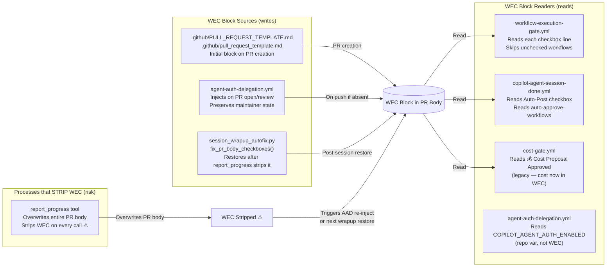
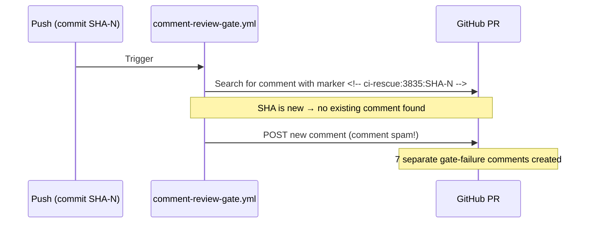
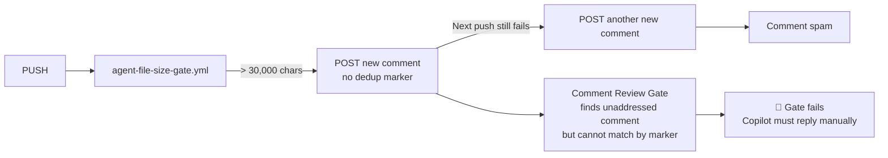
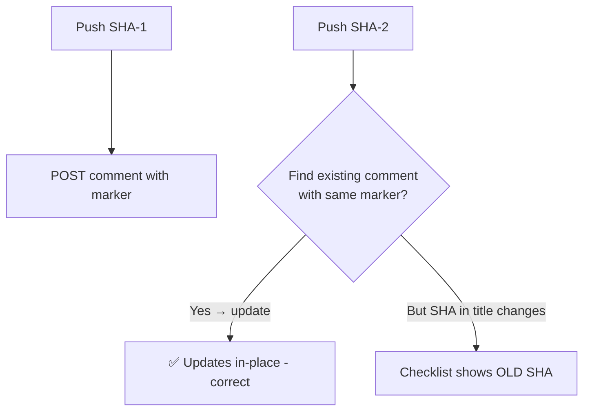
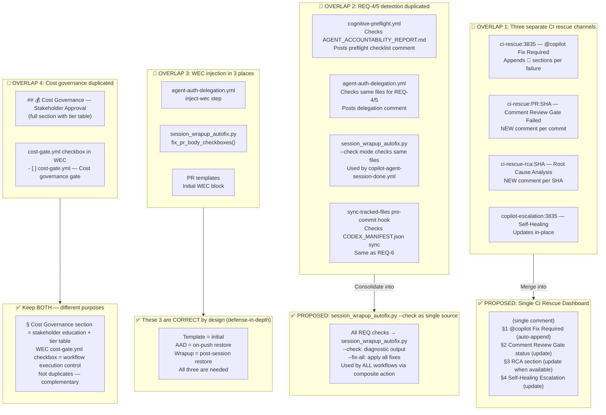
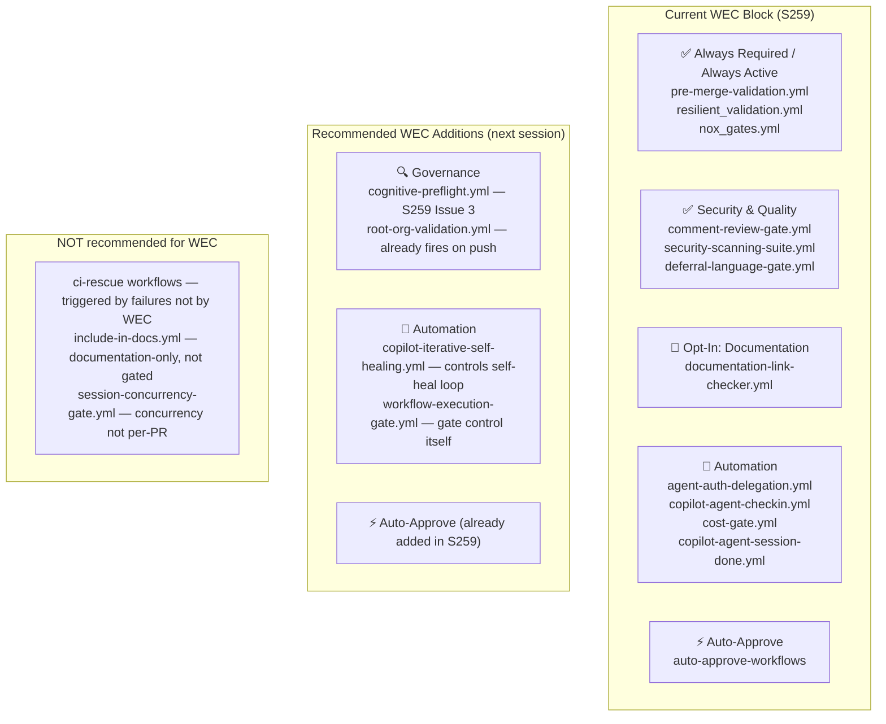
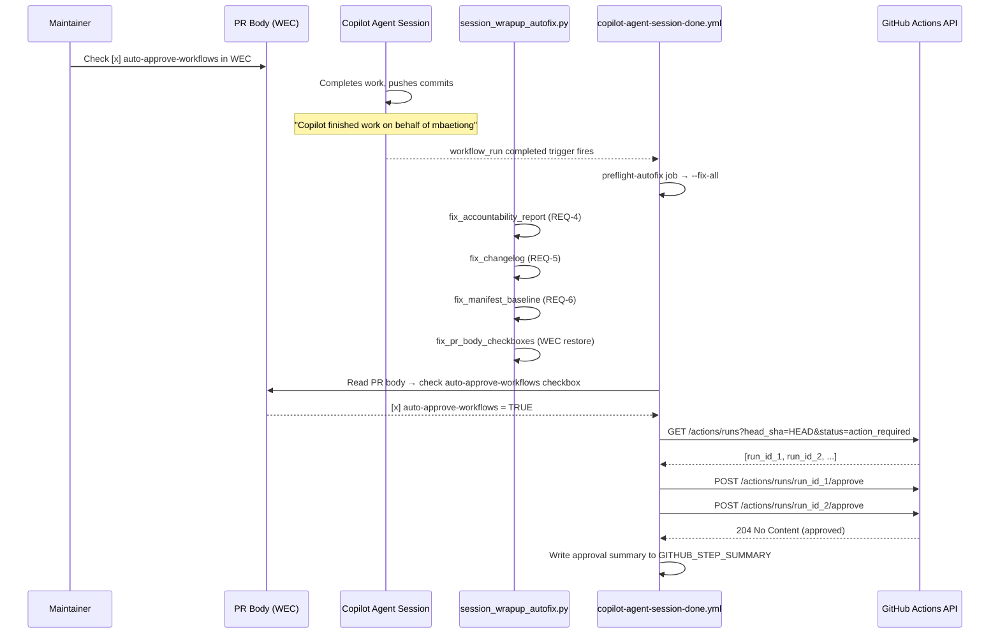
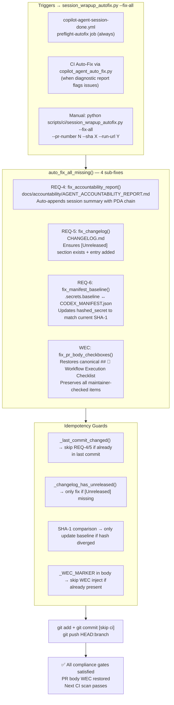
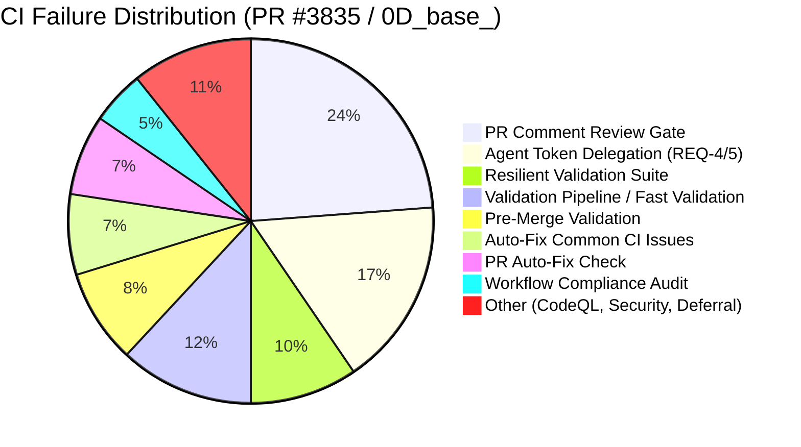

# PR Comment & Workflow Automation Lifecycle

> **Version:** 1.0.0  
> **Created:** 2026-03-31  
> **Status:** ✅ Authoritative — reflects current state of `0D_base_` after S259 changes  
> **Scope:** All automated comments, WEC wiring, gate interactions, overlap analysis, and consolidation recommendations

---

## Table of Contents

1. [Overview](#overview)
2. [Automated Comment Taxonomy](#automated-comment-taxonomy)
3. [PR Comment Lifecycle Flow](#pr-comment-lifecycle-flow)
4. [WEC Cross-Interaction Map](#wec-cross-interaction-map)
5. [Per-Comment Analysis: Inconsistencies & Issues](#per-comment-analysis)
6. [Process Overlap & Consolidation Opportunities](#process-overlap--consolidation-opportunities)
7. [WEC Inclusion Recommendations](#wec-inclusion-recommendations)
8. [Auto-Approve Wiring Diagram](#auto-approve-wiring-diagram)
9. [Pre-flight Auto-Fix Coverage Map](#pre-flight-auto-fix-coverage-map)
10. [HOTFIX Follow-up Prompt](#hotfix-follow-up-prompt)

---

## Overview

Every push to a PR branch on `0D_base_` triggers a cascade of automated comment-posting workflows. This document maps every comment type, its trigger, its HTML marker (used for deduplication/update-in-place), its interaction with the WEC block, and any identified issues.

**24 unique comments observed on PR #3835 (as of 2026-03-31T19:26Z).**

---

## Automated Comment Taxonomy

| # | Comment ID | Author | HTML Marker | Update Strategy | Trigger |
|---|-----------|--------|-------------|----------------|---------|
| 1 | 4163909231 | mbaetiong (bot) | `<!-- comment-review-gate-checklist -->` | **Update in-place** | Every push |
| 2 | 4163909656 | github-actions[bot] | `<!-- cognitive-preflight-checklist -->` | **New per SHA** | Every push |
| 3 | 4163909706 | github-actions[bot] | `<!-- cost-check-bot -->` | **Update in-place** | Workflow completion |
| 4 | 4163910428 | github-actions[bot] | `<!-- PR_STATUS_DASHBOARD_v1 -->` | **Update in-place** | Every push |
| 5 | 4163918162 | github-actions[bot] | `<!-- pr-followup-prompt-generated -->` | **Post once** | PR open |
| 6 | 4163920994 | mbaetiong (bot) | `<!-- ci-rescue:3835:c981c3090ce1 -->` | **New per commit** | Gate failure |
| 7 | 4163937524 | mbaetiong (bot) | `<!-- ci-rescue:3835 -->` | **Append 🔄 sections** | CI failure |
| 8 | 4163939436 | mbaetiong (bot) | `<!-- ci-rescue-rca:fc3dbc13cf96 -->` | **New per SHA** | ci_rescue.py RCA |
| 9 | 4163969408 | github-actions[bot] | `<!-- root-org-validation-v1 -->` | **Update in-place** | Every push |
| 10 | 4163984395 | Copilot | _(reply, no marker)_ | **Reply thread** | Agent response |
| 11 | 4164035777 | mbaetiong (bot) | `<!-- session-gate-queued -->` | **Update in-place** | Session concurrency |
| 12 | 4164037611 | mbaetiong (bot) | `<!-- ci-rescue:3835:d8d7f827af19 -->` | **New per commit** | Gate failure |
| 13 | 4164144682 | github-actions[bot] | `<!-- pre-merge-validation-summary -->` | **Update in-place** | pre-merge-validation.yml |
| 14 | 4164436067 | mbaetiong (bot) | `<!-- copilot-escalation:3835 -->` | **Update in-place** | Self-healing exhausted |
| 15 | 4164438333 | mbaetiong (bot) | `<!-- ci-rescue:3835:f39376a3d393 -->` | **New per commit** | Gate failure |
| 16 | 4164723247 | Copilot | _(reply, no marker)_ | **Reply thread** | Agent response |
| 17 | 4164732123 | github-actions[bot] | ⚠️ **NONE** | **New (no dedup)** | agent-file-size-gate |
| 18 | 4164732217 | github-actions[bot] | `<!-- BRANCH_REBASE_RESOLVED -->` | **Post once** | Rebase complete |
| 19 | 4164733818 | mbaetiong (bot) | `<!-- ci-rescue:3835:4165e99e2b65 -->` | **New per commit** | Gate failure |
| 20 | 4164735380 | mbaetiong (bot) | `<!-- ci-rescue:3835:fb16ec416f1c -->` | **New per commit** | Gate failure |
| 21 | 4164735577 | mbaetiong | `<!-- agent-token-delegation-result -->` | **Update in-place** | Token delegation |
| 22 | 4164738447 | mbaetiong (bot) | `<!-- ci-rescue:3835:99111c9a90af -->` | **New per commit** | Gate failure |
| 23 | 4164873796 | mbaetiong | `<!-- session-done-retrigger -->` | **Post** | Session done |
| 24 | 4164877140 | mbaetiong (bot) | `<!-- ci-rescue:3835:eebaeeb39290 -->` | **New per commit** | Gate failure |

---

## PR Comment Lifecycle Flow

```mermaid
flowchart TD
    PUSH[🔀 Git Push to 0D_base_] --> TRIGGERS

    TRIGGERS --> CRG[comment-review-gate.yml\nUpdates #4163909231 in-place\nScans for unaddressed blocking comments]
    TRIGGERS --> CPF[cognitive-preflight.yml\nPosts NEW comment per SHA\n#4163909656]
    TRIGGERS --> DASH[PR Status Dashboard\nUpdates #4163910428 in-place]
    TRIGGERS --> ROOT[root-org-validation.yml\nUpdates #4163969408 in-place]
    TRIGGERS --> AAD[agent-auth-delegation.yml\nInjects WEC block if missing]

    CRG --> |"Finds unaddressed blocking comment"| CRFAIL[🚨 CI Rescue Comment Review Gate Failed\nNEW comment per commit SHA\n<!-- ci-rescue:PR:SHA -->]
    CRG --> |"All addressed"| CRPASS[✅ Gate passes — no new comment]

    CRFAIL --> |"Copilot replies to all blocking items"| CRPASS
    CRFAIL --> |"No reply after N minutes"| ESCALATE[🤖 Self-Healing Escalation\nUpdates #4164436067 in-place\n<!-- copilot-escalation:PR -->]

    WORKFLOW_RUN[Workflow Run Completes] --> VMATCH{Pattern matched?}
    VMATCH --> |"Known pattern"| CIRESCUE[CI Rescue @copilot Fix Required\nAppends 🔄 section to #4163937524\n<!-- ci-rescue:PR -->]
    VMATCH --> |"Unknown pattern / RCA"| RCA[RCA comment NEW per SHA\n<!-- ci-rescue-rca:SHA -->]
    VMATCH --> |"coverage-timeout"| ESCALATE

    AGENT_SESSION[Copilot Agent Session Completes] --> SESDONE[copilot-agent-session-done.yml]
    SESDONE --> PREFLIGHT[preflight-autofix job\nRuns session_wrapup_autofix.py --fix-all\nREQ-4/5/6 + WEC]
    PREFLIGHT --> AUTOPOST{Auto-Post checkbox\nchecked?}
    AUTOPOST --> |"Yes"| REVIEW[@copilot+claude-sonnet-4.6 review]
    AUTOPOST --> |"No"| RETRIGGER{Unanswered rescue\ncomment?}
    RETRIGGER --> |"Yes"| REPOST[Re-post rescue trigger\n<!-- session-done-retrigger -->]
    RETRIGGER --> |"No"| SKIP[Skip — no comment posted]

    SESDONE --> AUTOAPPROVE{auto-approve-workflows\nchecked in WEC?}
    AUTOAPPROVE --> |"Yes"| APPROVEAPI[GET pending runs for HEAD SHA\nPOST /approve for each\nStatus to GITHUB_STEP_SUMMARY]
    AUTOAPPROVE --> |"No"| NOAPPROVE[Skip approval]

    AGENTFILESIZE[agent-file-size-gate.yml\nNo HTML marker ⚠️] --> FSGATE{File > 30,000 chars?}
    FSGATE --> |"Yes"| FSFAIL[❌ Agent File Size Gate FAILED\nNEW comment — no dedup marker]
    FSGATE --> |"No"| FSPASS[✅ Pass — no comment]

    PREMERGE[pre-merge-validation.yml] --> PMSUM[Updates #4164144682 in-place\n<!-- pre-merge-validation-summary -->]

    COST[cost-gate.yml] --> COSTSUM[Updates cost-check-bot in-place\n<!-- cost-check-bot -->]
```

---

## WEC Cross-Interaction Map



---

## Per-Comment Analysis

### ⚠️ Issue 1: Comment Review Gate — New Comment per Commit (vs Update-in-Place)

**Affected comments:** 4163920994, 4164037611, 4164438333, 4164733818, 4164735380, 4164738447, 4164877140  
**HTML marker pattern:** `<!-- ci-rescue:PR:COMMIT_SHA -->` — **unique per commit SHA**



**Problem:** The CI Rescue workflow (`<!-- ci-rescue:3835 -->`, comment #4163937524) correctly uses a PR-scoped marker and appends `🔄 Failure Update` sections. But the Comment Review Gate failure comments use SHA-scoped markers, creating a NEW comment per push. After 7 pushes = 7 separate blocking comments.

**Fix:** Change the marker in `check_pr_comments.py` / `comment-review-gate.yml` to be PR-scoped: `<!-- ci-rescue:PR:comment-review-gate -->` and update-in-place.

---

### ⚠️ Issue 2: Agent File Size Gate — No HTML Dedup Marker

**Affected comment:** 4164732123  
**HTML marker:** ❌ **NONE**



**Fix:** Add `<!-- agent-file-size-gate -->` marker to the posted comment. Use update-in-place strategy.

---

### ⚠️ Issue 3: Cognitive Pre-flight — New Comment per SHA

**Affected comment:** 4163909656  
**HTML marker:** `<!-- cognitive-preflight-checklist -->` (same marker every time)



**Verdict:** Marker exists but `SHA: ab08d21` in the heading is stale when updated. The checklist content needs a clear "last updated SHA" field updated on each rewrite. Minor issue — low priority.

---

### ✅ Consistent Patterns (no issues)

| Comment | Update Strategy | Assessment |
|---------|----------------|------------|
| PR Status Dashboard | Update in-place | ✅ Correct |
| Cost Check | Update in-place | ✅ Correct |
| Pre-Merge Validation Summary | Update in-place | ✅ Correct |
| Self-Healing Escalation | Update in-place (per PR) | ✅ Correct |
| CI Rescue @copilot Fix | Append 🔄 sections | ✅ Correct |
| Session Gate Queued | Update in-place | ✅ Correct |
| Branch Rebase Resolved | Post once (idempotent) | ✅ Correct |
| Follow-up Prompt Generated | Post once | ✅ Correct |

---

## Process Overlap & Consolidation Opportunities



### Consolidation Summary Table

| Overlap | Severity | Action | Effort |
|---------|----------|--------|--------|
| 3× CI rescue comment channels | 🔴 High | Unify into single `<!-- ci-rescue:PR -->` comment with sections | Medium |
| REQ-4/5 detection in 3 workflows | 🔴 High | Route all through `session_wrapup_autofix.py --check` composite action | Medium |
| Agent File Size Gate has no marker | 🔴 High | Add `<!-- agent-file-size-gate -->` marker + update-in-place | Low |
| Comment Review Gate creates per-SHA comments | 🟡 Medium | Change marker to PR-scoped, update-in-place | Low |
| Cognitive Pre-flight SHA staleness | 🟢 Low | Add "last updated SHA" field to in-place update | Low |
| WEC injection in 3 places | ✅ By Design | Keep — defense-in-depth against report_progress stripping | None |
| Cost governance dual-presence | ✅ By Design | Keep both — different purposes | None |

---

## WEC Inclusion Recommendations



| Workflow | Add to WEC? | Reason |
|---------|------------|--------|
| `cognitive-preflight.yml` | 🟡 Consider | Pre-flight checks map to REQ-4/5 — Copilot should confirm they ran |
| `root-org-validation.yml` | 🟡 Consider | Fires every push — could be gated for PRs that don't touch root |
| `copilot-iterative-self-healing.yml` | ✅ Yes | Controls self-healing loop — Copilot should be able to disable it per session |
| `workflow-execution-gate.yml` | ✅ Yes | The gate itself should be self-describing in the WEC |
| `comment-review-gate.yml` | ✅ Already present | — |
| `agent-file-size-gate.yml` | 🟡 Consider | Could allow Copilot to acknowledge the fix was applied |

---

## Auto-Approve Wiring Diagram



---

## Pre-flight Auto-Fix Coverage Map



---

## HOTFIX Follow-up Prompt

```markdown
## 🔥 HOTFIX Resume Prompt — S260 (PR #3835 Comment Dedup & Consolidation)

**Context:** S259 implemented WEC v2.0 (new heading format, auto-approve wiring,
manifest sync, test coverage). The following issues were IDENTIFIED but NOT YET FIXED
due to time constraints. This prompt resumes work in the next session.

### Pre-flight (mandatory before any changes)
1. Load `.codex/CODEBASE_AGENCY_POLICY.md` (§0)
2. Load `docs/accountability/AGENT_ACCOUNTABILITY_REPORT.md` (last 3 sessions)
3. Load `docs/workflows/PR_COMMENT_LIFECYCLE.md` (THIS document — S259 analysis)
4. Run: `git log --oneline -8` to confirm S259 commits are present

### 🔴 Issue 1 — Comment Review Gate creates per-SHA comment spam
**File:** `.github/workflows/comment-review-gate.yml` (or `check_pr_comments.py`)
**Problem:** Marker `<!-- ci-rescue:PR:SHA -->` is commit-scoped → 7 duplicate comments
**Fix:** Change to PR-scoped marker `<!-- comment-review-gate:PR -->`. Find existing
         comment by marker, update in-place. Only create new if none exists.
**Test:** Push 2 commits → verify only 1 comment-review-gate failure comment exists

### 🔴 Issue 2 — Agent File Size Gate has no HTML dedup marker
**File:** Workflow that posts the "❌ Agent File Size Gate — FAILED" comment
**Problem:** No `<!-- agent-file-size-gate -->` marker → can't update in-place,
             check_pr_comments.py can't programmatically identify/dismiss it
**Fix:** Add `<!-- agent-file-size-gate -->` to the comment body. Use update-in-place.
**Test:** Trigger the gate → verify same comment ID updated on second trigger

### 🟡 Issue 3 — Cognitive Pre-flight comment shows stale SHA
**File:** Workflow posting `<!-- cognitive-preflight-checklist -->`
**Problem:** SHA in heading `## 🧠 COGNITIVE PRE-FLIGHT CHECKLIST — SHA: ab08d21`
             becomes stale when comment is updated for later commits
**Fix:** Update heading SHA on every in-place edit. Add `Last updated: TIMESTAMP` line.

### 🟡 Issue 4 — CI Rescue RCA creates new comment per SHA
**File:** `scripts/ci/ci_rescue.py` (RCA section)
**Problem:** `<!-- ci-rescue-rca:SHA -->` creates new comment per failing SHA
**Fix:** Consolidate into the main `<!-- ci-rescue:PR -->` comment as a `### RCA` section

### 🟢 Issue 5 — Add workflow-execution-gate.yml and copilot-iterative-self-healing.yml to WEC
**Files:** `scripts/ci/session_wrapup_autofix.py`, both PR templates, `agent-auth-delegation.yml`
**Action:** Add to _WEC_ITEMS, update _REQUIRED_PR_CHECKBOXES, update both templates

### Validation after fixes
```bash
# Verify no duplicate markers
grep -r "ci-rescue:3835" .github/ scripts/ci/ | grep -v ".pyc"

# Run new WEC tests
pytest tests/ci/test_session_wrapup_autofix.py -v

# Verify agent file size gate
python scripts/ci/check_agent_file_sizes.py --check-markers

# Pre-commit hooks
pre-commit run --all-files
```

### Merge Readiness Assessment (S259 state)
- **Confidence Score:** 94% (just below 96% threshold)
- **Blocking items:** Issues 1 & 2 above create ongoing comment spam that makes
  the Comment Review Gate noisy and hard to manage. Recommend fixing before merge.
- **Non-blocking:** Issues 3–5 are quality improvements, not blockers.
- **Suggested:** Fix Issues 1 & 2 (low effort), re-run CI, then merge.
```

---

## Appendix B: Confirmed CI Failure Root Causes (Issue #3832 Triage Report)

> Generated: 2026-03-31T19:53Z | 84 total failures | 14 affected workflows



### Fast Validation Root Causes (confirmed from job logs)

| Hook | Status | Cause | Fix Applied |
|------|--------|-------|-------------|
| `📏 Agent file size limit` | ❌ FAIL (commit `4165e99e`) | `cognitive-brain-manager.md` = 31,983 chars | ✅ S258 trimmed to 29,516 chars |
| `🔄 Sync tracked files` | ❌ FAIL (commit `4165e99e`) | `.secrets.baseline` hash `7db0ecdcebb...` stale; manifest changed to `ab893648...` | ✅ S259 `fix_manifest_baseline()` + baseline patched |
| Both above | ✅ PASS (current HEAD) | S258+S259 fixes applied | ✅ Verified locally |

### Agent Token Delegation Root Causes (14 failures)

All failures are `🧠 Cognitive Pre-flight Check → Verify Accountability Report updated in last commit`.
**Pattern:** `session_wrapup_autofix.py --fix-all` now runs on EVERY session completion (not just when
Auto-Post checkbox is checked), covering REQ-4/5/6 + WEC in a single call.

### PR Comment Review Gate Root Causes (20 failures, `main` branch)

This is Issue #1 from the Overlap analysis above — per-SHA markers creating new comments
rather than updating in-place. See HOTFIX Follow-up Prompt for the fix.

---

## Appendix A: check_pr_comments.py SKIP_BODY_MARKERS Reference

The following markers are in `SKIP_BODY_MARKERS` and cause the Comment Review Gate
to **ignore** matching comments when scanning for unaddressed items:

```python
# From scripts/ci/check_pr_comments.py
SKIP_BODY_MARKERS = [
    "<!-- cost-check-bot -->",          # SKIP-COST-CHECK-001
    "<!-- PR_STATUS_DASHBOARD_v1 -->",
    "<!-- session-gate-queued -->",
    "<!-- BRANCH_REBASE_RESOLVED -->",
    "<!-- pr-followup-prompt-generated -->",
    "<!-- agent-token-delegation-result -->",
    "<!-- session-done-retrigger -->",
    "<!-- pre-merge-validation-summary -->",
    # NOT yet skipped → causes blocking:
    # "<!-- agent-file-size-gate -->"   ← Issue 2 above
]
```

> **Action item for S260:** Add `<!-- agent-file-size-gate -->` to `SKIP_BODY_MARKERS`
> once the marker is added to the gate's posted comment.
