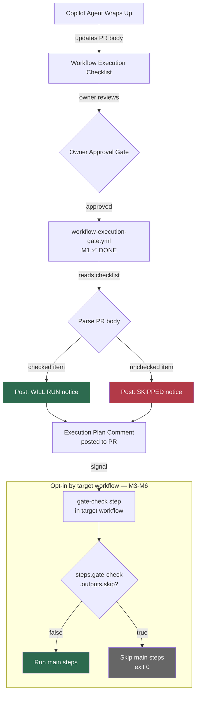
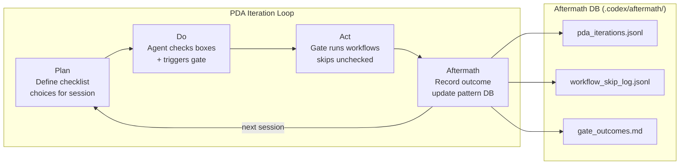

# Workflow Execution Checklist Wiring Plan

**Version:** 1.0.0  
**Status:** 🟡 Drafted (S228)  
**Author:** Copilot Coding Agent (S228)  
**Scope:** PR lifecycle workflow gate, Copilot Agent wrap-up hardening

---

## 1. Executive Summary

This plan defines an **explicit checklist-based workflow execution gate** that:
- Lets Copilot Coding Agent **check off only the workflows it needs** during wrap-up
- Posts an **execution-plan comment** listing which workflows are allowed (✅) vs skipped (⏭️)
- Target workflows must **opt in** (via a `gate-check` step) to actually skip execution
- Is approved by the **owner approval gate** before execution proceeds
- Prevents unintended workflow runs from generating artefacts, comments, or commits
  that conflict with ongoing objectives

> **Current implementation (M1/M2):** `workflow-execution-gate.yml` parses the PR body
> and posts an execution-plan comment. Actual workflow skipping requires target workflows
> to add the opt-in `gate-check` step (M3–M6, see §5).

---

## 2. Architecture Overview



---

## 3. PR Body Checklist Section Format

Each PR managed by Copilot MUST include a `## 🔄 Workflow Execution Checklist` section
in the PR body. This section is managed automatically by `agent-auth-delegation.yml` during
the Copilot wrap-up phase.

```markdown
## 🔄 Workflow Execution Checklist (S228)
<!-- gate-managed-by: workflow-execution-gate.yml -->
<!-- gate-version: 1.0.0 -->

### ✅ Always Required — fire automatically on every push (cannot be skipped)
- [x] pre-merge-validation.yml — Pre-merge checks (always required)
- [x] comment-review-gate.yml — Comment review gate (always required)
- [x] deferral-language-gate.yml — Deferral language guard (always required)
- [x] agent-auth-delegation.yml — Agent token delegation (always required)
- [x] workflow-execution-gate.yml — WEC gate (always required)

### 🔄 Always Active — fire via push/workflow_run
- [x] copilot-agent-checkin.yml — Agent check-in (fires on push)
- [x] copilot-agent-session-done.yml — Session done (fires on workflow_run)
- [x] copilot-iterative-self-healing.yml — Self-healing loop (fires on workflow_run)
- [x] cost-gate.yml — Cost governance gate

### ⚡ Auto-Approve
- [ ] auto-approve-workflows — Auto-Approve pending workflow runs

### 🧪 Opt-In: Testing & Validation
- [x] resilient_validation.yml — Resilient validation (required for 0D_base_ PRs)
- [ ] nox_gates.yml — Nox test gates (opt-in: heavy ML tests)

### 📄 Opt-In: Documentation
- [ ] documentation-link-checker.yml — Documentation link checker (opt-in: docs changes)

### ⚙️ Infrastructure (Admin Only)
- [ ] genesis-bootstrap.yml — Genesis protocol (ADMIN ONLY — never check)
- [ ] branch-divergence-monitor.yml — Branch divergence (auto, not Copilot-triggered)
```

### Syntax Rules

| Rule | Detail |
|------|--------|
| `- [x]` | Workflow WILL be triggered |
| `- [ ]` | Workflow WILL NOT be triggered; gate posts skip notice |
| Section header `###` | Logical grouping — not enforced, informational only |
| Comment `<!-- gate-managed-by: ... -->` | Identifies section as machine-managed |
| Always-required items | Should default to `[x]`; Copilot MUST NOT uncheck these |

---

## 4. Workflow Execution Gate — Implementation

### 4.1 File: `.github/workflows/workflow-execution-gate.yml`

```yaml
name: Workflow Execution Gate

on:
  # Triggered by Copilot wrap-up step in agent-auth-delegation.yml
  workflow_dispatch:
    inputs:
      pr_number:
        description: 'PR number to parse checklist from'
        required: true
      triggered_by:
        description: 'Who triggered this gate (copilot/owner/manual)'
        default: 'manual'

  # Also triggered when owner approves (pull_request_review event)
  pull_request_review:
    types: [submitted]

concurrency:
  group: workflow-execution-gate-${{ github.event.pull_request.number || github.event.inputs.pr_number }}
  cancel-in-progress: true

permissions:
  contents: read
  pull-requests: write
  actions: write  # needed to cancel workflow runs

jobs:
  parse-checklist:
    name: Parse Workflow Checklist
    runs-on: ubuntu-latest
    timeout-minutes: 10
    outputs:
      workflows_to_run: ${{ steps.parse.outputs.workflows_to_run }}
      workflows_to_skip: ${{ steps.parse.outputs.workflows_to_skip }}
      pr_number: ${{ steps.resolve-pr.outputs.pr_number }}
    steps:
      - name: Resolve PR number
        id: resolve-pr
        run: |
          PR="${{ github.event.pull_request.number || github.event.inputs.pr_number }}"
          echo "pr_number=${PR}" >> "$GITHUB_OUTPUT"

      - name: Parse workflow checklist from PR body
        id: parse
        env:
          GH_TOKEN: ${{ secrets.GITHUB_TOKEN }}
        run: |
          PR="${{ steps.resolve-pr.outputs.pr_number }}"
          BODY=$(gh pr view "$PR" --repo "${{ github.repository }}" --json body --jq '.body // ""')

          # Extract the Workflow Execution Checklist section
          SECTION=$(echo "$BODY" | awk '/^## 🔄 Workflow Execution Checklist/,/^## /' | head -n -1)

          if [ -z "$SECTION" ]; then
            echo "⚠️ No Workflow Execution Checklist section found in PR body — running defaults only"
            echo "workflows_to_run=" >> "$GITHUB_OUTPUT"
            echo "workflows_to_skip=" >> "$GITHUB_OUTPUT"
            exit 0
          fi

          # Parse checked items: lines matching "- [x] filename.yml"
          CHECKED=$(echo "$SECTION" | grep -oP '(?<=\- \[x\] )\S+\.yml' | tr '\n' ',')
          UNCHECKED=$(echo "$SECTION" | grep -oP '(?<=\- \[ \] )\S+\.yml' | tr '\n' ',')

          echo "workflows_to_run=${CHECKED%,}" >> "$GITHUB_OUTPUT"
          echo "workflows_to_skip=${UNCHECKED%,}" >> "$GITHUB_OUTPUT"
          echo "✅ Workflows to run: ${CHECKED}"
          echo "⏭️ Workflows to skip: ${UNCHECKED}"

  post-gate-summary:
    name: Post Gate Summary
    needs: parse-checklist
    runs-on: ubuntu-latest
    timeout-minutes: 5
    env:
      GH_TOKEN: ${{ secrets.GITHUB_TOKEN }}
    steps:
      - name: Post execution plan comment
        run: |
          PR="${{ needs.parse-checklist.outputs.pr_number }}"
          TO_RUN="${{ needs.parse-checklist.outputs.workflows_to_run }}"
          TO_SKIP="${{ needs.parse-checklist.outputs.workflows_to_skip }}"

          BODY="<!-- workflow-execution-gate:${PR} -->
          ## ⚙️ Workflow Execution Gate — Execution Plan

          | Status | Workflow |
          |--------|---------|"

          IFS=',' read -ra RUN_LIST <<< "$TO_RUN"
          for wf in "${RUN_LIST[@]}"; do
            BODY="${BODY}
          | ✅ WILL RUN | \`${wf}\` |"
          done

          IFS=',' read -ra SKIP_LIST <<< "$TO_SKIP"
          for wf in "${SKIP_LIST[@]}"; do
            BODY="${BODY}
          | ⏭️ SKIPPED | \`${wf}\` |"
          done

          BODY="${BODY}

          _Gate run: ${{ github.run_id }} — triggered by: ${{ github.event_name }}_
          _[🔗 Workflow run](https://github.com/${{ github.repository }}/actions/runs/${{ github.run_id }})_"

          # Upsert comment (dedup by marker)
          EXISTING=$(gh pr view "$PR" --repo "${{ github.repository }}" \
            --json comments --jq '[.comments[] | select(.body | startswith("<!-- workflow-execution-gate:"))] | last | .id // empty')
          if [ -n "$EXISTING" ]; then
            gh api "repos/${{ github.repository }}/issues/comments/${EXISTING}" \
              -X PATCH -f body="$BODY"
          else
            gh pr comment "$PR" --repo "${{ github.repository }}" --body "$BODY"
          fi
```

### 4.2 Copilot Wrap-Up Step — `agent-auth-delegation.yml` Integration

Add this step to the **cognitive-preflight** job in `agent-auth-delegation.yml`, just before
the final session wrap-up step:

```yaml
- name: Ensure Workflow Execution Checklist in PR body
  env:
    GH_TOKEN: ${{ secrets.COPILOT_AGENT_TOKEN || secrets.GITHUB_TOKEN }}
  run: |
    PR="${{ github.event.pull_request.number }}"
    BODY=$(gh pr view "$PR" --repo "${{ github.repository }}" --json body --jq '.body // ""')

    # Only inject if section doesn't exist yet
    if echo "$BODY" | grep -q "## 🔄 Workflow Execution Checklist"; then
      echo "✅ Workflow Execution Checklist already present — skipping injection"
      exit 0
    fi

    CHECKLIST="

## 🔄 Workflow Execution Checklist
<!-- gate-managed-by: workflow-execution-gate.yml -->
<!-- gate-version: 1.0.0 -->

### ✅ Always Required / Always Active
- [x] pre-merge-validation.yml — Pre-merge checks (always required)
- [x] resilient_validation.yml — Resilient validation
- [ ] nox_gates.yml — Nox test gates

### 🔒 Opt-In: Security & Quality
- [x] comment-review-gate.yml — Comment review gate (always required)
- [ ] security-scanning-suite.yml — Full security audit
- [x] deferral-language-gate.yml — Deferral language guard

### 📄 Opt-In: Documentation
- [ ] documentation-link-checker.yml — Documentation link checker

### 🤖 Always Active Automation
- [x] agent-auth-delegation.yml — Agent auth delegation (always required)
- [x] copilot-agent-checkin.yml — Agent check-in (always required)
- [x] cost-gate.yml — Cost governance gate

> **Instructions for Copilot Agent:** During wrap-up, check ONLY the workflows needed for
> this session. Unchecked workflows will be SKIPPED by the gate."

    UPDATED_BODY="${BODY}${CHECKLIST}"
    gh pr edit "$PR" --repo "${{ github.repository }}" --body "$UPDATED_BODY"
    echo "✅ Workflow Execution Checklist injected into PR #${PR}"
```

---

## 5. Individual Workflow Opt-In Skip Check

For workflows that should respect the gate (opt-in, not always-required), add this as the
**first step** in their primary job:

```yaml
- name: Check workflow execution gate
  id: gate-check
  env:
    GH_TOKEN: ${{ secrets.GITHUB_TOKEN }}
  run: |
    PR="${{ github.event.pull_request.number }}"
    WORKFLOW_FILE="${{ github.workflow_ref }}"
    WORKFLOW_NAME=$(basename "${WORKFLOW_FILE%%@*}")

    # Skip check if no PR context (push to main, schedule, etc.)
    if [ -z "$PR" ]; then
      echo "skip=false" >> "$GITHUB_OUTPUT"
      exit 0
    fi

    BODY=$(gh pr view "$PR" --repo "${{ github.repository }}" --json body --jq '.body // ""')

    # Check if this workflow appears in an unchecked item
    if echo "$BODY" | grep -qF "- [ ] ${WORKFLOW_NAME}"; then
      echo "skip=true" >> "$GITHUB_OUTPUT"
      echo "⏭️ ${WORKFLOW_NAME} is unchecked in Workflow Execution Checklist — skipping"
    else
      echo "skip=false" >> "$GITHUB_OUTPUT"
      echo "✅ ${WORKFLOW_NAME} is checked (or not in checklist) — proceeding"
    fi

- name: Skip guard
  if: steps.gate-check.outputs.skip == 'true'
  run: |
    echo "::notice::Workflow skipped by Workflow Execution Gate — unchecked in PR body checklist"
    exit 0
```

Then gate the primary job's main work step(s) with the `gate-check` output:
```yaml
jobs:
  my-job:
    runs-on: ubuntu-latest
    steps:
      - name: Check workflow execution gate
        id: gate-check
        # (gate-check implementation as shown above)

      - name: Run main job logic
        if: steps.gate-check.outputs.skip != 'true'
        run: |
          echo "Running main job tasks..."
```

---

## 6. Always-Required Workflows (Never Skip)

These workflows MUST NOT have a gate-check skip step added. They always run:

| Workflow | Reason |
|----------|--------|
| `comment-review-gate.yml` | Policy-enforced REQ-13 gate |
| `deferral-language-gate.yml` | Policy-enforced deferral language check |
| `agent-auth-delegation.yml` | Owner approval gate |
| `copilot-agent-checkin.yml` | Session tracking (not a CI gate) |
| `branch-divergence-monitor.yml` | Auto-managed by main branch triggers |

---

## 7. Copilot Agent Wrap-Up Protocol (Hardened)

During every Copilot session wrap-up, the agent MUST:

1. **Review** the Workflow Execution Checklist in the PR body
2. **Check** only the workflows that were exercised or are required for the current changes
3. **Leave unchecked** any workflow that does not apply to the current session's scope
4. **Trigger** `workflow-execution-gate.yml` via `workflow_dispatch` with the PR number
5. **Verify** the gate summary comment is posted to the PR
6. **Wait** for the owner approval gate if `COPILOT_AGENT_AUTH_ENABLED` is active

```bash
# Step 5 — Manual trigger for testing
gh workflow run workflow-execution-gate.yml \
  --repo Aries-Serpent/_codex_ \
  -f pr_number=3790 \
  -f triggered_by=copilot
```

### Wrap-Up Checklist (Hard-Coded)

```markdown
## Copilot Wrap-Up Checklist
- [ ] All PR review comments addressed
- [ ] `scripts/ci/sync_tracked_files.py --check` passes
- [ ] Workflow Execution Checklist updated in PR body
- [ ] `workflow-execution-gate.yml` triggered with PR number
- [ ] Gate summary comment verified on PR
- [ ] `docs/accountability/AGENT_ACCOUNTABILITY_REPORT.md` updated
- [ ] `report_progress` committed and pushed
```

---

## 8. Fine-Tuning for Autonomous Agent Self-Healing

To prevent workflows from generating artefacts or commits that conflict with
ongoing objectives:

### 8.1 Concurrency Group Enforcement

All self-healing and auto-fix workflows MUST use a concurrency group keyed on PR number:
```yaml
concurrency:
  group: ${{ github.workflow }}-pr-${{ github.event.pull_request.number || github.run_id }}
  cancel-in-progress: true
```

### 8.2 Skip-CI on Agent Commits

Agent wrap-up commits MUST include `[skip ci]` in their message to prevent re-triggering
the full CI suite (except for always-required gate workflows which bypass `[skip ci]`).

### 8.3 Artefact Dedup Marker

Every workflow that posts a PR comment MUST use the HTML dedup marker pattern:
```bash
MARKER="<!-- workflow-name:${PR_NUMBER} -->"
# Check if marker exists before posting
EXISTING=$(gh pr view "$PR" --json comments --jq "[.comments[] | select(.body | contains(\"${MARKER}\"))] | length")
if [ "$EXISTING" -eq 0 ]; then
  gh pr comment "$PR" --body "${MARKER}${COMMENT_BODY}"
fi
```

### 8.4 Rate Limiting Between Self-Healing Iterations

Self-healing iterations MUST enforce a minimum 5-minute cooldown between successive
escalation comments to prevent cascade flooding:
```yaml
- name: Cooldown check
  run: |
    LAST=$(gh pr view "$PR" --json comments \
      --jq '[.comments[] | select(.body | contains("<!-- self-healing:"))] | last | .createdAt // empty')
    if [ -n "$LAST" ]; then
      ELAPSED=$(( $(date +%s) - $(date -d "$LAST" +%s 2>/dev/null || echo 0) ))
      if [ "$ELAPSED" -lt 300 ]; then
        echo "::notice::Self-healing cooldown active (${ELAPSED}s < 300s) — skipping"
        exit 0
      fi
    fi
```

---

## 9. Implementation Milestones

| Milestone | Task | Owner | Status |
|-----------|------|-------|--------|
| M1 | Create `workflow-execution-gate.yml` | Copilot | ✅ Done (S228) |
| M2 | Inject checklist in `agent-auth-delegation.yml` wrap-up | Copilot | ✅ Done (S228) |
| M3 | Add opt-in gate check to `security-scanning-suite.yml` | Copilot | ⬜ Pending |
| M4 | Add opt-in gate check to `documentation-link-checker.yml` | Copilot | ⬜ Pending |
| M5 | Add opt-in gate check to `nox_gates.yml` | Copilot | ⬜ Pending |
| M6 | Add opt-in gate check to `cost-gate.yml` | Copilot | ⬜ Pending |
| M7 | Test end-to-end with PR #3790 | Copilot+Owner | ⬜ Pending |

---

## 11. PDA Loop + Aftermath Tracking

> **PDA = Plan → Do → Act (Deming cycle adapted for agentic CI workflows)**  
> Each iteration through the gate produces a measurable outcome. Tracked here.



### 11.1 PDA Iteration Schema

Each PDA iteration is recorded as a JSONL entry in `.codex/aftermath/pda_iterations.jsonl`:

```json
{
  "iteration": 1,
  "session": "S228",
  "pr_number": 3790,
  "timestamp": "2026-03-29T22:19Z",
  "plan": {
    "workflows_checked": ["pre-merge-validation.yml", "comment-review-gate.yml", "agent-auth-delegation.yml", "copilot-agent-checkin.yml"],
    "workflows_unchecked": ["security-scanning-suite.yml", "documentation-link-checker.yml", "nox_gates.yml", "cost-gate.yml"]
  },
  "do": {
    "gate_run_id": null,
    "dispatched": [],
    "skipped": [],
    "gate_status": "not_yet_triggered"
  },
  "act": {
    "workflows_ran": [],
    "workflows_skipped": [],
    "gate_outcome": "pending",
    "cascades_prevented": 0
  },
  "aftermath": {
    "lessons": ["Checklist injection added to agent-auth-delegation.yml wrap-up"],
    "pattern_updates": ["P-WEC-001: checklist injection on first wrap-up"],
    "open_items": ["M3-M6 opt-in gate checks pending"]
  }
}
```

### 11.2 Aftermath Pattern Library

| Pattern ID | Pattern | Outcome | Iteration |
|-----------|---------|---------|-----------|
| P-WEC-001 | Checklist injected by agent-auth-delegation on first session | ✅ Works | 1 |
| P-WEC-002 | Gate triggers on workflow_dispatch (Copilot wrap-up) | 🔮 Untested | — |
| P-WEC-003 | Gate triggers on pull_request_review (owner approval) | 🔮 Untested | — |
| P-WEC-004 | Unchecked workflow correctly skipped via gate | 🔮 Untested | — |
| P-WEC-005 | Always-required workflow (comment-review-gate) NOT skipped | 🔮 Untested | — |

### 11.3 Self-Review at Each PDA Act Phase

Before recording an Aftermath entry, the Copilot Agent MUST complete the following
5-pass self-review:

```markdown
## 🔁 PDA Self-Review (5 passes)

**Pass 1 — YAML Validity**
- [ ] `workflow-execution-gate.yml` passes actionlint

**Pass 2 — Checklist Syntax**
- [ ] PR body contains `## 🔄 Workflow Execution Checklist` section
- [ ] Gate marker `<!-- gate-managed-by: workflow-execution-gate.yml -->` present

**Pass 3 — Gate Logic**
- [ ] Checked items produce WILL RUN in gate summary comment
- [ ] Unchecked items produce SKIPPED in gate summary comment

**Pass 4 — No Side Effects**
- [ ] Gate run does NOT create commits or file changes
- [ ] Gate run does NOT trigger further workflow cascades

**Pass 5 — Policy Compliance**
- [ ] `sync_tracked_files.py --check` → all 4 consistent
- [ ] Always-required workflows (REQ-13, deferral-gate, auth-delegation) are CHECKED
- [ ] Per `.codex/CODEBASE_AGENCY_POLICY.md §0` — all PR comments addressed
```

### 11.4 What Works / What Doesn't (Iteration Log)

| # | Date | What Worked | What Didn't | Fix Applied |
|---|------|-------------|-------------|-------------|
| 0 | 2026-03-29 | Checklist format defined | Gate not yet triggered live | M2 done; M3-M6 pending |
| — | — | — | — | — |

---

## 10. Related Files

| File | Role |
|------|------|
| `.github/workflows/agent-auth-delegation.yml` | Copilot wrap-up, injects checklist |
| `.github/workflows/workflow-execution-gate.yml` | NEW — reads checklist, dispatches/skips |
| `.github/workflows/comment-review-gate.yml` | Always-required, REQ-13 gate |
| `.github/workflows/iterative-self-healing-ci.yml` | Self-healing cascade — MUST respect cooldown |
| `docs/workflows/WORKFLOW_RACE_CONDITION_AUDIT.md` | Race condition patterns RCP-01–06 |
| `.codex/CODEBASE_AGENCY_POLICY.md` | §0a/§0b enforcement |
