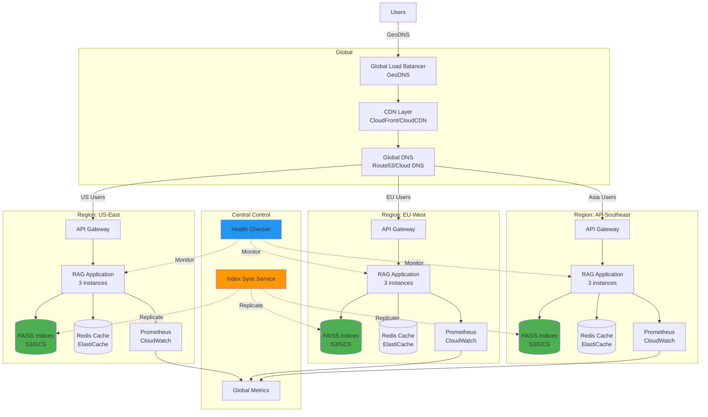

# Iteration 6: Multi-Region Deployment - Complete Prompt Set

**Iteration**: 6 of 7 (Advanced Validation Series)  
**Priority**: P1 (High)  
**Duration**: 3-4 hours  
**Dependencies**: Iterations 1-5 complete  
**Environment**: Multi-region cloud infrastructure

---

## Executive Summary

Design and validate multi-region deployment architecture for RAG system. Implement region-aware routing, data replication strategies, latency optimization, and disaster recovery procedures.

---

## Prerequisites Checklist

- [x] Iterations 1-5 complete (load testing validated)
- [ ] Access to multi-region cloud environment (AWS/GCP/Azure)
- [ ] Terraform or equivalent IaC tool installed
- [ ] kubectl configured for Kubernetes (if using K8s)
- [ ] DNS management access
- [ ] CDN configuration capability

---

## Prompt for GitHub Copilot Agent

```
@copilot Execute Iteration 6 (Multi-Region Deployment) for RAG Production Readiness

## Context
Branch: copilot/sub-pr-2750
Status: Iterations 1-5 complete, load testing passed (1M+ queries validated)
Goal: Design and implement multi-region deployment architecture

## Multi-Region Objectives

1. **Geographic Distribution**: Deploy across 3+ regions
2. **Latency Optimization**: <100ms P99 for global users
3. **Data Replication**: Consistent FAISS indices across regions
4. **Failover**: Automatic region failover <5 minutes
5. **Monitoring**: Region-specific metrics and alerting

## Architecture Design

### Task 1: Create Multi-Region Architecture Diagram

Create `docs/architecture/MULTI_REGION_ARCHITECTURE.md`:

````markdown
# Multi-Region RAG Deployment Architecture

## Overview

Global deployment architecture with 3 primary regions and automatic failover.

## Architecture Diagram



## Region Configuration

### Primary Regions

| Region | Provider | Location | Purpose |
|--------|----------|----------|---------|
| us-east-1 | AWS | N. Virginia | Primary (Americas) |
| eu-west-1 | AWS | Ireland | Primary (Europe) |
| ap-southeast-1 | AWS | Singapore | Primary (Asia Pacific) |

### Failover Regions

| Region | Provider | Location | Failover For |
|--------|----------|----------|--------------|
| us-west-2 | AWS | Oregon | us-east-1 |
| eu-central-1 | AWS | Frankfurt | eu-west-1 |
| ap-northeast-1 | AWS | Tokyo | ap-southeast-1 |

## Routing Strategy

### GeoDNS Configuration

```yaml
routing_policy: geolocation
health_check_interval: 30s
failover_threshold: 3_consecutive_failures

regions:
  - region_code: "NA"  # North America
    primary: us-east-1
    fallback: us-west-2
    latency_target_ms: 50
  
  - region_code: "EU"  # Europe
    primary: eu-west-1
    fallback: eu-central-1
    latency_target_ms: 50
  
  - region_code: "AS"  # Asia
    primary: ap-southeast-1
    fallback: ap-northeast-1
    latency_target_ms: 100
  
  - region_code: "default"
    primary: us-east-1
    fallback: [us-west-2, eu-west-1]
```

## Data Replication

### FAISS Index Sync

**Strategy**: Event-driven replication with eventual consistency

```python
# Pseudo-code for index sync
class IndexSyncService:
    def on_index_updated(self, tenant_id, index_name, region):
        """Replicate index update to all regions."""
        source_path = f"s3://{region}-bucket/{tenant_id}/{index_name}/"
        
        for target_region in ALL_REGIONS:
            if target_region != region:
                target_path = f"s3://{target_region}-bucket/{tenant_id}/{index_name}/"
                
                # Async replication
                replicate_async(
                    source=source_path,
                    target=target_path,
                    checksum=True
                )
                
                # Notify target region
                publish_event(
                    region=target_region,
                    event="index_updated",
                    payload={
                        "tenant_id": tenant_id,
                        "index_name": index_name,
                        "version": get_index_version()
                    }
                )
```

**Replication SLA**:
- Critical indices: <5 minutes
- Standard indices: <30 minutes
- Bulk updates: <2 hours

### Cache Invalidation

**Strategy**: Active-active with Redis replication

```yaml
cache_strategy:
  type: redis_cluster
  replication: multi-master
  consistency: eventual
  ttl: 3600  # 1 hour
  
  invalidation:
    on_index_update: true
    on_cache_full: lru_eviction
    cross_region_sync: true
```

## Latency Optimization

### CDN Configuration

```yaml
cdn_config:
  provider: cloudfront  # or cloudflare, cloudcdn
  edge_locations: global
  
  caching:
    query_results:
      ttl: 300  # 5 minutes for popular queries
      cache_key: hash(query + tenant_id)
    
    embeddings:
      ttl: 86400  # 24 hours
      cache_key: hash(text + model)
  
  optimization:
    compression: gzip,br
    http2: enabled
    http3: enabled
    minify: false  # preserve JSON structure
```

### Connection Pooling

```python
# Regional connection pools
class RegionAwareClient:
    def __init__(self):
        self.pools = {
            'us-east-1': HTTPSConnectionPool(maxsize=100),
            'eu-west-1': HTTPSConnectionPool(maxsize=100),
            'ap-southeast-1': HTTPSConnectionPool(maxsize=100),
        }
    
    def get_nearest_region(self, user_location):
        """Return nearest region based on user location."""
        # GeoDNS handles this, but can also do client-side
        return min(
            self.pools.keys(),
            key=lambda r: calculate_latency(user_location, r)
        )
```

## Failover Procedures

### Automatic Failover

```yaml
health_checks:
  endpoint: /health
  interval: 30s
  timeout: 5s
  unhealthy_threshold: 3
  healthy_threshold: 2

failover:
  mode: automatic
  triggers:
    - health_check_failed
    - latency_threshold_exceeded  # >500ms
    - error_rate_high  # >5%
  
  actions:
    - update_dns_records
    - notify_ops_team
    - log_failover_event
  
  rollback:
    automatic: true
    wait_time: 300s  # 5 minutes
    health_threshold: 10_consecutive_success
```

### Manual Failover

```bash
# Emergency failover script
#!/bin/bash
# scripts/failover.sh

REGION=$1
TARGET_REGION=$2

echo "Initiating failover: $REGION -> $TARGET_REGION"

# Update Route53 records
aws route53 change-resource-record-sets \
  --hosted-zone-id $ZONE_ID \
  --change-batch file://failover-config.json

# Verify health
sleep 30
curl -f https://api-${TARGET_REGION}.example.com/health || exit 1

echo "✅ Failover complete"
```

## Monitoring

### Regional Metrics

```yaml
metrics:
  per_region:
    - query_latency_p99
    - query_throughput_qps
    - error_rate_percent
    - cache_hit_rate
    - index_sync_lag_seconds
    - health_check_status
  
  global:
    - total_queries
    - cross_region_latency
    - replication_lag_max
    - active_regions
    - failover_events

alerts:
  - name: high_latency
    condition: p99_latency > 500ms
    severity: warning
    notify: ops-team
  
  - name: region_down
    condition: health_check_failed > 3
    severity: critical
    notify: on-call, ops-team
    action: trigger_failover
  
  - name: replication_lag
    condition: sync_lag > 600s
    severity: warning
    notify: ops-team
```

### Dashboard

```yaml
grafana_dashboard:
  name: "RAG Multi-Region Overview"
  
  panels:
    - title: "Global Query Distribution"
      type: world_map
      metric: queries_by_region
    
    - title: "Regional Latency (P99)"
      type: timeseries
      metrics:
        - us_east_1_p99
        - eu_west_1_p99
        - ap_southeast_1_p99
    
    - title: "Replication Lag"
      type: heatmap
      metric: index_sync_lag_seconds
    
    - title: "Failover Events"
      type: table
      query: failover_events_last_24h
```

## Disaster Recovery

### Backup Strategy

```yaml
backup:
  indices:
    frequency: daily
    retention: 30_days
    destinations:
      - s3://backup-us-east-1/
      - s3://backup-eu-west-1/
      - s3://backup-ap-southeast-1/
  
  metadata:
    frequency: hourly
    retention: 7_days
  
  configuration:
    frequency: on_change
    retention: 90_days
    version_control: git
```

### Recovery Procedures

```bash
# Recovery from backup
./scripts/restore.sh \
  --region us-east-1 \
  --backup-date 2026-01-08 \
  --tenant-id customer_a \
  --verify-checksum

# Expected time: 30-60 minutes per region
```

## Cost Optimization

### Data Transfer Costs

```yaml
optimization_strategies:
  - Use CloudFront/CDN for frequently accessed data
  - Enable S3 Transfer Acceleration
  - Implement regional caching
  - Compress data in transit
  - Use VPC endpoints (avoid internet gateway)

estimated_monthly_costs:
  compute: $5000  # 9 instances across 3 regions
  storage: $1000  # FAISS indices + backups
  data_transfer: $2000  # Inter-region + CDN
  caching: $500  # Redis clusters
  total: $8500
```

## Deployment Checklist

- [ ] Infrastructure provisioned in all regions
- [ ] GeoDNS configured with health checks
- [ ] CDN endpoints created and tested
- [ ] FAISS indices replicated to all regions
- [ ] Cache clusters deployed and connected
- [ ] Monitoring dashboards created
- [ ] Alert rules configured
- [ ] Failover procedures tested
- [ ] Backup/restore validated
- [ ] Cost monitoring enabled
- [ ] Documentation updated
- [ ] Team trained on procedures

---

**Architecture Version**: 1.0.0  
**Last Updated**: 2026-01-08  
**Approved By**: DevOps Team
````

### Task 2: Create Infrastructure as Code

Create `deploy/terraform/multi-region/main.tf`:

```hcl
# Terraform configuration for multi-region RAG deployment

terraform {
  required_version = ">= 1.0"
  
  required_providers {
    aws = {
      source  = "hashicorp/aws"
      version = "~> 5.0"
    }
  }
  
  backend "s3" {
    bucket = "rag-terraform-state"
    key    = "multi-region/terraform.tfstate"
    region = "us-east-1"
  }
}

# Providers for each region
provider "aws" {
  alias  = "us_east_1"
  region = "us-east-1"
}

provider "aws" {
  alias  = "eu_west_1"
  region = "eu-west-1"
}

provider "aws" {
  alias  = "ap_southeast_1"
  region = "ap-southeast-1"
}

# Variables
variable "environment" {
  description = "Environment name"
  type        = string
  default     = "production"
}

variable "app_version" {
  description = "RAG application version"
  type        = string
}

# S3 buckets for FAISS indices (per region)
module "faiss_storage_us" {
  source = "./modules/faiss-storage"
  providers = {
    aws = aws.us_east_1
  }
  
  region      = "us-east-1"
  environment = var.environment
}

module "faiss_storage_eu" {
  source = "./modules/faiss-storage"
  providers = {
    aws = aws.eu_west_1
  }
  
  region      = "eu-west-1"
  environment = var.environment
}

module "faiss_storage_ap" {
  source = "./modules/faiss-storage"
  providers = {
    aws = aws.ap_southeast_1
  }
  
  region      = "ap-southeast-1"
  environment = var.environment
}

# ECS clusters for RAG application
module "rag_cluster_us" {
  source = "./modules/rag-cluster"
  providers = {
    aws = aws.us_east_1
  }
  
  region          = "us-east-1"
  environment     = var.environment
  app_version     = var.app_version
  instance_count  = 3
  faiss_bucket    = module.faiss_storage_us.bucket_name
}

# (Similar for EU and AP regions)

# Global Route53 configuration
resource "aws_route53_zone" "main" {
  name = "rag.example.com"
}

resource "aws_route53_record" "api" {
  zone_id = aws_route53_zone.main.zone_id
  name    = "api.rag.example.com"
  type    = "A"
  
  geolocation_routing_policy {
    continent = "NA"
  }
  
  alias {
    name                   = module.rag_cluster_us.alb_dns_name
    zone_id                = module.rag_cluster_us.alb_zone_id
    evaluate_target_health = true
  }
  
  health_check_id = aws_route53_health_check.us.id
}

# Health checks
resource "aws_route53_health_check" "us" {
  fqdn              = module.rag_cluster_us.endpoint
  port              = 443
  type              = "HTTPS"
  resource_path     = "/health"
  failure_threshold = 3
  request_interval  = 30
  
  tags = {
    Name = "rag-us-east-1-health"
  }
}

# CloudWatch alarms for failover
resource "aws_cloudwatch_metric_alarm" "high_latency_us" {
  alarm_name          = "rag-high-latency-us-east-1"
  comparison_operator = "GreaterThanThreshold"
  evaluation_periods  = 3
  metric_name         = "TargetResponseTime"
  namespace           = "AWS/ApplicationELB"
  period              = 60
  statistic           = "Average"
  threshold           = 500  # 500ms
  alarm_description   = "Trigger when P99 latency exceeds 500ms"
  alarm_actions       = [aws_sns_topic.alerts.arn]
}

# Outputs
output "api_endpoints" {
  value = {
    us = module.rag_cluster_us.endpoint
    eu = module.rag_cluster_eu.endpoint
    ap = module.rag_cluster_ap.endpoint
  }
}

output "global_endpoint" {
  value = aws_route53_record.api.fqdn
}
```

### Task 3: Create Index Sync Service

Create `src/codex/deployment/index_sync.py`:

```python
"""
FAISS Index Synchronization Service
Handles cross-region replication of FAISS indices.
"""

import asyncio
import boto3
from datetime import datetime
from typing import List, Dict
import logging

logger = logging.getLogger(__name__)


class IndexSyncService:
    """Synchronizes FAISS indices across multiple regions."""
    
    def __init__(self, regions: List[str]):
        self.regions = regions
        self.s3_clients = {
            region: boto3.client('s3', region_name=region)
            for region in regions
        }
    
    async def sync_index(
        self,
        tenant_id: str,
        index_name: str,
        source_region: str
    ) -> Dict[str, bool]:
        """
        Sync index from source region to all other regions.
        
        Returns:
            Dict mapping region to success status
        """
        logger.info(f"Starting sync: {tenant_id}/{index_name} from {source_region}")
        
        results = {}
        tasks = []
        
        for target_region in self.regions:
            if target_region != source_region:
                task = self._copy_index(
                    tenant_id,
                    index_name,
                    source_region,
                    target_region
                )
                tasks.append((target_region, task))
        
        # Execute copies in parallel
        for region, task in tasks:
            try:
                await task
                results[region] = True
                logger.info(f"✅ Synced to {region}")
            except Exception as e:
                results[region] = False
                logger.error(f"❌ Failed to sync to {region}: {e}")
        
        return results
    
    async def _copy_index(
        self,
        tenant_id: str,
        index_name: str,
        source_region: str,
        target_region: str
    ):
        """Copy index files from source to target region."""
        source_bucket = f"rag-indices-{source_region}"
        target_bucket = f"rag-indices-{target_region}"
        
        prefix = f"{tenant_id}/{index_name}/"
        
        # List objects in source
        source_s3 = self.s3_clients[source_region]
        objects = source_s3.list_objects_v2(
            Bucket=source_bucket,
            Prefix=prefix
        )
        
        # Copy each object
        for obj in objects.get('Contents', []):
            key = obj['Key']
            
            # Use S3 copy (server-side, faster)
            target_s3 = self.s3_clients[target_region]
            target_s3.copy_object(
                CopySource={'Bucket': source_bucket, 'Key': key},
                Bucket=target_bucket,
                Key=key
            )
```

### Task 4: Deploy and Validate

```bash
# 1. Initialize Terraform
cd deploy/terraform/multi-region
terraform init

# 2. Plan deployment
terraform plan -out=tfplan

# 3. Apply (requires approval)
terraform apply tfplan

# 4. Validate deployment
./scripts/validate-multi-region.sh

# 5. Test cross-region failover
./scripts/test-failover.sh us-east-1 us-west-2
```

### Task 5: Create Monitoring Dashboard

Generate Grafana dashboard JSON and import:

```bash
python3 scripts/generate-grafana-dashboard.py \
  --regions us-east-1,eu-west-1,ap-southeast-1 \
  --output deploy/grafana/multi-region-dashboard.json

# Import to Grafana
curl -X POST http://grafana:3000/api/dashboards/db \
  -H "Content-Type: application/json" \
  -d @deploy/grafana/multi-region-dashboard.json
```

## Success Criteria

- ✅ Infrastructure deployed in 3+ regions
- ✅ GeoDNS routing functional
- ✅ Index replication working (<5 min for critical)
- ✅ Automatic failover tested and validated
- ✅ P99 latency <100ms for regional users
- ✅ Cross-region latency monitored
- ✅ Disaster recovery tested successfully
- ✅ Cost tracking enabled

## Deliverables

1. Multi-region architecture documentation
2. Infrastructure as Code (Terraform)
3. Index sync service implementation
4. Deployment scripts and validation tools
5. Monitoring dashboards
6. Failover playbooks
7. Cost analysis report

Execute all tasks and document deployment architecture, procedures, and validation results.
```

---

## Execution Checklist

- [ ] Architecture diagram created
- [ ] Terraform configuration written
- [ ] Index sync service implemented
- [ ] Infrastructure deployed
- [ ] GeoDNS configured and tested
- [ ] Failover procedures validated
- [ ] Monitoring dashboards created
- [ ] Cost tracking enabled
- [ ] Documentation complete
- [ ] Team training conducted

---

## Timeline

- Architecture design: 1 hour
- IaC development: 2 hours
- Deployment: 2 hours
- Testing & validation: 2 hours
- Documentation: 1 hour
- **Total**: ~8 hours (can be parallelized)

---

**Prompt Created**: 2026-01-08 20:45 UTC  
**Ready for**: DevOps team execution  
**Expected Outcome**: Production-ready multi-region deployment
